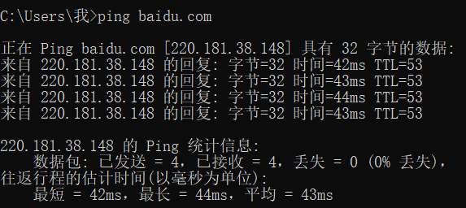
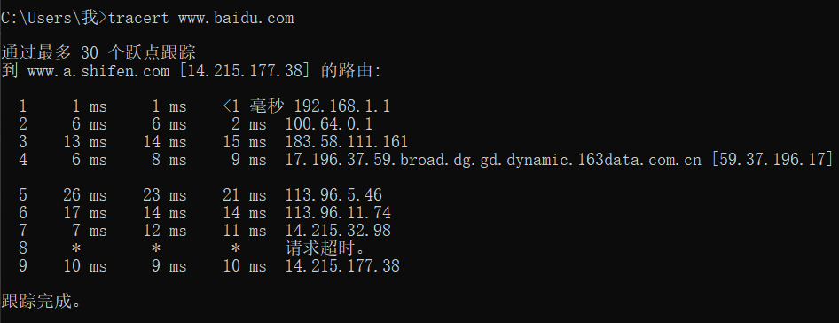

#### ping百度：

​		ping 主要是用来查看到目的地址的时延和丢包情况。

#### tracert百度:

​		tracert是用来查看所经过的每一跳路由，可以具体判断时延变大或者丢包的点。

​		从左到右的5条信息分别代表了“生存时间”（每途经一个路由器结点自增1）、“三次发送的ICMP包返回时间”（共计3个，单位为毫秒ms）和“途经路由器的IP地址”（如果有主机名，还会包含主机名）。
