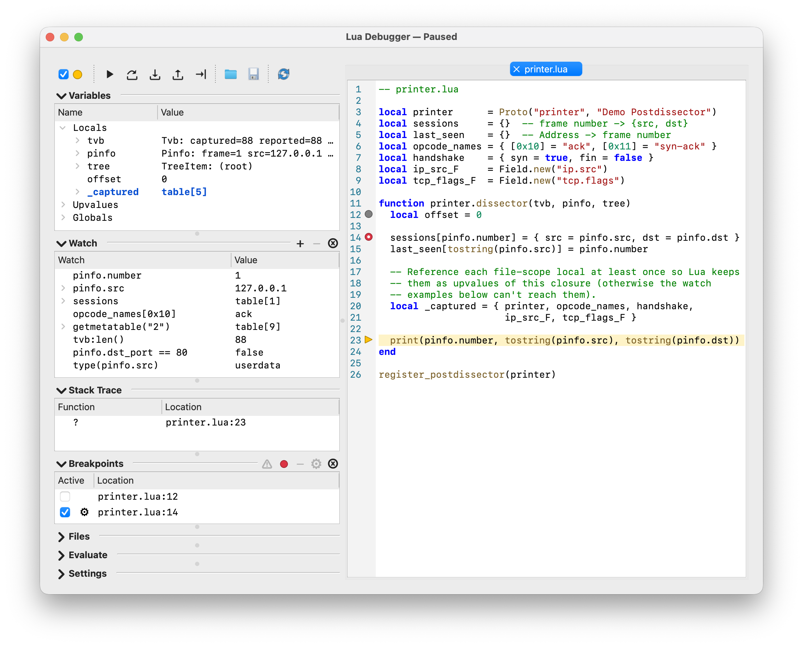

// WSDG Lua Debugger chapter — included from developer-guide.adoc.

[#wslua_debugger]

== Lua Debugger

[#wslua_debugger_intro]

=== Introduction

Wireshark ships with a comprehensive built-in graphical debugger
for Lua scripts (dissectors, postdissectors, taps, and file
readers/writers), with breakpoints, stepping, call-stack and
variable inspection, watches, and expression evaluation. It is a
sub-window of the main application, reached from menu:Tools[Lua Debugger].
There is only ever one debugger dialog; closing it does not lose any
state, and reopening it from the menu brings back the same
breakpoints, watches, and editor tabs.

The debugger lets you:

* set _breakpoints_ — optionally with a condition, hit-count gate,
  or logpoint message — on any line of a loaded Lua script, or any
  file you open in its editor;
* _step_ through Lua code line by line (step over, step into, step
  out, and run-to-line);
* inspect the current _call stack_, local variables, upvalues, and
  globals while paused, with the rest of Wireshark frozen;
* set _watches_ — both Variables-style paths and arbitrary Lua
  expressions — that re-evaluate on every pause;
* _evaluate_ ad-hoc Lua expressions against the paused state;
* _edit_ script files in place, with syntax highlighting, a
  breakpoint gutter, inline find, and go-to-line;

The top of the dialog has an *Enabled* checkbox; its icon is a small
colored circle that mirrors the debugger's current state, and the
debugger's state is also appended to the window title (for example
_Lua Debugger — Paused_). The debugger has four states:

* *Disabled* (gray) — the line hook is not installed; scripts run at
  full speed and breakpoints do not fire.
* *Running* (green) — the line hook is installed; scripts run until a
  breakpoint (or step target) hits.
* *Paused* (yellow) — a breakpoint, single step, or run-to-line
  pointed at a line inside a loaded script and the debugger has
  stopped Lua execution.
* *Disabled (live capture)* (red) — debugging is forcibly suppressed
  for the duration of a live capture and is restored to the previous
  enabled state when the capture ends. The *Enabled* checkbox is
  disabled in this state and its tooltip explains why; see
  <<wslua_debugger_live_capture>>.

Watches, breakpoints, the editor theme, and section layout are
remembered across Wireshark restarts.

.Lua Debugger dialog, paused inside a postdissector

[#wslua_debugger_pause]

=== Pause Behavior

When your Lua code hits a breakpoint or the next step target, the
debugger pauses. The dialog raises and activates with the paused
line highlighted in the editor and the Variables, Watch, and Stack
Trace panels repopulated; the rest of Wireshark is disabled and
covered by a translucent vignette with a "Lua debugger paused"
banner until you resume. *Continue*, *Step*, or closing the
debugger return control to Lua so it can run the next line (or
return from the current function).

Live capture is incompatible with this pause model — packets keep
arriving from the capture device and would have to be dissected
while a previous Lua call is still on the stack. The debugger is
therefore forcibly suppressed for the duration of any live
capture; see <<wslua_debugger_live_capture>>.

[#wslua_debugger_live_capture]

==== Live-capture suppression

A live capture keeps pulling packets off the interface and dissecting
them for as long as the capture runs. Dissection routinely calls into
Lua — every packet passes through any registered dissector,
postdissector, or tap. Pausing Lua at a breakpoint while packets are
still arriving would stall the capture pipeline on code that cannot
make progress, or would try to call your Lua code again while its
previous invocation is still frozen at the breakpoint.

To avoid that, the debugger *auto-disables* itself for the duration
of any live capture:

* When a live capture starts, the debugger switches to *Disabled* if
  it was on, and breakpoints stop firing for the rest of the capture.
* When the capture ends, the debugger is restored to whatever
  enabled state you had before the capture started. Your breakpoints,
  watches, and open editor tabs are untouched.
* While a capture is active the *Enabled* checkbox in the dialog
  header is disabled and its tooltip explains why, and the status
  label reflects the suppressed state so it is always visible that
  the debugger is off for a reason.

If you need to step through a dissector on live traffic, stop the
capture, re-enable the debugger if needed, and reload a saved capture
file instead — offline dissection is fully compatible with pausing.

[#wslua_debugger_getting_started]

=== Getting Started

A small postdissector is enough to exercise everything the
debugger does. Save the following as `printer.lua`:

[source,lua]
----
local printer      = Proto("printer", "Demo Postdissector")
local sessions     = {}  -- frame number -> {src, dst}
local last_seen    = {}  -- Address -> frame number
local opcode_names = { [0x10] = "ack", [0x11] = "syn-ack" }
local handshake    = { syn = true, fin = false }
local ip_src_F     = Field.new("ip.src")
local tcp_flags_F  = Field.new("tcp.flags")

function printer.dissector(tvb, pinfo, tree)
  local offset = 0

  sessions[pinfo.number] = { src = pinfo.src, dst = pinfo.dst }
  last_seen[tostring(pinfo.src)] = pinfo.number

  -- Reference each file-scope local at least once so Lua keeps
  -- them as upvalues of this closure (otherwise the watch
  -- examples below can't reach them).
  local _captured = { printer, opcode_names, handshake,
                      ip_src_F, tcp_flags_F }

  print(pinfo.number, tostring(pinfo.src), tostring(pinfo.dst))
end

register_postdissector(printer)
----

Every example later in this chapter resolves against names this
script defines, so you can paste any of them into the *Watch*
panel without setting up extra state. What's in scope while
`printer.dissector` is paused:

* *Upvalues* (file-scope locals captured by the dissector closure):
  `printer`, `sessions`, `last_seen`, `opcode_names`, `handshake`,
  `ip_src_F`, `tcp_flags_F`.
* *Locals*: `tvb`, `pinfo`, `tree`, `offset`.
* *Globals* of interest: `print`, `tostring`, `assert`, `string`,
  `type`, `getmetatable`, `Field`, `Proto`, `register_postdissector`,
  `get_version`.

The `local _captured = { ... }` line in the dissector body is
demo-only: Lua captures file-scope locals as upvalues only if the
closure references them, so each name has to be mentioned at least
once for it to show up under `Upvalues`. A real postdissector's
protocol logic does the same work organically. `opcode_names` and
`handshake` are otherwise unused — they exist solely to seed
hex-keyed and boolean-keyed tables for the path-watch examples
below.

`Field.new(...)` is called at *file scope* on purpose: extractors
can only be constructed at script load, before any dissector or tap
callback runs. Inside the dissector callback the script *references*
`ip_src_F` / `tcp_flags_F` (and so do the watch examples below), but
never calls `Field.new` again.

Drop it into your
link:{wireshark-users-guide-url}ChAppFilesConfigurationSection.html[_personal plugins directory_]
(the exact path on your install is also shown under
menu:Help[About Wireshark > Folders > Personal Lua Plugins]). The
canonical locations are:

* Linux and macOS: `~/.local/lib/wireshark/plugins/`
* Windows: `%APPDATA%\Wireshark\plugins\`

Then:

. Pick menu:Analyze[Reload Lua Plugins] (`kbd:[Ctrl+Shift+L]`) so
  Wireshark picks up the new file. The same shortcut also works
  from the *Reload Lua Plugins* toolbar action inside the Lua
  Debugger dialog once it's open.
. Open menu:Tools[Lua Debugger] and tick the *Enabled* checkbox in
  the dialog header.
. Expand the *Files* section and double-click `printer.lua` to open
  it in the editor.
. Click in the gutter on a line inside `printer.dissector` to toggle
  a breakpoint (a red circle appears).
. Load any capture file. Dissection starts, the breakpoint hits, and
  the debugger pauses — the paused line gets a yellow stripe (and a
  yellow right-pointing triangle in the gutter), the *Enabled*
  checkbox dot turns yellow, the window title changes to _Lua
  Debugger — Paused_, and the main window grays out behind a
  "Lua debugger paused" banner.
. Inspect the paused state:
  - *Variables* shows Locals (`tvb`, `pinfo`, `tree`), Upvalues, and
    Globals for the current frame.
  - *Stack Trace* shows the postdissector call on top of whatever
    frame drove the dissection.
  - Try *Add Watch* on `pinfo.src` (via the Variables context menu
    or the `＋` button in the *Watch* section header,
    `kbd:[Ctrl+Shift+W]`).
. Use *Step Over* (`kbd:[F10]`), *Step Into* (`kbd:[F11]`), or
  *Continue* (`kbd:[F5]`) to advance. The Watch tree updates on every
  pause; values that changed since the previous pause are drawn in a
  bold accent color and briefly flash.

[#wslua_debugger_toolbar]

=== Toolbar

The toolbar across the top of the dialog collects the debugger's
main actions. Every action has a keyboard shortcut that also works
when the focus is inside the script editor.

The standard step controls:

[cols="1,1,3",options="header"]
|===
| Action | Shortcut | Effect
| *Continue* | `kbd:[F5]` | Resume until the next breakpoint.
| *Step Over* | `kbd:[F10]` | Run the current line and pause on the next line in the same (or outer) stack frame; calls run to completion without pausing inside.
| *Step Into* | `kbd:[F11]` | Run the current line and pause on the very next Lua line, including lines inside functions called from the current line.
| *Step Out* | `kbd:[Shift+F11]` | Resume until the current function returns, then pause in the caller. On the outermost Lua frame this behaves like *Continue*.
|===

The remaining toolbar actions:

* *Run to this line* (`kbd:[Ctrl+F10]`) — set a one-shot target on
  the line under the editor cursor and resume; pause there when (and
  if) the target is reached. Enabled only while paused with an
  active editor tab. See <<wslua_debugger_breakpoints>>.
* *Open File* — open a `.lua` file in a new editor tab.
* *Save* (`kbd:[Ctrl+S]`) — write the active editor tab to disk.
  Enabled only when the active tab has unsaved changes.
* *Reload Lua Plugins* (`kbd:[Ctrl+Shift+L]`) — re-run the full Lua
  plugin load sequence (global then personal plugin directories) in
  a fresh Lua VM. Breakpoints, watches, and editor tabs survive the
  reload; anything the previous Lua state had stashed in globals
  does not.

Next to the toolbar the dialog header carries the *Enabled*
checkbox; its colored dot mirrors the current debugger state — see
<<wslua_debugger_intro>>.

[#wslua_debugger_variables]

=== Variables

The *Variables* collapsible section shows three roots:

* *Locals* — parameters and local variables for the currently
  selected stack frame.
* *Upvalues* — values the function actually references from its
  enclosing scope. Functions that do not close over anything have no
  upvalues.
* *Globals* — names from Lua's global environment.

`Globals` resolves against `_G` first and then against the paused
frame's `_ENV` upvalue. The `_ENV` fallback matters for scripts
loaded with a file environment (for example via `dofile`) — a
top-level `my_proto = Proto.new(...)` in such a script lands in the
file's `_ENV` rather than `_G`, and the debugger still lists it
under Globals.

The tree is populated lazily: a row is only inspected when you
expand it. Sub-trees stop at the same path-depth cap as Watch (see
<<wslua_debugger_watch_grammar>>).

The tree has two columns, *Name* and *Value*; the underlying
type is folded into the row tooltip rather than shown in its own
column. For userdata values (Wireshark class instances such as
`Pinfo`, `Tvb`, `ProtoField`), the tooltip reads `userdata
(ClassName)` when the instance metatable exposes a `__name`,
otherwise just `userdata`.

Functions are listed alongside other values (rendered as
`function: 0xADDR`, the standard Lua tostring shape) so callbacks,
locally-bound helpers, methods on userdata, and stdlib namespaces
like `string` and `table` all show up in their respective scopes.
Function rows are not expandable; to inspect what a function does,
view its source via *Stack Trace* once it is on the call stack.

Selecting a different frame in *Stack Trace* rebuilds the Variables
tree for that frame.

A context menu on any row offers *Copy Name*, *Copy Value* (the
full, untruncated value — the tree itself truncates long values for
display), *Copy Name & Value* (`__name__ = __value__`), *Copy Path*
(the canonical Variables-tree path, ready to paste into the *Watch*
panel or the *Evaluate* panel), and *Add Watch* (prefilled with
the row's variable path; the menu label includes the path so you
can see exactly what would be added).

[#wslua_debugger_changed_value]

==== Changed-value cue

Both the Variables tree and the Watch tree highlight values that
_changed since the previous pause_: the row is drawn in a bold
accent foreground from the current theme and briefly flashes a
softer highlight tint. New rows (a local that did not exist last
pause, a key added to a table, a freshly appearing Watch child)
receive the same treatment. Watch _roots_ deliberately do not flash
on first sighting — a new root is usually a spec you just typed.

The cue is anchored to the stack frame that was active when the
pause started, because "the value changed" only makes sense against
a comparable earlier reading:

* Selecting a different frame in the Stack Trace mid-pause shows an
  unrelated scope, so the cue is suppressed on Locals, Upvalues,
  and any unqualified or Locals.* / Upvalues.* watch rows
  while you are in a non-entry frame. Globals.* rows stay
  comparable across frame switches and keep their highlight.
* A pause that landed inside a different function than the previous
  pause also suppresses the cue on Locals and Upvalues, to avoid
  spuriously lighting up "every local is new" after stepping
  across a call or return. Pauses that hit the same function again
  — for example the next iteration of a loop, or a recurring
  dissector callback — still show the cue.

The change baseline is cleared, so the next pause shows no cue,
after editing a watch's spec, removing watches, reloading Lua
plugins, or disabling the debugger. A failed watch lookup
invalidates that one watch's baseline only.

Empty strings count as real values for the comparison: a variable
whose value was `""` last pause and is still `""` now does not
flash. Single-stepping never flickers the Watch _Value_ column
through its not-paused em-dash placeholder, even though a step
technically resumes and re-pauses; the tree repaints straight from
the new pause's values.

[#wslua_debugger_watch]

=== Watch

The *Watch* section pins values that are re-evaluated on every
pause. Type any Lua expression into the *Watch* column —
`tostring(pinfo.src)`, `tvb:len()`, `pinfo.dst_port == 80`,
`assert(tvb:len() >= 20, "short IP header")` — and the row updates
the next time the debugger pauses.

* No leading `=` or `return` is needed; value-returning expressions
  auto-return their value, and a bare function or method call shows
  what it returned. (The legacy `=` prefix from the *Evaluate* panel
  is still tolerated, just redundant here.)
* Bare identifiers resolve against the paused frame's locals, then
  upvalues, then globals; see <<wslua_debugger_variables>>. In
  `printer.lua`, `pinfo`, `tvb`, and `tree` are the parameters of
  `printer.dissector`; `printer`, `sessions`, `last_seen`,
  `opcode_names`, `handshake`, `ip_src_F`, and `tcp_flags_F` are
  upvalues; and library names like `string`, `tostring`, and `Field`
  fall through to globals automatically.
* Tables — and Wireshark userdata with attribute getters or a
  `__pairs` metamethod — are expandable in the Watch tree.
  Children re-resolve against the *current* result on every pause;
  they do not snapshot.
* Hovering a row shows its current type and a kind-of-watch hint —
  _From: Locals/Upvalues/Globals_ for plain paths, _Expression —
  re-evaluated on every pause._ otherwise. Errors land in the row's
  _Value_ column with red error chrome and the unstripped Lua error
  in the tooltip.

For a goal-organized cheat sheet of expression shapes — formats,
predicates, bit fields, ad-hoc tables, fallbacks, type inspection —
see <<wslua_debugger_watch_expressions>>.

*Plain variable paths get extras.* When the spec is a plain name
optionally chained with `.field` or `[key]` segments — for example
`pinfo.src`, `Upvalues.sessions[1].src`, `opcode_names[0x10]`, or
just `pinfo` — the debugger recognizes the shape and routes the row
through a *path watch* fast path: a constrained but tree-aware
specialization of the general expression watcher. Anything that
isn't a plain path (operators, calls, comparisons, table
constructors, …) falls through to the expression watcher
automatically; you don't choose between the two, the panel routes
each row.

The path-watch fast path adds:

* *Selection sync* — clicking a path-watch row selects the matching
  Variables-tree row, and vice versa.
* *Stack-frame nudge* — `Locals.` / unqualified paths pick the
  innermost frame where the name resolves; `Upvalues.` picks the
  frame whose closure carries the upvalue; `Globals.` does not move
  the stack.
* *Sharper error chrome* — a missing name produces _Path not found:
  …_ pinpointing the missing segment instead of relaying a Lua
  runtime message.
* *Cheaper re-resolution* — the path is walked node-by-node against
  the live tables; it does not go through the Lua compiler.
* *Section-aware tooltip* — hovering reports which section the path
  resolved into (From: _Locals_, _Upvalues_, or _Globals_).

For the formal grammar of what counts as a "plain variable path",
see <<wslua_debugger_watch_grammar>>.

[#wslua_debugger_watch_control_and_behavior]

==== Controls and behavior

The section header carries three small controls to the right of the
title rule:

* `＋` — *Add Watch*: insert a new top-level row and open its inline
  editor (same as `kbd:[Ctrl+Shift+W]`).
* `－` — *Remove Watch*: remove the selected top-level watches.
  Disabled when no top-level watch row is selected.
* `Ⓧ` — *Remove All Watches* (`kbd:[Ctrl+Shift+K]`). Disabled
  when the Watch list is empty.

Rows are added by *Add Watch* (header `＋`, `kbd:[Ctrl+Shift+W]`,
the Watch-tree context menu, the editor context menu, or
double-clicking the empty area below the last row), edited inline
via double-click or `kbd:[F2]`, removed via `kbd:[Delete]` /
`kbd:[Backspace]` or the `－` button, and reordered by drag. The
tree supports `kbd:[Ctrl]` / `kbd:[Shift]`-click to extend the
selection so a bulk delete removes every selected top-level row in
one shot. The right-click context menu offers *Add Watch*; on a
watch root also *Duplicate Watch* (`kbd:[Ctrl+Shift+D]`), *Edit
Watch* (`kbd:[F2]`), *Copy Value* (`kbd:[Ctrl+Shift+C]`), *Remove*
(`kbd:[Delete]`), and *Remove All Watches* (`kbd:[Ctrl+Shift+K]`);
on a sub-row only *Add Watch* and *Copy Value*. Committing an
empty spec removes the row. The _Value_ column is always
read-only.

The Wireshark-specific behaviors:

* *Error chrome.* A row with an invalid path or a lookup failure is
  drawn with a red background and a tooltip that reports the error
  message.
* *Not paused.* When the debugger is not paused, the _Value_ column
  shows a muted em dash. Hovering the em dash explains that watches
  are only evaluated while the debugger is paused.
* *Changed-value cue.* Identical treatment to Variables; see
  <<wslua_debugger_changed_value>>.
* *Selection sync.* Selecting a watch row selects the matching
  Variables row (and vice versa). Selecting a path-style watch root
  also moves the Call Stack selection to a frame where that root
  resolves — `Locals.…` / unqualified paths pick the innermost
  matching frame; `Upvalues.…` picks the frame whose closure
  carries that upvalue; `Globals.…` does not move the stack.
  Expression watches have no Variables-tree counterpart, so they
  do not participate in selection sync or stack-frame nudging.
* *Depth cap.* Subtrees stop at the same depth limit as the
  Variables tree; see <<wslua_debugger_watch_grammar>>. The
  sentinel child at the cap has the tooltip _Maximum watch depth
  reached_. This applies to expression-watch sub-elements as well:
  the subpath walked under the expression result counts toward the
  cap.

Expansion state is kept only for the current session; watches open
collapsed the next time you start Wireshark.

[#wslua_debugger_watch_grammar]

==== Path-watch syntax

The chapter intro called out that a Watch row whose contents look
like a *plain variable path* gets the path-watch fast path —
selection sync with the Variables tree, sharper error chrome,
cheaper re-resolution, and so on. This subsection nails down what
"plain variable path" means.

A path watch is one identifier followed by any number of `.name` or
`[key]` segments, optionally qualified by a section prefix.
Anything else — method calls, arithmetic, function calls,
comparisons, table constructors — is routed to the expression
watcher (see <<wslua_debugger_watch_expressions>>) automatically;
there is no error and no UI toggle.

*Examples.*

[source,lua]
----
-- A local in the current frame (a parameter of printer.dissector):
Locals.pinfo

-- A field on that local userdata:
pinfo.src

-- An upvalue table indexed by an integer key (printer.lua's
-- per-frame cache):
Upvalues.sessions[1]

-- A nested field reachable through the same path:
Upvalues.sessions[1].src

-- Hex and boolean keys (printer.lua's lookup tables):
Upvalues.opcode_names[0x10]
Upvalues.handshake[true]

-- An explicit Globals path (a Lua-side global function):
Globals.get_version

-- Unqualified — tried in locals, then upvalues, then globals:
sessions                  -- finds the upvalue
get_version               -- finds the global

-- _G aliases:
_G.get_version            -- same as Globals.get_version
_G                        -- same as Globals (whole section)
----

*Prefixes.* A Watch spec may start with one of the three debugger
section prefixes:

* `Locals.__name__` — a local in the current stack frame.
* `Upvalues.__name__` — an upvalue of the current stack frame's
  function.
* `Globals.__name__` — a global, resolved through `_G` first and
  then through the paused frame's `_ENV` upvalue (see the note in
  <<wslua_debugger_variables>>).

The exact tokens `Locals`, `Upvalues`, and `Globals` (with no
trailing `.`) are also accepted and select the whole section's
contents. `_G` is aliased to `Globals` and `_G.` to `Globals.`. A
bare path with no prefix (including a lone identifier) is resolved
in `Locals`, then `Upvalues`, then `Globals`, in that order, and
the UI rewrites the tooltip with the section that actually matched.

A common confusion: a file-scope `local` like `printer.lua`'s
`local sessions = {}` is an *upvalue* of any function defined in
the same chunk, *not* a global. So the path is
`Upvalues.sessions`, not `Globals.sessions`. Globals are names that
were assigned without `local` (or that come from the standard
library, such as `print`, `tostring`, `Field`, or `get_version`).

*What's allowed inside `[ ]`.* Bracket subscripts mirror Lua's own
short-literal syntax and accept:

* *Integer keys* — decimal or hex, optionally negative:
  `t[0]`, `t[-1]`, `t[0x1F]`, `t[-0X1f]`.
* *Boolean keys* — Lua-case only: `t[true]`, `t[false]`. `True`
  and `FALSE` are parsed as identifiers, not booleans.
* *String keys* — double- or single-quoted, with the standard Lua
  5.x short-string escape set.

The decoded key is looked up exactly the way Lua itself indexes a
table, so any key type that a Lua table can carry is reachable. For
userdata (Wireshark class instances, e.g. `Proto`, `Field`), a
bracket key must be a string and is looked up as an attribute name,
the same as `ud.name`.

Anything that doesn't match the grammar above is routed to the
expression watcher. See *When the path-watch fast path doesn't
apply* in <<wslua_debugger_watch_expressions>> for the full list of
shapes that go that way.

===== Reference and edge cases

*Grammar.* After canonicalization the Watch grammar is:

[source]
----
watch   := section "." body
         | section
         | body
section := "Locals" | "Upvalues" | "Globals"
body    := ident ( "." ident | "[" key "]" )*
ident   := [A-Za-z_] [A-Za-z0-9_]*
key     := integer | boolean | string
integer := "-"? ( decimal-digits | ("0x" | "0X") hex-digits )
boolean := "true" | "false"
string  := '"' ( char-except-"\"\\ | escape )* '"'
         | "'" ( char-except-'\\ | escape )* "'"
----

*String escapes.* String keys accept the Lua 5.x short-string
escape set: `\a \b \f \n \r \t \v \\ \" \' \?`, decimal bytes
`\NNN` (1–3 digits, value ≤ 255), hex bytes `\xHH`, Unicode code
points `\u{H…}` (1–8 hex digits, value ≤ 0x7FFFFFFF, UTF-8
encoded), and `\z` which skips the following whitespace. Raw
newlines inside a string key are rejected; use `\n`.

*Canonicalization.* Before the path is validated:

* Leading and trailing whitespace is trimmed.
* `_G` and `_G.` are rewritten to `Globals` and `Globals.`.
* Spaces and tabs around `.` are collapsed outside bracket
  literals, so `Globals . foo . bar` becomes `Globals.foo.bar`.
* Whitespace inside `[ ... ]` around the key is tolerated.
* String escapes inside `["…"]` / `['…']` are decoded before
  lookup, so `t["a\tb"]` indexes the key `a<TAB>b`.

*Depth cap.* Path depth is capped at 32 — the count of `.` and `[`
in the canonical path. Paths that reach that limit are rejected.
The same cap applies to Variables and Watch sub-trees, with the
sentinel child carrying the tooltip _Maximum watch depth reached_.

[#wslua_debugger_watch_expressions]

==== Expression patterns

The mini-blocks below are the cheat sheet for what kinds of Lua a
Watch row accepts when the spec isn't a plain path. Each is
paste-and-run — drop a line into the *Watch* column and the row
updates on every pause. Names like `pinfo`, `tvb`, and `tree` refer
to whatever locals the current dissector exposes; substitute as
needed.

*Format a value the way columns do.*

[source,lua]
----
-- Address as the canonical column string:
tostring(pinfo.src)

-- Endpoints in one row:
tostring(pinfo.src) .. " -> " .. tostring(pinfo.dst)

-- TCP/UDP port pair:
string.format("%d -> %d", pinfo.src_port, pinfo.dst_port)

-- A flag byte rendered like Wireshark does:
string.format("0x%02x", tvb:range(13,1):uint())
----

Use `tostring()` and `string.format()` exactly as you would in a
dissector callback. Wireshark's userdata classes (`Address`,
`Pinfo`, `Tvb`, …) expose conversion via the standard `__tostring`
metamethod, so `tostring(pinfo.src)` is the canonical form — they
do *not* offer a `:tostring()` method. The `:method` syntax still
works on string locals (`name:upper()`).

*Compute a derived number or boolean.*

[source,lua]
----
-- Bytes left to consume:
tvb:len() - offset

-- "Beyond frame N":
pinfo.number > 100

-- "Targets HTTP":
pinfo.dst_port == 80

-- First-pass dissection?
not pinfo.visited

-- Seconds since the previous captured frame, negated:
-pinfo.delta_ts
----

Inspect a derived value without expanding the underlying userdata
or table. Standard arithmetic, comparison, and unary operators all
work. Note that there is no `__len` metamethod on `Tvb` /
`TvbRange`, so use `tvb:len()` rather than `#tvb`.

*Pick out a bit field.*

[source,lua]
----
-- (Offset 13 here is illustrative; substitute whatever byte
--  position is meaningful for the protocol you're inspecting.)

-- High bit of that byte:
tvb:range(13, 1):uint() & 0x80

-- Upper nibble of the same byte:
(tvb:range(13, 1):uint() >> 4) & 0x0F
----

Lua 5.3+ bitwise operators on integers (Wireshark's floor). The
bundled `bit` library is also available if you prefer the
named-function form (`bit.band(tvb:range(13, 1):uint(), 0x80)`).

*Read a previously-constructed Field.*

[source,lua]
----
-- printer.lua defines `ip_src_F` and `tcp_flags_F` at file scope:
ip_src_F()
(tcp_flags_F()).value
----

Calling a `Field` returns the most recent `FieldInfo` for the
current packet — handy when the local you want isn't in scope but
the protocol field is. If the field is not present in the current
packet (e.g. `tcp_flags_F()` on a non-TCP frame) the call returns
`nil`, so `(tcp_flags_F()).value` errors with _attempt to index a
nil value_; guard with `tcp_flags_F() and (tcp_flags_F()).value`
when the protocol may be missing. *`Field.new(...)` itself cannot
be called from a watch*: extractors can only be constructed at
script load, before any dissector or tap callback runs (the watch
evaluates inside that callback). Define the `Field` once at file
scope, the way `printer.lua` does, and reference it by name in the
watch.

*Index a table by a non-path key.*

[source,lua]
----
-- Hyphenated key in _G (no such global by default; the watcher
-- just returns nil):
_G["my-shared-state"]

-- A subtable indexed by the current frame number:
sessions[pinfo.number]

-- A userdata stringified for use as a stable table key:
last_seen[tostring(pinfo.src)]

-- Non-integer / boolean keys:
sessions[1.5]
handshake[true]
----

Path watches accept identifiers and short integer / boolean /
string keys; expressions accept anything Lua tables accept,
including hyphenated names, non-integer numbers, booleans
(including `false`), or a long-literal `+[[...]]+` string
(e.g. `+state[ [[multi-line key]] ]+`).

*Userdata as a table key.* Lua hashes table keys by raw identity
for userdata, ignoring `__eq`. Wireshark attribute getters like
`pinfo.src` and `pinfo.dst` return a fresh userdata wrapper on each
access, so `t[pinfo.src] = …` followed by `t[pinfo.src]` always
misses on the second read. Key by a stable representation
instead — `tostring(pinfo.src)` for an `Address`, `pinfo.number`
for per-frame uniqueness — which is why `last_seen` above keys by
`tostring(pinfo.src)`.

*Build an ad-hoc table.*

[source,lua]
----
-- A tuple of locals, expandable in the Watch tree:
{pinfo.src, pinfo.dst, pinfo.dst_port}

-- All return values of a multi-valued function:
{ string.find(tostring(pinfo.src), "(%d+)%.(%d+)") }
----

Expandable in the Watch tree without polluting the dissector with
a temporary local. The second form captures every return value of
a multi-valued function — see *Capture all return values* below.

*Inspect type or metatable.*

[source,lua]
----
-- "userdata", "table", "string", ...:
type(pinfo.src)

-- Class-ish name on a Wireshark userdata
-- (Address, Pinfo, Tvb, ...):
getmetatable(pinfo.src).__name

-- Full metatable contents when something behaves unexpectedly:
getmetatable(tree)
----

Useful before assuming what a value is, especially when a row
reports an unexpected `attempt to index a nil value`. Note that
Wireshark userdata raise an error when indexed with an unknown
attribute — `pinfo.src.__name` does *not* fall back to `nil`, so
go through `getmetatable(...)` for the class name.

*Predicates and "tell me when X changes".*

[source,lua]
----
-- Is this the first dissection of this frame?
not pinfo.visited

-- "Seen" or "first time" — flips colour as soon as it changes:
pinfo.visited and "seen" or "first time"

-- Fail loudly the moment an invariant breaks:
assert(tvb:len() >= 20, "short IP header")

-- "Frame is more than 30 s after the previous one":
pinfo.delta_ts > 30
----

A failing `assert` (or a bare `error("...")`) turns the row red
with the user-supplied message in the _Value_ column — a
lightweight alternative to a conditional breakpoint for "tell me
when X changes". The row stays normal as long as the predicate
holds. The synthetic `+watch:1:+` prefix Lua adds to the message
is stripped from the cell text, so a failing
`+assert(..., "short IP header")+` reads simply
`+short IP header+`; the full prefixed message is preserved in
the row's tooltip.

*Conditional / fallback.*

[source,lua]
----
-- "Frame number where this source was last seen, or 'never'":
last_seen[tostring(pinfo.src)] or "never"

-- A two-state badge:
pinfo.visited and "seen" or "first time"
----

"Show this if available, otherwise that." The first branch
evaluates Lua-truthy, so a boolean like `pinfo.visited` works as
expected.

*Capture all return values.*

[source,lua]
----
-- string.find returns (start, end, capture1, capture2, ...);
-- a bare watch only shows `start`, so wrap to capture them all:
{ string.find(tostring(pinfo.src), "(%d+)%.(%d+)") }
----

A bare `string.find(...)` watch shows only the *first* return
value. Wrap with `{ ... }` to get them as a sequence you can
expand.

*When the path-watch fast path doesn't apply.* The shapes below
cannot be expressed as a plain variable path, so a row that uses
any of them is automatically routed to the expression watcher and
gives up the path-watch extras (selection sync, stack-frame nudge,
sharper error chrome, cheaper re-resolution).

* Indexing a table by a *non-path key* — non-integer numbers
  (`t[1.5]`), booleans (`t[true]`, including `false`), or a
  long-literal `+[[...]]+` string.
* Indexing `_G` by a key that isn't a Lua identifier —
  `_G["weird-key-with-dashes"]`. Path syntax does not alias
  `_G[...]` to `Globals.[...]`; the expression watcher resolves
  it against the live `_G` table on every pause.
* Any *computation, transformation, or format* applied to the
  value — operators, function or method calls, string formatting,
  type or metatable lookups.
* *Capturing multiple return values* as a sequence (`{ f() }`)
  instead of seeing only the first.
* An *ad-hoc tuple* (`{a, b, c}`) you can expand in the Watch tree
  without adding a temporary local to the dissector.

In short: keep specs as plain paths whenever you can, and reach
for the expression watcher only for the cases above (or when one
of the patterns earlier in this subsection is what you actually
want).

*What to watch out for.*

* *Locals are read-only.* `foo = 42` writes to `_G.foo`, not to a
  local `foo`. Use the *Evaluate* panel and `debug.setlocal()` if
  you really need to mutate a local.
* *Side effects persist.* The expression runs in the live
  dissector Lua state. Mutating a global, a userdata field, or a
  shared table changes what subsequent dissection sees. Keep watch
  expressions read-only when you can.
* *Don't put statements in a watch.* `flag = true` and similar
  assignments do compile, but the implicit `return` makes them
  illegal as a value expression, so the chunk is wrapped as a
  block and the row reports `nil`. The side effect still happens
  — a bare `flag = true` writes to `_G.flag`. Use the *Evaluate*
  panel for assignments, blocks, loops, or anything else with
  side effects you actually care about.
* *Errors are scoped to one row.* A failing expression marks its
  row with the usual error chrome and the Lua error message in
  the _Value_ column; the rest of the Watch list keeps refreshing.
  The synthetic `+watch:1:+` prefix Lua adds to runtime errors is
  stripped from the cell text but kept in the row's tooltip for
  diagnostics.
* *Long-running expressions are aborted (Lua 5.4+).* The same
  instruction-count and call-depth caps that protect the
  *Evaluate* panel apply to expression watches; a runaway
  `while true do end` is killed with an error rather than freezing
  the GUI. On builds linked against Lua 5.3 the caps are inactive
  (Lua's debug-hook gate cannot be reached safely from outside the
  engine's private headers in that release), so a runaway watch
  *can* freeze Wireshark; a one-shot warning is logged the first
  time a watch or Evaluate expression is run.
* *Sub-element copy.* *Copy Value* on a sub-element of an
  expression-watch root re-evaluates the expression and walks the
  same subpath, mirroring how path watches re-resolve on copy.

[#wslua_debugger_stack]

=== Stack Trace

The *Stack Trace* panel lists the Lua call stack at the pause
point, innermost frame first. Each row has two columns:

* *Function* — the function's name, or a fallback like `(main chunk)`
  or `(anonymous)` when no name is available. C frames in the stack
  are shown for context.
* *Location* — `__source__:__line__` for the currently-executing
  line of that frame.

Selecting a row changes which frame provides Locals and Upvalues
in the Variables tree. Globals are not affected. Double-clicking a
Lua frame opens (or switches to) its source file and jumps to the
current line. C frames cannot be opened.

A right-click context menu on a stack row offers *Open Source*
(same as double-click; disabled on C frames) and *Copy Location*
(copies `__source__:__line__` to the clipboard).

See <<wslua_debugger_changed_value>> for how the Stack Trace
interacts with the changed-value cue.

[#wslua_debugger_breakpoints]

=== Breakpoints

The *Breakpoints* section lists every breakpoint the debugger
knows about, with three columns:

* *Active* — a checkbox. Unchecking disables the breakpoint without
  removing it.
* *Hits* — a compact summary of the row's hit-count gate plus the
  running counter, so you can see at a glance "what kind of pause is
  armed and how close it is to firing" without hovering the row
  tooltip. The cell uses a tiny grammar that mirrors the inline
  editor's mode dropdown:
+
--
** `≥__N__` — `from` mode: pause from the _N_-th hit onwards.
** `×__N__` — `every` mode: pause on hits _N_, _2N_, _3N_, ….
** `@__N__` — `once` mode: pause once on the _N_-th hit, then
   deactivate the row.
** The cell starts with the running hit counter; if a gate is set
   it follows in parentheses, e.g. `3 (≥10)` means "currently at 3
   hits, armed at ≥10". With no hit gate the cell is just the
   counter.
** Hover the column header to see the same grammar in tooltip form.
   To set or change the gate, edit the *Location* cell — see
   <<wslua_debugger_breakpoint_extras>>.
--
* *Location* — `__source__:__line__` for the line of the
  breakpoint.

Rows whose source file no longer exists on disk are drawn with a
warning icon, gray text in every cell (including *Hits*), and a
disabled *Active* checkbox; their tooltip reads _File not found:
<path>_ so you can spot stale entries that the loader will never
resolve.

Alongside line breakpoints, the debugger can also pause on any
Lua runtime error — see <<wslua_debugger_break_on_error>>.

Breakpoints are created and removed in several ways:

* Click the gutter of the editor next to a line to toggle a
  breakpoint. A red circle appears in the gutter for active
  breakpoints; an inactive breakpoint is drawn as a gray circle.
  `kbd:[Shift]`-clicking the gutter on an existing breakpoint
  toggles only its *active* state (red ↔ gray) without removing
  it; on a line with no breakpoint, `kbd:[Shift]`-click adds a
  *disabled* (gray) breakpoint, which is handy for pre-arming a
  line you want to break on later without paying the line-hook
  cost until you activate it. The gutter's tooltip surfaces both
  behaviors.
* Use the editor context menu: *Add Breakpoint* / *Remove
  Breakpoint* on the line under the cursor, or with the script
  editor focused use `kbd:[Ctrl+Shift+B]` to toggle a breakpoint
  on the current line (same as the context-menu shortcuts).
* *Run to this line* (toolbar, editor context menu; only while
  paused) sets a one-shot target on that line and resumes; with
  the script editor focused, `kbd:[Ctrl+F10]` does the same. The
  target clears itself the first time execution reaches it, and
  is also discarded by *Continue* or any *Step*. The target
  survives across dissector returns, so a line that is only
  reached on a later packet still pauses.

Looking for *conditional* breakpoints, *hit counts*, or
*logpoints*? Edit the *Location* cell of a breakpoint row to attach
any of those — see <<wslua_debugger_breakpoint_extras>>.

Double-clicking a row in the Breakpoints table opens the
corresponding file in the editor and jumps to the line.

The section header carries five small controls to the right of
the title rule, in left-to-right order:

* `⚠` — *Break on Error* toggle. Gray when off, red when on.
  Click to flip; the setting is remembered across Wireshark
  restarts. See <<wslua_debugger_break_on_error>>.
* a colored dot — the aggregate-active toggle. The dot mirrors the
  gutter convention: gray when every breakpoint is inactive, red
  when any breakpoint is active. Clicking it flips the aggregate
  state in one shot — gray → activates every breakpoint, red →
  deactivates every breakpoint. The control is disabled (and the
  dot stays gray) when there are no breakpoints. Its tooltip
  describes the click outcome and reminds you of the per-line
  `kbd:[Ctrl+Shift+B]` shortcut.
* `－` — *Remove Breakpoint* (`kbd:[Delete]`). Removes the
  selected rows; disabled when nothing is selected.
* `⚙` — *Edit Breakpoint*. Opens the inline editor on the
  focused row (or the first selected row), the same as
  double-clicking the *Location* cell or pressing `kbd:[F2]`.
* `Ⓧ` — *Remove All Breakpoints* (`kbd:[Ctrl+Shift+F9]`).
  Disabled when the Breakpoints list is empty.

The Breakpoints table supports `kbd:[Ctrl]` / `kbd:[Shift]` click
for multi-row selection. A right-click context menu groups its
entries by scope — first the actions that target the row under
the cursor, then the actions that target the whole table:

* *Edit...* — opens the inline editor on the clicked row, same as
  double-clicking *Location* or pressing `kbd:[F2]`. Disabled on
  stale rows whose target file is no longer loaded.
* *Open Source* — jumps the editor to the breakpoint's file and
  line. Double-clicking *Location* also navigates here, in addition
  to opening the inline editor.
* *Reset Hit Count* — clears `hit_count` and the `{delta}`
  reference timestamp for the clicked row. Enabled when the row
  has a hit-count target or a counter greater than zero.
* *Remove* — drops the selected rows (`kbd:[Delete]` /
  `kbd:[Backspace]` also work).
* *Reset All Hit Counts* — clears `hit_count` and the `{delta}`
  reference timestamp on every row that currently has a non-zero
  counter.
* *Remove All Breakpoints* — drops the whole list, same as the
  `Ⓧ` control in the section header (labeled with
  `kbd:[Ctrl+Shift+F9]` in the menu; the shortcut works from
  anywhere in the dialog).

Breakpoints survive Wireshark restarts. Adding a breakpoint
automatically turns the debugger on if it was off — running with
no line hook cannot trigger a pause.

[#wslua_debugger_break_on_error]

==== Break on Error

In addition to line breakpoints, the debugger can pause whenever
your Lua code raises a runtime error — a failing `assert`, an
explicit `error("...")`, or an unhandled error such as `attempt
to index a nil value`. *Break on Error* is a single switch that
applies to every Lua callback the debugger sees; nothing is
attached per script or per line.

Toggle it from the *Breakpoints* section header. The setting is
remembered across Wireshark restarts. Turning the button on
automatically enables the debugger if it was off — a pause cannot
fire while the line hook is not installed.

When Lua raises an error and *Break on Error* is on, the
debugger pauses on the failing line. The pause behaves like a
regular breakpoint: the editor jumps to that line, *Variables*,
*Watch*, and *Stack Trace* repopulate against the paused frame,
and the rest of Wireshark grays out (see
<<wslua_debugger_pause>>). An inline bar under the editor shows
the error message.

Live-capture suppression still applies: while a live capture is
running the debugger is forcibly off, so *Break on Error* does
not fire (see <<wslua_debugger_live_capture>>). To debug an
error you can only reproduce on live traffic, save the capture
and reload it offline.

[#wslua_debugger_breakpoint_extras]

==== Conditions, hit counts, and logpoints

The *Location* cell of a breakpoint row is editable (double-click,
`kbd:[F2]`, or right-click → *Edit*) and lets you attach one of
three extras to the breakpoint. A white core inside the breakpoint
dot — in the Breakpoints list and in the editor gutter — marks
rows that carry an extra:

* *Expression* — a Lua expression evaluated each time control
  reaches the line. The breakpoint pauses only when the expression
  is truthy in the current frame; locals, upvalues, and globals
  are visible exactly as they are in *Watch* / *Evaluate*. Runtime
  errors are treated as false (no pause) and surface as a warning
  icon on the row.
* *Hit Count* — gate the pause on a hit-counter. `0` disables
  the gate. A small dropdown next to the integer picks the
  comparison mode:
+
--
[horizontal]
`from`:: Pause on every hit from _N_ onwards — inclusive of
  the _N_-th hit (default; "skip the first _N-1_, then pause
  forever").
`every`:: Pause on hits _N_, _2N_, _3N_, … — sample a noisy
  loop without stopping on every iteration.
`once`:: One-shot. Pause on the _N_-th hit and deactivate the
  breakpoint so subsequent hits go through. The slot is consumed
  the moment the counter reaches _N_, even if the row's
  *Expression* evaluates falsy or the row is a logpoint that
  emits and resumes — the row deactivates either way. The row's
  *Active* checkbox visibly clears AND the runtime counter
  resets to zero in the same step, so re-ticking *Active* is
  enough to arm the next _N_-hit cycle without a separate
  *Reset Hit Count*.
--
+
The counter is per breakpoint and is not persisted across
Wireshark restarts.
* *Log Message* — a template that is written to the *Evaluate*
  output (and to Wireshark's debug log) each time the breakpoint
  fires — that is, after the *Hit Count* gate and any *Expression*
  allow it. By default execution continues without pausing; click
  the pause toggle on the editor row (the icon next to the
  *Log Message* field) to also pause after emitting (useful for
  "log-then-inspect" without duplicating the breakpoint). The
  line is emitted verbatim — there is no automatic file:line
  prefix; include the origin via the tags below if you want it.

The Log Message template uses `{...}` placeholders. `{{` and
`}}` produce literal `{` / `}`. Anything inside `{}` that is not
one of the reserved tags below is evaluated as a Lua expression
in the paused frame and converted to text with the same coercion
`tostring()` performs; per-placeholder evaluation errors
substitute `<error: ...>` without aborting the line.

The reserved tags below shadow any same-named Lua local /
upvalue / global. To log a Lua variable that happens to share a
name with a tag, wrap it: `{tostring(filename)}`.

Origin
[horizontal]
`{filename}`:: Source file path (canonicalized).
`{basename}`:: Last path component of `{filename}`, e.g.
  `printer.lua`. Empty when the chunk has no on-disk path.
`{line}`:: 1-based line number of the breakpoint.
`{function}`:: Running function's name (`debug.getinfo` `n`),
  or `?` for anonymous, tail, and main-chunk frames.
`{what}`:: Frame kind: `Lua`, `C`, `main`, or `tail`.

Counters and scope
[horizontal]
`{hits}`:: This breakpoint's cumulative hit counter — the number
  of times the line has been reached since the row was created
  or the counter was last reset. The counter advances on *every*
  line hit, including hits skipped by the hit-count gate or a
  falsy *Expression*; the log line itself only emits on hits the
  gates pass, so the value rendered is the counter at the firing
  moment (e.g. `every 100` shows `100, 200, 300, …`).
`{depth}`:: Lua-frame stack depth at the fire site.
`{thread}`:: `main` for the main thread, `coro@<ptr>` for
  coroutines (the pointer is stable per coroutine within a
  session).

Time
[horizontal]
`{timestamp}`:: Local wall-clock `HH:MM:SS.mmm` at fire time.
`{datetime}`:: Local `YYYY-MM-DD HH:MM:SS.mmm` at fire time.
`{epoch}`:: Unix time, seconds with millisecond fraction.
`{epoch_ms}`:: Unix time as integer milliseconds.
`{elapsed}`:: Milliseconds since the debugger was last attached.
`{delta}`:: Milliseconds since this breakpoint last fired
  (`0` on the first fire and after *Reset Hit Count* /
  *Reset All Hit Counts*).

===== Examples

The mini-blocks below resolve against the names defined by the
`printer.lua` postdissector in <<wslua_debugger_getting_started>>:
locals `tvb`, `pinfo`, `tree`, `offset` inside `printer.dissector`,
upvalues `sessions`, `last_seen`, `opcode_names`, `handshake`,
`ip_src_F`, `tcp_flags_F`. Drop a breakpoint on any line of
`printer.dissector` and edit its *Location* cell to attach the
extras shown.

*Expression — gate the pause on a Lua predicate.*

[source,lua]
----
-- Pause only after frame 100:
pinfo.number > 100

-- Only on the first dissection of a frame:
not pinfo.visited

-- Only TLS in either direction:
pinfo.dst_port == 443 or pinfo.src_port == 443

-- Frames whose IP source we have seen before:
last_seen[tostring(pinfo.src)] ~= nil

-- Bail-out invariant: pause if a length assumption breaks:
tvb:len() < 20
----

A runtime error inside the expression is treated as `false` and
shows a warning icon on the row, so a typo or a `nil` index
silently disables the pause instead of stopping execution. See
<<wslua_debugger_watch_expressions>> for the full menu of shapes
the same evaluator accepts.

*Hit Count — gate the pause on a counter.*

The integer field carries _N_; the dropdown next to it picks
the comparison mode. The block below sketches the three shapes
the gate can take (each line reads as "_mode_ _N_" — the mode
is the dropdown selection, _N_ is what you type into the
integer field):

[source]
----
from 10   -- ignore the first 9 hits, pause from hit 10 on
             (default mode; "skip the warm-up")
every 100 -- sample a tight per-packet loop: pause on hits
             100, 200, 300, …
once 5    -- one-shot debug: pause on hit 5 and clear the
             row's Active checkbox; tick it again to re-arm
0         -- disable the gate (any mode); same as clearing
             the field
----

The counter is per breakpoint and per Wireshark session. It is
preserved across edits to the *Expression*, the *Hit Count*
target or mode, and the *Log Message* — tuning the threshold
or switching from `from` to `every` mid-run will not throw away
the count you were watching, with one exception: lowering the
target below the current counter rolls the counter back to
`0` so the breakpoint can resume waiting for "the next _N_
hits" instead of pausing on every line. Right-click the row
and choose *Reset Hit Count* — or *Reset All Hit Counts* on
the empty area of the table — to zero it explicitly. The
counter is not persisted across Wireshark restarts. Hit Count,
*Expression*, and *Log Message* on the same row run
in a strict order: hit-count → *Expression* → *Log Message*.
The hit-count gate runs first; only when it passes is the
*Expression* evaluated; only when the *Expression* is truthy
(or absent) does the *Log Message* emit and the row pause. So a
logpoint with a condition stays silent while the condition is
false, and an `every 100` logpoint with `tvb:len() > 1500` only
logs on the matching every-hundredth packet.

*Log Message — show where the line hit.*

[source]
----
{filename}:{line}
{basename}:{line} in {function}
{filename}:{line} ({what}) hits={hits} depth={depth}
[{thread}] {function}:{line}
----

`{basename}` is the readable form of `{filename}` — the script's
filename without its directory, useful when most logs come from
one or two scripts and the absolute path is just noise.
`{function}` is `?` for anonymous, tail, and main-chunk frames;
`{what}` (`Lua` / `C` / `main` / `tail`) disambiguates them.
`{thread}` is `main` for
the main coroutine and `coro@<ptr>` otherwise — handy when a
dissector is called from a tap callback that runs on its own
coroutine.

*Log Message — wall-clock and intervals.*

[source]
----
[{timestamp}] hit
[{datetime}] entered {function}
{epoch_ms} -- frame seen, ms since the Unix epoch
{elapsed} ms since the debugger was attached
loop iteration {hits} took {delta} ms since the previous fire
----

Use `{timestamp}` for short interactive sessions and `{datetime}`
for long-running captures where you may cross midnight. `{delta}`
reports `0` on the very first fire (and after *Reset Hit Count* /
*Reset All Hit Counts*), so a "took 0 ms" line in the log marks a
fresh counter rather than an instant fire.

*Log Message — mixing tags with Lua expressions.*

Anything inside `{}` that isn't a reserved tag is evaluated as a
Lua expression in the paused frame and converted to text with the
same coercion `tostring()` performs, just like a Watch row.

[source]
----
frame {pinfo.number}: {tostring(pinfo.src)} -> {tostring(pinfo.dst)}
bytes_left={tvb:len() - offset} at {filename}:{line}
flags=0x{string.format("%02x", tvb:range(13, 1):uint())}
{tostring(pinfo.src)} last seen at frame {last_seen[tostring(pinfo.src)] or "never"}
{datetime} hit #{hits}: ports {pinfo.src_port}->{pinfo.dst_port}
----

Wireshark userdata classes (`Address`, `Pinfo`, `Tvb`, …) expose
their canonical text via `__tostring`, so wrap them in
`tostring(...)` instead of relying on a `:tostring()` method (the
class doesn't have one). `{` is the only character that needs
escaping; `{{` and `}}` produce literal braces:

[source]
----
state = {{ src={tostring(pinfo.src)}, dst={tostring(pinfo.dst)} }}
----

A per-placeholder runtime error becomes `<error: …>` inline, so
one bad expression in a long template doesn't drop the rest of
the line. Edit the row's *Location* cell to clear the bad
placeholder.

[NOTE]
.Logpoints on every packet of a large capture
====
A logpoint that matches every packet of a multi-thousand-frame
capture can fire thousands of times per second. The debugger
coalesces those fires onto the GUI thread in a single drain
per event-loop tick, and the *Evaluate* output keeps only the
last ~5000 lines (older lines are evicted as new ones arrive),
so the dialog stays responsive — but each fire still runs the
template formatter on the Lua thread.

To keep per-packet logpoints cheap on big captures:

* Throttle with *Hit Count*: pick `every` _N_ (e.g. `every 100`)
  to sample one out of every _N_ matches instead of all of them.
* Filter with *Expression*: a predicate like `pinfo.dst_port == 443`
  or `tvb:len() > 1500` skips the format-and-emit path entirely
  on every non-matching frame.
* Keep templates lean: `{depth}` walks the Lua call stack and
  `{thread}` queries the running coroutine on every fire. Tags
  the template doesn't reference are skipped, so omit ones
  you don't need.
====

[#wslua_debugger_files]

=== Files

The *Files* section is a tree of every Lua script the debugger
knows about:

* every script the Lua loader has already loaded into the current
  session;
* every `.lua` file discovered under the global and personal
  plugin directories (shown even before it has been loaded, so
  you can open it in the editor and set breakpoints in advance).

Each leaf row's tooltip is the absolute path of the script.
Double-clicking a leaf opens the script in a new editor tab (or
switches to the existing tab if it is already open). The tree is
rebuilt whenever plugins are reloaded or a new script is loaded,
so newly pulled-in `require`d files show up without restarting;
the tree is fully expanded after every refresh.

A right-click context menu on a script leaf offers *Open Source*
(same as double-click), *Reveal in File Manager* (opens the
containing folder in the platform's file browser), and *Copy
Path* (copies the absolute path to the clipboard).

[#wslua_debugger_evaluate]

=== Evaluate

The *Evaluate* panel is an inline Lua REPL against the paused
state. The top half is an input editor; the bottom half is a
read-only log of previous expressions and their results.

* Enter Lua code and press `kbd:[Ctrl+Return]` (or click
  *Evaluate*) to run it against the paused state. The evaluator
  runs the code in a protected way, so runtime errors are caught
  and reported in the output rather than terminating Wireshark.
* No `=` or `return` is needed — bare expressions auto-return
  their value, the same way Watch rows do (see
  <<wslua_debugger_watch>>). The legacy `=expr` prefix from older
  Lua REPLs is still tolerated, just redundant.
* *Clear* empties both the input and the output.

The panel is enabled only while the debugger is paused. Typical
uses:

* Inspect a value — `pinfo.src`, `tostring(pinfo.dst)`, or
  `sessions[pinfo.number]`.
* Mutate state — `_G.my_flag = true`, `my_table.field = 99`. (For
  *read-only* observation prefer the *Watch* panel; expression
  watches re-evaluate automatically on every pause without taking
  up the *Evaluate* output history.)
* Run a one-off statement — set a global, push a row into a
  table, or call a logging helper.

*Scope.* The evaluator runs against the paused state with the
same custom `_ENV` as expression watches; bare identifiers
resolve against locals, then upvalues, then globals (see
<<wslua_debugger_variables>>). So `pinfo.src` works the same way
`Locals.pinfo.src` works, and library names like `string` and
`tostring` fall through to globals automatically.

*Limitations.*

* *Locals cannot be mutated by assignment.* A statement like
  `foo = 42` writes to `_G.foo`, not to a local `foo`. Use
  `debug.setlocal()` if you really need to mutate a local.
* *Mutating globals is destructive.* Changes persist after
  *Continue* and will affect subsequent dissection.
* *Long-running expressions are aborted (Lua 5.4+).* The
  evaluator caps execution time so a runaway `while true do end`
  cannot hang the GUI. On Lua 5.3 builds the cap is inactive;
  see the *Expression watches* section for details.

After an evaluation the Stack Trace, Variables, and Watch panels
are refreshed because the expression may have mutated state the
other panels display.

[#wslua_debugger_editor]

=== Editor

The right-hand pane of the dialog is a multi-tab script editor.
Each tab hosts one `.lua` file. Standard text-editor behaviors
are all there: Find (`kbd:[Ctrl+F]`) with Find Next / Find
Previous / Replace / Replace All (case-sensitive, wraps); Go to
Line (`kbd:[Ctrl+G]`); Undo (`kbd:[Ctrl+Z]`), Redo
(`kbd:[Ctrl+Y]` / `kbd:[Ctrl+Shift+Z]` (macOS)), Cut / Copy / Paste,
Select All; a context menu mirroring those plus Add / Remove
Breakpoint and Run to this Line; tabs marked with a trailing `*`
for unsaved changes plus a save / discard prompt on close; a
monospace font that follows Wireshark's main-window zoom so
`kbd:[Ctrl+&#43;] or kbd:[Ctrl+=]` / `kbd:[Ctrl+-]` adjust the editor text size too.
`kbd:[Esc]` first hides any visible find / go-to-line bar; if
neither is shown, it queues a close of the dialog.

The debugger-specific behaviors:

* *Breakpoint gutter.* Clicking the gutter toggles a breakpoint
  on that line; see <<wslua_debugger_breakpoints>> for the full
  set of gutter behaviors, including the `kbd:[Shift]`-click
  variants for "toggle active" and "add disabled".
* *Paused-line bar.* The line where execution is paused is drawn
  with a yellow stripe across the full width and a yellow
  right-pointing triangle in the gutter (overlaid on top of the
  breakpoint circle if one is set on that line); the cursor is
  moved to that line on pause.
* *Lua-aware syntax highlighting* using the active code-view
  theme; see <<wslua_debugger_settings>> below.
* *Add Watch.* The editor context menu's *Add Watch* uses the
  current selection if there is one, otherwise the Lua identifier
  under the cursor. The selection is taken verbatim, so a path
  (`pinfo.src`) becomes a path watch and an expression
  (`tostring(pinfo.src)`) becomes an expression watch — see
  <<wslua_debugger_watch>>. When the debugger is not paused the
  new row's value column shows a muted em dash until the next
  pause.
* *Keyboard shortcuts.* With the script editor focused,
  Add Breakpoint `kbd:[Ctrl+Shift+B]`,
  Add Watch `kbd:[Ctrl+Shift+W]`, and Run to this line
  `kbd:[Ctrl+F10]` (available when debugger is paused).

[#wslua_debugger_settings]

==== Color theme

The code-view theme has three modes: *Auto (follow color scheme)*,
*Dark*, and *Light*. The setting affects only the code editor
(syntax coloring, background, cursor-line stripe); the tree panels
use the normal Wireshark palette. The *Dark* and *Light* palettes
are VS Code Dark+ / Light+ inspired so that Lua source colors
match what most developers see in their primary editor. _Auto_
resolves against the current Wireshark color scheme and reacts to
palette changes in real time.

The choice is remembered across Wireshark restarts.

[#wslua_debugger_architecture]

=== Architecture

From a Lua author's point of view the debugger is a thin layer
around a single Lua feature — a *line hook* — plus a UI that
knows how to inspect the Lua stack while that hook is stopped at
a line:

[source]
----
           Your Lua script
                 |
                 v
         +---------------+     on every line:
         |    Lua VM     | --- is this line a breakpoint
         +-------+-------+     or the next step target?
                 |                   |
                 | run               | pause
                 v                   v
         (next Lua line)   +---------------------+
                           |   Debugger dialog   |
                           |  Stack / Variables  |
                           |   Watch / Evaluate  |
                           +----------+----------+
                                      |
                                      | Continue / Step
                                      v
                                (back to Lua VM)
----

While the debugger is *Enabled*, a line hook (the same mechanism
`debug.sethook` exposes to Lua) runs before every line of Lua
code and checks the current source and line against the
breakpoint list and any pending step target. Until a hit, scripts
run at full speed; the hook has no effect on dissector output.

When the hook decides to pause, your Lua code is frozen mid-line.
The rest of Wireshark cannot dissect packets, run taps, or call
any other Lua code until you resume — that is why the main window
grays out and why live capture is not compatible with pausing
(see <<wslua_debugger_live_capture>>).

Everything shown in the Variables tree, Watch tree, and Stack Trace
is read directly from the paused Lua state through the standard
Lua reflection surface — `debug.getlocal`, `debug.getupvalue`,
and the Globals environment as described in
<<wslua_debugger_variables>>. *Reload Lua Plugins* in the toolbar
re-runs the full plugin load sequence in a fresh VM (see
<<wslua_debugger_toolbar>>); debugger state — breakpoints,
watches, open editor tabs, and the current theme — survives the
reload, anything the script stashed in globals does not.

[#wslua_debugger_troubleshooting]

=== Troubleshooting

*The debugger never pauses.* Check that *Enabled* is ticked and
that you are not in a live capture — the debugger is forcibly
disabled while live capture is running (see
<<wslua_debugger_live_capture>>). Check that the breakpoint file
path matches the path the Lua loader actually used. A file opened
via a symlink can end up with a different path than the loaded
copy — in that case open the script from the Files tree (which
always uses the loader's path) and set the breakpoint from there.

*Watch row shows red with "Path not found".* The spec is a valid
watch path but did not resolve in the current scope. If the spec
is unqualified, try `Locals.`, `Upvalues.`, or `Globals.`
explicitly to see which section the symbol is actually in. For
scripts loaded via `dofile` whose globals live in `_ENV`, prefer
`Globals.__name__` over a bare name.

*Watch row shows red with a Lua error message.* The row is an
expression watch (its tooltip says _Expression — re-evaluated on
every pause._) and either failed to compile or raised at runtime;
the row's text is the verbatim Lua error. The usual suspects are:

* `attempt to index a nil value` — a name on the path is `nil` at
  this pause. Confirm it with a path watch on the same name, or
  use the *Evaluate* panel.
* `attempt to perform arithmetic on a __<kind>__ value` — an
  operator received the wrong type; check with `type(...)` first.
* `'<eof>' expected` or `'=' expected near …` — the expression
  doesn't parse. A common cause is putting a *statement* (an
  assignment, `if`, `for`, `local`) in the Watch column; use the
  *Evaluate* panel for those.
* A user-supplied message after `assert` or `error` — a predicate
  watch fired (see _Predicates and "tell me when X changes"_ in
  <<wslua_debugger_watch_expressions>>).

*Evaluate reports "attempt to index a nil value".* The paused
expression tried to dereference a field that is `nil` at this
pause. Use the Variables tree or a broader _root_ expression to
confirm what is (and is not) bound at the pause point.

*Changed-value cue cleared across a call/return.* This is by
design — see <<wslua_debugger_changed_value>>. The cue resumes on
the next pause inside the original function.

*The main window refuses to close while paused.* Resume (*Continue*)
or *Step* first, then close. Close requests targeted at the main
window or `kbd:[Ctrl+Q]` while the debugger is paused are
deferred and re-delivered automatically once the pause ends, so
Wireshark never tries to shut down with Lua code still on the
stack. A shutdown request that arrived while a debugger editor
tab has unsaved changes runs the same save/discard/cancel flow
as closing the dialog before the shutdown can proceed.
