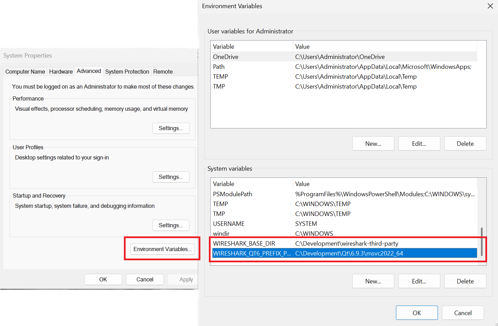
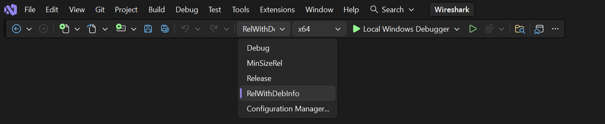

// WSDG Chapter Setup

[#ChapterSetup]

== Setup and Build Instructions

[#ChSetupAuto]
=== Automatic development setup (tools/setup-dev)

If you want a guided setup for dependencies and git hooks, run the helper scripts in the source tree root:

* Linux: `tools/setup-dev.sh` configures the commit template and hooks, then offers to run the distro-specific install script (Debian-based by default; Alpine, Arch, and RPM-based distros are auto-detected when possible).
* macOS: `tools/setup-dev.sh` configures hooks and asks whether to run the Homebrew setup (`tools/macos-setup-brew.sh`, default) or the non-Homebrew script (`tools/macos-setup.sh`).
* Windows / MSYS2 / MinGW: use `tools/setup-dev.ps1` (PowerShell) to configure hooks; follow <<ChSetupWindows>> for platform setup details.

[#ChSetupUNIX]

=== UN*X

[#ChSetupUNIXBuildEnvironmentSetup]

==== Build environment setup

The following must be installed in order to build Wireshark:

* A C compiler and a C++ compiler;
* The Flex lexical analyzer;
* Python 3;
* CMake;
* Several required libraries.

Either make or https://ninja-build.org/[Ninja] can be used to build Wireshark; at least one of
those must be installed.

To build the manual pages, Developer's Guide and User's Guide, Asciidoctor, Xsltproc, and DocBook must be installed.

Perl is required to generate some code and run some code analysis checks.

Some features of Wireshark require additional libraries to be installed.
The processes for doing so on various UN*X families is shown here.

There are shell scripts in the `tools` directory to install the packages
and libraries required to build Wireshark. Usage is available with the
`--help` option. `root` permission is required to run the scripts.
The available scripts and their options for a given family of UN*Xes are
shown in the section for that family.

[discrete]
==== Alpine Linux

The setup script is `tools/alpine-setup.sh`; its options are:

* `--install-optional` install optional software as well
* `--install-all` install everything
* `[other]` other options are passed as-is to apk

[discrete]
==== Arch Linux and pacman-based systems

The setup script is `tools/arch-setup.sh`; its options are:

* `--install-optional` install optional software as well
* `--install-test-deps` install packages required to run all tests
* `--install-all` install everything
* `[other]` other options are passed as-is to pacman

[discrete]
==== BSD systems such as FreeBSD, NetBSD, OpenBSD, and DragonFly BSD

The setup script is `tools/bsd-setup.sh`; its options are:

* `--install-optional` install optional software as well
* `[other]` other options are passed as-is to pkg manager

[discrete]
==== Debian, and Linux distributions based on Debian, such as Ubuntu

The setup script is `tools/debian-setup.sh`; its options are:

* `--install-optional` install optional software as well
* `--install-deb-deps` install packages required to build the .deb file
* `--install-test-deps` install packages required to run all tests
* `--install-qt5-deps` force installation of packages required to use Qt5 (not recommended)
* `--install-qt6-deps` force installation of packages required to use Qt6
* `--install-all` install everything
* `[other]` other options are passed as-is to apt

[discrete]
==== RPM-based Linux distributions such as Red Hat, Centos, Fedora, and openSUSE +

The setup script is `tools/rpm-setup.sh`; its options are:

* `--install-optional` install optional software as well
* `--install-rpm-deps` install packages required to build the .rpm file
* `--install-qt5-deps` force installation of packages required to use Qt5 (not recommended)
* `--install-qt6-deps` force installation of packages required to use Qt6
* `--install-all` install everything
* `[other]` other options are passed as-is to the packet manager

[discrete]
==== macOS

You must first install Xcode.

As with Windows we provide pre-built third party libraries which will be automatically installed if you set the `WIRESHARK_BASE_DIR` CMake variable to a directory that is writable by you, such as _/opt/wireshark-third-party_ or _wireshark-libraries_ at the same level as your Wireshark source code directory.

You can use `tools/macos-setup-brew.sh` to install the tools required to build Wireshark using the https://brew.sh/[Homebrew] package manager.
You can also use it to install third party libraries instead of setting `WIRESHARK_BASE_DIR`.

* `--install-required` install third party libraries required to build Wireshark. Not needed if you set `WIRESHARK_BASE_DIR`.
* `--install-optional` install optional third party libraries. Not needed if you set `WIRESHARK_BASE_DIR`.
* `--install-dmg-deps` install packages required to build the .dmg file
* `--install-sparkle-deps` install the Sparkle automatic updater
* `--install-all` install everything
* `--install-stratoshark` install libraries required to build Stratoshark and the Falco Events plugin
* `[other]` other options are passed as-is to brew

Running `tools/macos-setup-brew.sh` with no options will install CMake, Ninja, pgkconf, and ccache.

In the past, `tools/macos-setup.sh` could be used to build third party libraries locally.
It is now deprecated, and can only be used to install the tools required to build Wireshark or to remove any previously installed libraries.
It supports the following options:

* `-n` dry run; don't build or install any tools
* `-p` specify the installation prefix; _/usr/local_ is the default
* `-u` uninstall packages

We recommend setting `WIRESHARK_BASE_DIR` to install libraries, since it's easy and it's what we use to create the official packages.
If you're using Homebrew we recommend using `tools/macos-setup-brew.sh` with no options to install CMake and Ninja.

You will also have to install Qt 6. To install
Qt, go to the https://www.qt.io/download-qt-installer-oss[Download Qt
for open source use page], select “macOS” if it's not already selected,
and then select “Qt online installer for macOS“.  This will download a
.dmg for the installer; launch the installer.  It will require that you
log into your Qt account; if you don't have an account, select “Sign up“
to create one.  The next page will require you to accept the LGPL (Lesser
GNU Public License); do so.  Continue to the “Installation Folder“ page
of the installer screen, and select the “Custom installation“ option.
On the “Select Components“ screen of the installer, select your desired
Qt version. We recommend using the same Qt version used to build the official
Wireshark packages, which at the time of this writing is Qt {macos-qt6-lts-version}.
Select the following components:

* Desktop
* Qt 5 Compatibility Module
* Qt Debug Information Files (contains dSYM files which can be used for debugging)

Optionally, under "Additional Libraries" also select the following components:

* Qt Multimedia (to support advanced controls for playing back streams in the RTP Player dialog)

You can deselect all of the other the components such as “Qt Charts” or “Android xxxx”
as they aren’t required.

If you don't want register for the Qt Online Installer for macOS, you can install Qt from the command line using https://github.com/miurahr/aqtinstall/releases[Another (unofficial) Qt CLI Installer].
The AQt command to install Qt and the modules recommended above would look something like the following:

[source,sh,subs="attributes+"]
----
aqt install-qt mac desktop {macos-qt6-lts-version} clang_64 --modules qt5compat qtmultimedia debug_info
----

[#ChSetupUNIXBuild]

==== Building

Before building:

On macOS, you will need to set the Qt installation directory in the
environment:

[source,sh,subs="attributes+"]
----
CMAKE_PREFIX_PATH=/Users/your_username/Qt/{macos-qt6-lts-version}/macos
export CMAKE_PREFIX_PATH
----

If you want to append a custom string to the package version, run the
command

[source,sh,subs="attributes+"]
----
WIRESHARK_VERSION_EXTRA=-YourExtraVersionInfo
export WIRESHARK_VERSION_EXTRA
----

The recommended (and fastest) way to build Wireshark is with CMake
and Ninja. Building with make took nearly 2x time as Ninja in one
experiment.

CMake builds are best done in a separate build directory, such as a
`build` subdirectory of the top-level source directory.
If that directory is a subdirectory of the top-level source directory,
to generate the build files, change to the build directory and enter the
following command:

[source,sh]
----
cmake ..
----

to use make as the build tool or

[source,sh]
----
cmake -G Ninja ..
----

to use Ninja as the build tool.

If you created the build directory in the
same directory that contains the top-level Wireshark source directory,
to generate the build files, change to the build directory and enter the
following command:

[source,sh]
----
cmake ../{source directory}
----

to use make as the build tool or

[source,sh]
----
cmake -G Ninja ../{source directory}
----

to use Ninja as the build tool.  +
`{source directory}` is the name of the
top-level Wireshark source directory.

If you need to build with a non-standard configuration, you can run

[source,sh]
----
cmake -LH ../{source directory}
----

to see what options you have.

You can then run Ninja or make to build Wireshark.

[source,sh]
----
ninja
# or
make
----

Once you have build Wireshark with `ninja` or `make` above, you should be able to test it
by entering `run/wireshark`.

==== Optional: Install

Install Wireshark in its final destination:

[source,sh]
----
make install
----

Once you have installed Wireshark with `make install` above, you should be able
to run it by entering `wireshark`.

==== Optional: Create User’s and Developer’s Guide

To build the Wireshark User's Guide and the Wireshark Developer's Guide,
build the `all_guides` target, e.g.  `make all_guides` or `ninja
all_guides`.  Detailed information to build these guides can be found in
the file _doc/README.documentation.adoc_ in the Wireshark sources.

==== Optional: Create an installable or source code package

You can create packages using the following build targets and commands:

Source code tarball::
  Build the `dist` target.

deb (Debian) package::
  Create a symlink named _debian_ in the top-level source directory to _packaging/debian_, then run `dpkg-buildpackage`.

RPM package::
  Build the `wireshark_rpm` target.

https://appimage.org[AppImage] package::
  Build the `wireshark_appimage` target.

macOS .dmg package containing an application bundle::
  Build the `wireshark_dmg` or `stratoshark_dmg` targets.

Installable packages typically require building Wireshark first.

==== Troubleshooting during the build and install on Unix

A number of errors can occur during the build and installation process.
Some hints on solving these are provided here.

If the `cmake` stage fails you will need to find out why. You can check the
file `CMakeOutput.log` and `CMakeError.log` in the build directory to find
out what failed. The last few lines of this file should help in determining the
problem.

The standard problems are that you do not have a required development package on
your system or that the development package isn’t new enough. Note that
installing a library package isn’t enough. You need to install its development
package as well.

If you cannot determine what the problems are, send an email to the
_wireshark-dev_ mailing list explaining your problem. Include the output from
`cmake` and anything else you think is relevant such as a trace of the
`make` stage.

// Retain ChSetupWin32 for backward compatibility
[#ChSetupWindows]
=== Windows

A quick setup guide for Windows development with recommended configurations.

[#ChSetupWindowsMSVC]
==== Using Microsoft Visual Studio (recommended) [[ChSetupWin32]]

[WARNING]
====
Unless you know exactly what you are doing, you
should strictly follow the recommendations below. They are known to work
and if the build breaks, please re-read this guide carefully.

Known traps are:

. Not using the correct (x64 or arm64) version of the Visual Studio command prompt.

. Not using a supported version of Windows. Please check
  https://support.microsoft.com/en-gb/help/13853/windows-lifecycle-fact-sheet[here]
  that your installed version is supported and updated.

====

While this is a huge download, the Community Editions of Visual Studio are free (as in beer) and include the (great) Visual Studio integrated debugger.
Visual Studio is also used to create official Wireshark builds for Windows, so it will likely have fewer development-related problems.

[#ChSetupMSVC]

===== Install Microsoft Visual Studio

Download and install https://visualstudio.microsoft.com/thank-you-downloading-visual-studio/?sku=Community&channel=Stable&version=VS18[“Microsoft Visual Studio 2026 Community Edition”].
The examples below are for Visual Studio 2026 but can be adapted for Visual Studio 2022 or 2019.

Check the checkbox for “Desktop development with {cpp}”. The default component list is fine. You may uncheck components that you don't require, but keep at least:

* “MSVC Build Tools for x64/x86 (Latest)”
* “Windows 11 SDK (XXXXX)”
* “{cpp} CMake tools for Windows”

It might be possible to build Wireshark using https://clang.llvm.org/docs/MSVCCompatibility.html[clang-cl], but this has not been tested.
Compiling with plain gcc or Clang is not recommended and will certainly not work (at least not without a lot of advanced tweaking).
For further details on this topic, see <<ChToolsGNUChain>>. This may change in future as releases of Visual Studio add more cross-platform support.

[#ChSetupPython]

===== Install Python

Get a Python 3 installer from https://python.org/download/[] and install Python.
Its installation location varies depending on the options selected in the installer and on the version of Python that you are installing.

[#ChSetupGit]

===== Install Git

The official command-line installer is available at https://git-scm.com/download/win.

While installing, select :

* (recommended) Select components : Uncheck "Windows integration"

* Adjusting your PATH environment : _Git from the command line and also from 3rd-party software_. Do *not* select the _Use Git and optional Unix tools from the Windows Command Prompt_ option.

* (recommended) Choosing the SSH executable : Use external OpenSSH

* (recommended) Choosing HTTPS transport backend : Use the native Windows Secure Channel library

* (recommended) Configure the line ending conversions : Checkout Windows-style, commit Unix-style line endings

* Configuring the terminal emulator : _Use Windows' default console window_

* (recommended) Choose a credential helper : None

[#ChSetupQt]

===== Install Qt

The main Wireshark application uses the Qt windowing toolkit.

[TIP]
.Qt’s LTS branch
====
As of of Qt 6, the Qt Company does not provide binary packages of Long Term Support (LTS)
releases for open source use, and source packages are provided at a one year delay from
the commercial LTS release. Thus the LTS branch is likely not an available option.

To avoid unexpected bugs and regressions, we generally recommend using the same version of
Qt used in the official Wireshark packages. For the current stable release at the time of
this writing, that is {windows-qt6-lts-version}. If you use another version, note that the
last patch release of a Qt minor version is generally more stable than the first release of
the next minor version, e.g. Qt 6.9.3 vs 6.10.0.
====

[#ChSetupQtAqt]

====== Install Qt using AQt (recommended)

Using the official Qt installer (see <<ChSetupQtOfficial>>) requires creating an account.
A workaround is to use https://github.com/miurahr/aqtinstall/releases[Another (unofficial) Qt CLI Installer] instead.

You can choose installation folder of Qt. In the following example, we're using _C:\Development\Qt_

[source,cmd,subs="attributes+"]
----
mkdir C:\Development\Qt
cd C:\Development\Qt
curl.exe -LOJ https://github.com/miurahr/aqtinstall/releases/download/v3.3.0/aqt_x64.exe
.\aqt_x64.exe install-qt windows desktop {windows-qt6-lts-version} win64_msvc2022_64 -m qt5compat debug_info qtmultimedia
----

[#ChSetupQtOfficial]

====== Install Qt using the official installer

Go to the
https://www.qt.io/download-qt-installer-oss["Download Qt for open source
use” page],
select "Download the Qt Online Installer" in the "Looking for Qt Binaries"
section, select "Windows x86" or "Windows ARM64" as appropriate for your
system, and download "Qt Online Installer for Windows (x64)" or "Qt
Online Installer for Windows (ARM64)". When executing it, sign up or log in,
and use Next button to proceed. When you are asked to select packages to be
installed, select "*Custom installation*".

In the "Select Components" page, select your desired Qt version. We recommend
using the same Qt version shipped with the Windows installers for the current
stable Wireshark release, which at the time of this writing is Qt {windows-qt6-lts-version}.
Select the following components:

* MSVC 2022 64-bit or MSVC 2022 ARM64
* Qt 5 Compatibility Module
* Qt Debug Information Files (contains PDB files which can be used for debugging)

Optionally, under "Additional Libraries" also select the following components:

* Qt Multimedia (to support advanced controls for playing back streams in the RTP Player dialog)

You can deselect all of the other the components such as “Qt Charts” or “Android xxxx”
as they aren’t required.

[#ChSetupSetEnvVariables]

===== Configure environment variables

You need to set two configuration variables to be able to build wireshark:

* WIRESHARK_BASE_DIR : where the third party libraries will be downloaded, e.g. `C:\Development\wireshark-third-party`
* WIRESHARK_QT6_PREFIX_PATH (or CMAKE_PREFIX_PATH) (see `https://doc.qt.io/qt-6/cmake-get-started.html`) : pointing towards the Qt installation directory, e.g. `C:\Development\Qt{backslash}{windows-qt6-lts-version}\msvc2022_64`

The easiest way is to set those variables globally, search for "Edit the System Environment Variables" in Windows > Environment Variables

===== Install and Prepare Sources

[TIP]
.Make sure everything works
====
It’s a good idea to make sure Wireshark compiles and runs at least once before
you start hacking the Wireshark sources for your own project.
====

*Download the wireshark sources* into `C:\Development\wireshark` using either the command line :

[source,cmd]
----
cd C:\Development
git clone https://gitlab.com/wireshark/wireshark.git
----

[#ChSetupPrepareCommandCom]

===== Open a Visual Studio Command Prompt

From the Start Menu (or Start Screen), open the “Windows Terminal”, then ”Developer PowerShell for VS 18” using the dropdown.

image::images/win-setup-vs18shell.png[{screenshot-attrs}]

If you have not already done so globally in <<ChSetupSetEnvVariables>>, you can set the following environment variables, using paths and values suitable for your installation :

[source,cmd,subs="attributes+"]
----
rem Let CMake determine the library download directory name under WIRESHARK_BASE_DIR.
set WIRESHARK_BASE_DIR=C:\Development\wireshark-third-party
rem Set the Qt installation directory
set CMAKE_PREFIX_PATH=C:\Qt{backslash}{windows-qt6-lts-version}\msvc2022_64
rem Append a custom string to the package version. Optional.
set WIRESHARK_VERSION_EXTRA=-YourExtraVersionInfo
----

Setting these variables could be added to a batch file to be run after you open the Visual Studio Tools Command Prompt.
They can also be passed directly to CMake, e.g. `cmake -DWIRESHARK_BASE_DIR=...`

=====  Create (if required) and change to the correct build directory.

CMake is best used in an out-of-tree build configuration where the build is done in a separate directory from the source tree, leaving the source tree in a pristine state.
64 and 32 bit builds require a separate build directory.

// XXX Our CI builds are in-tree in <src dir>/build.
[source,cmd]
----
mkdir C:\Development\wsbuild64
cd C:\Development\wsbuild64
----
to create and jump into the build directory.

The build directory can be deleted at any time and the build files regenerated as detailed in <<ChWindowsGenerate>>.

[#ChWindowsGenerate]

===== Generate the build files

CMake is used to process the CMakeLists.txt files in the source tree and produce build files appropriate
for your system.

To generate the build files enter the following at the Visual Studio command prompt (adjusting the path to the Wireshark source tree as required) :
[source,cmd]
----
cd C:\Development\wsbuild64
cmake -G "Visual Studio 18 2026" -A x64 ..\wireshark
----

The initial generation step is only required the first time a build directory is created. Subsequent
builds will regenerate the build files as required.

To use a different generator modify the `-G` parameter.
`cmake -G` lists all the CMake supported generators, but only Visual Studio is supported for Wireshark builds.
32-bit builds are no longer supported.

The CMake generation process will download the required 3rd party libraries (apart from Qt)
as required, then test each library for usability before generating the build files.

At the end of the CMake generation process the following should be displayed:
----
-- Configuring done
-- Generating done
-- Build files have been written to: C:/Development/wsbuild64
----

If you get any other output, there is an issue in your environment that must be rectified before building.
Check the parameters passed to CMake, especially the `-G` option and the path to the Wireshark sources and
the environment variables `WIRESHARK_BASE_DIR` and `CMAKE_PREFIX_PATH`.

[#ChWindowsBuild]

===== Build Wireshark

Now it’s time to build Wireshark!

. Navigate to `C:\Development\wsbuild64`

. Open `Wireshark.sln`

. Choose the `RelWithDebInfo` configuration
+

+
. Press Ctrl+Shift+B or Build > Build Solution

. Wait for Wireshark to compile. This will take a while, and there will be a lot of text output in the command prompt window

. Run _C:\Development\wsbuild64\run\RelWithDebInfo\Wireshark.exe_ and make sure it starts.

. Open menu:Help[About]. If it shows your "private" program
version, e.g.: Version {wireshark-version}-myprotocol123
congratulations! You have compiled your own version of Wireshark!

You may also build Wireshark from Visual Studio command line, using :

[source,cmd,subs="attributes+"]
----
cd C:\Development\wsbuild64
msbuild /m /p:Configuration=RelWithDebInfo Wireshark.sln
----

TIP: If compilation fails for suspicious reasons after you changed some source
files try to clean the build files by doing `Build > Clean solution` (or running `msbuild /m /p:Configuration=RelWithDebInfo Wireshark.sln /t:Clean`)
and then building the solution again.

The build files produced by CMake will regenerate themselves if required by changes in the source tree.

====== Debug Environment Setup

You can debug using the Visual Studio Debugger or WinDbg. See the section
on using the <<ChToolsDebugger, Debugger Tools>>.

===== Optional: Building the User’s and Developer’s Guide

To build the Wireshark User's Guide and the Wireshark Developer's Guide,
build the `all_guides` target, e.g.

[source,cmd,subs="attributes+"]
----
cd C:\Development\wsbuild64
msbuild doc\all_guides.vcxproj
----

Detailed information to build these guides can be found in the file
`doc\README.documentation.adoc` in the Wireshark sources.

Building the documentation requires `Xsltproc` as an additional dependency :

[#ChSetupXsltproc]

====== Install Xsltproc

Asciidoctor, xsltproc, and DocBook are required to build the documentation.
CMake will download a pre-built version of Asciidoctor and DocBook on Windows, but xsltproc must be installed manually.
You can install it using Chocolatey (https://chocolatey.org/install):

[source,cmd]
----
choco install -y xsltproc
----

// winget has no Asciidoctor, xsltproc, or DocBook packages.

===== Optional: Creating a Wireshark Installer

Note: You should have successfully built Wireshark
before doing the following.

If you want to build your own
_Wireshark-{wireshark-version}-myprotocol123-x64.exe_, you'll need
NSIS. You can download it from http://nsis.sourceforge.net[].

Note that the 32-bit version of NSIS will work for both 64-bit and 32-bit versions of Wireshark.
NSIS version 3 is required.

If you've closed the Visual Studio Command Prompt <<ChSetupPrepareCommandCom,prepare>> it again. Run

[source,cmd]
----
msbuild /m /p:Configuration=RelWithDebInfo wireshark_nsis_prep.vcxproj
msbuild /m /p:Configuration=RelWithDebInfo wireshark_nsis.vcxproj
----

to build a Wireshark installer.
If you sign your executables you should do so between the “wireshark_nsis_prep” and “wireshark_nsis” steps.
To sign your installer you should place the signing batch script on the path. It must be named "sign-wireshark.bat".
It should be autodetected by CMake, to always require signing set the -DENABLE_SIGNED_NSIS=On CMake option.

Run

[source,cmd,subs="attributes+"]
----
packaging\nsis\wireshark-{wireshark-version}-myprotocol123-x64.exe
----

to test your new installer.
It’s a good idea to test on a different machine than the developer machine.

// ====== Only if needed: Install Perl
//
// As discussed in the <<ChToolsWindowsPerl,Tool Reference>>, you should avoid installing Perl on Windows unless you have a specific need for it.
//
// If you do need Perl you can get an installer from
// https://strawberryperl.com/
// or
// https://www.activestate.com/
// and install it into the default location.
//
// Alternatively you can install Perl using Chocolatey:
//
// [source,cmd]
// ----
// choco install -y strawberryperl
// # ...or...
// choco install -y activeperl
// ----

// winget has StrawberryPerl.
// https://github.com/microsoft/winget-pkgs/tree/master/manifests/s/StrawberryPerl/StrawberryPerl

[#ChSetupMSYS2]

==== Using MinGW-w64 with MSYS2

MSYS2 comes with different environments/subsystems and the first thing you
have to decide is which one to use. The differences among the environments
are mainly environment variables, default compilers/linkers, architecture,
system libraries used etc. If you are unsure, go with UCRT64.

===== Building from source

. Open the shell for the selected 64-bit environment.

. Download the Wireshark source code using Git, if you haven't done so already,
  and cd into that directory.

. Install needed dependencies:

    tools/msys2-setup.sh --install-all

. Build using CMake + Ninja:

    mkdir build && cd build
    # Ninja generator is the default
    cmake -DENABLE_CCACHE=On ..
    ninja
    ninja test        # optional, to run the test suite
    ninja install     # optional, install to the MSYS2 shell path

The application should be launched using the same shell.

===== Building an .exe installer

. Follow the instructions above to compile Wireshark from source.

. Build the NSIS installer target.

    ninja wireshark_nsis_prep
    ninja wireshark_nsis

If successful the installer can be found in `$CMAKE_BINARY_DIR/packaging/nsis`.

Alternatively you can also use the PKGBUILD included in the Wireshark
source distribution to compile Wireshark into a binary package that can be
https://www.msys2.org/wiki/Creating-Packages/[installed using pacman].

===== Comparison with MSVC toolchain

The official Wireshark Windows installer is compiled using Microsoft Visual
Studio (MSVC). Currently the MSYS2 build has the following limitations compared to
the build using MSVC:

* Lua does not have https://github.com/Lekensteyn/lua-unicode[custom UTF-8 patches].

* The Event Tracing for Windows (ETW) extcap cannot be compiled using MinGW-w64.

* Enhanced Kerberos dissection with decryption is not available.

[#ChSetupWSL2]

==== Using WSL2 on a Windows Host

Using WSL2 on a Windows machine can provide a quick and easy way for beginners
to get started. This section will focus on using the official Debian
distribution installed from the `wsl` CLI command or Windows App Store.

This will allow for a quick and easy way to build Wireshark. Please note
that while this guide is sufficient for an environment to build and test minor changes,
some changes and enhancements will still need to be built and tested for Windows
as described in the sections above.

To install WSL2 for the first time and Debian via the CLI run (as administrator):

  wsl --install
  wsl --install -d Debian

https://learn.microsoft.com/en-us/windows/wsl/install[Please see the documentation on WSL for help with installation.]

From here following the build guide for Debian based Un*x systems should finish
the setup of the build environment. See <<ChSetupUNIX>> for
details on compiling, building, and running Wireshark on Debian. WSL2 supports
both X11 and Wayland to enable the use of GUI applications without any additional
requirements. Please see the https://learn.microsoft.com/en-us/windows/wsl/tutorials/gui-appsp[WSL2 reference of GUIs for more detail.]

[NOTE]
.For First Time Contributors
====
It is highly recommended to review the source control process before attempting
to build any changes.

Please see:

  - <<ChSrcGit>>
  - <<ChSrcGitUpdate>>
  - <<ChSrcContribute>>

For a description of the process.
====

[#ChSetupCross]

==== Cross-compilation using Linux

It is possible to compile Wireshark for Microsoft Windows using Linux and MinGW.
This way developers can deploy Wireshark on Windows systems without requiring
a Windows host machine. Building for Windows using a Linux host is also
easier for devs already familiar with Linux, the build itself is faster and it
uses a very mature C/C++ compiler (GCC) and debugger (GDB).

===== Using Fedora Linux

https://fedoraproject.org/[Fedora Linux] provides the best out-of-the-box
support for MinGW cross-compilation. Fedora is what the project uses to test
the build and it's what we recommend. While any other reasonably modern Linux
distribution can be used, that will make the process more time consuming and
involve some trial and error to setup.

The build instructions on Fedora follow the familiar recipe for building Wireshark
using Linux.

====== Building from source

. Install needed dependencies:

  tools/mingw-rpm-setup.sh --install-all

. Build using CMake + Ninja:

  mkdir build && cd build
  mingw64-cmake -G Ninja -DENABLE_CCACHE=Yes -DFETCH_lua=Yes ..
  ninja
+
Note that currently it is not possible to run the test-suite when cross-compiling.

. Build the NSIS installer

  ninja wireshark_nsis_prep
  ninja wireshark_nsis

If successful the installer can be found in `$CMAKE_BINARY_DIR/packaging/nsis`.

====== Notes and comparison with MSVC builds

* Only the MSVCRT C library for Microsoft Windows can be used. Support for the
  UCRT (Universal C Runtime) library on Fedora Linux is in the initial stages of
  deployment and not ready for prime-time (at the time of this writing).

* Some optional dependencies are missing from Fedora repositories and must be
  compiled from source if desired. An up-to-date complete list can be found in
  the bug tracker (https://gitlab.com/wireshark/wireshark/-/issues/19108[issue 19108]).

* Lua does not have https://github.com/Lekensteyn/lua-unicode[custom UTF-8 patches].

* The Event Tracing for Windows (ETW) extcap cannot be compiled using MinGW-w64.

* Enhanced Kerberos dissection with decryption is not available.

===== Using Arch Linux

https://archlinux.org/[Arch Linux] has good support for MinGW using packages
from the https://aur.archlinux.org/[AUR]. Note that the mingw-w64 AUR packages
sometimes break. If that happens you may be required to fix it or skip the
package until it is fixed by the maintainer, if it's an optional dependency.
You may also want to consider using an
https://wiki.archlinux.org/title/unofficial_user_repositories[unofficial user repository]
(such as the https://martchus.no-ip.biz/repo/arch/ownstuff/[ownstuff] repository)
to provide pre-compiled packages. This will greatly simplify the initial setup
and subsequent upgrades.

CAUTION: AUR packages and unofficial user repositories are user-produced
content. These packages are completely unofficial and have not been thoroughly
vetted. It is your decision whether to trust their maintainers and you take
full responsibility for choosing to use them.

You will need to install an https://wiki.archlinux.org/title/AUR_helpers[AUR helper].
This guide assumes `paru` is being used.

. Install required dependencies from official repositories:

  pacman -S mingw-w64 nsis lemon qt6-tools ccache

. Install required dependencies from the AUR:

  paru -S mingw-w64-cmake
  paru -S mingw-w64-glib2
  paru -S mingw-w64-libgcrypt
  paru -S mingw-w64-libxml2
  paru -S mingw-w64-c-ares
  paru -S mingw-w64-speexdsp
  paru -S mingw-w64-libpcap

. Install Qt6:

  paru -S mingw-w64-qt6-base mingw-w64-qt6-5compat mingw-w64-qt6-multimedia

. Install optional dependencies:

  paru -S mingw-w64-gnutls
  paru -S mingw-w64-lz4
  paru -S mingw-w64-snappy
  paru -S mingw-w64-opus
  paru -S mingw-w64-opencore-amr
  paru -S mingw-w64-libnghttp2
  paru -S mingw-w64-libssh
  paru -S mingw-w64-minizip
+
Search the AUR for other dependencies not listed above.

. Build Wireshark using CMake + Ninja. From the directory containing the
  Wireshark source tree run:

  mkdir build && cd build
  x86_64-w64-mingw32-cmake -G Ninja -DENABLE_CCACHE=Yes -DFETCH_lua=Yes \
        -DMINGW_SYSROOT=/usr/x86_64-w64-mingw32 ..
  ninja
+
This will automatically download and build Lua as a static library.
+
To reconfigure the CMake build you may to do it explicitly by running
`x86_64-w64-mingw32-cmake .` in the build directory,
instead of letting `ninja` do it for you automatically.

. Build the NSIS installer

  ninja wireshark_nsis_prep
  ninja wireshark_nsis

If everything goes well the installer can be found in `$CMAKE_BINARY_DIR/packaging/nsis`.

The same notes as the build using Fedora apply.
