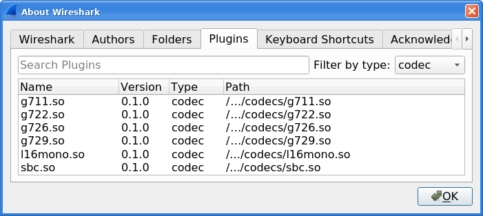
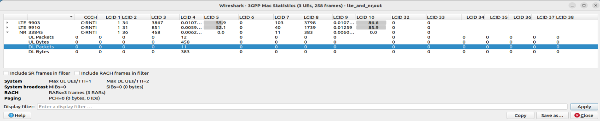
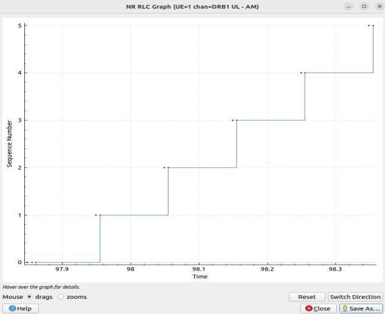
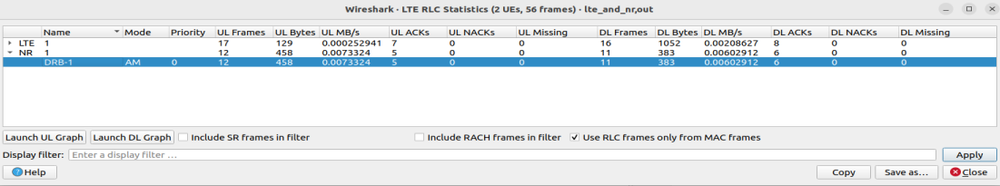
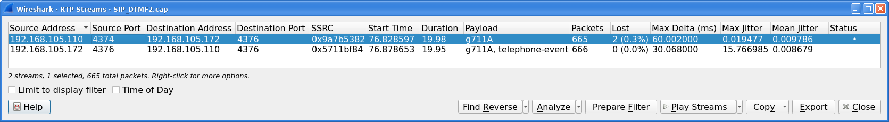
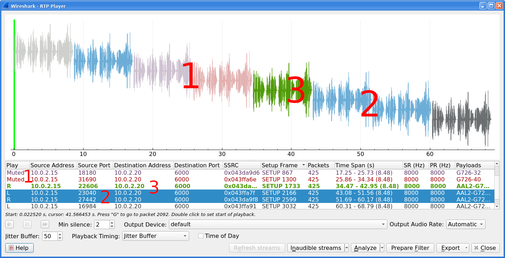
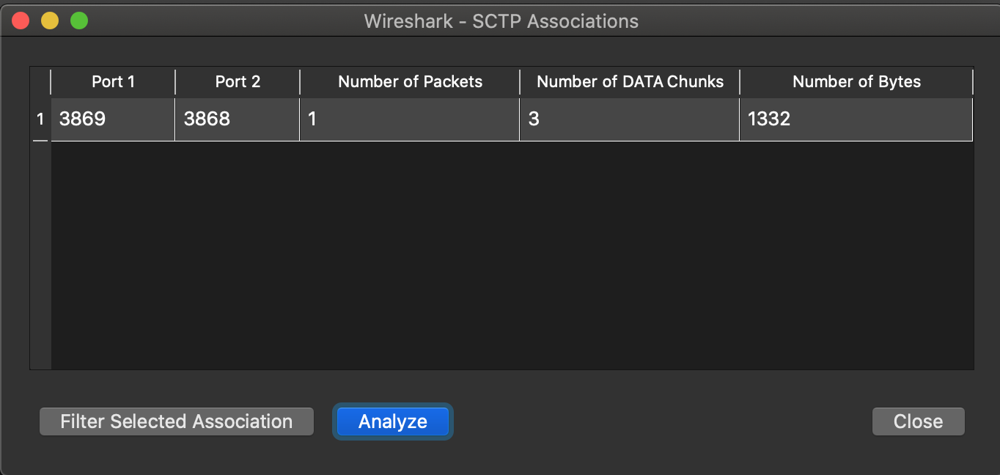

// WSUG Chapter Telephony

[#ChTelephony]

== Telephony

[#ChTelIntroduction]

=== Introduction

Wireshark provides a wide range of telephony related network statistics which
can be accessed via the menu:Telephony[] menu.

These statistics range from specific signaling protocols, to analysis of
signaling and media flows. If encoded in a compatible encoding the media flow
can even be played.

The protocol specific statistics windows display detailed information of
specific protocols and might be described in a later version of this document.

Some of these statistics are described at the
{wireshark-wiki-url}Statistics pages.

[#ChTelPlayingCalls]

=== Playing VoIP Calls

The tool for playing VoIP calls is called <<ChTelRtpPlayer,RTP Player>>. It shows RTP streams and its waveforms, allows play stream and export it as audio or payload to file. Its capabilities depend on supported codecs.

==== Supported codecs

RTP Player is able to play any codec supported by an installed plugin. The codecs supported by RTP Player depend on the version of Wireshark you're using. The official builds contain all of the plugins maintained by the Wireshark developers, but custom/distribution builds might not include some of those codecs. To check your Wireshark installation's installed codec plugins, do the following:

* Open menu:Help[About Wireshark] window
* Select the menu:Plugins[] tab
* In the menu:Filter by type[] menu on the top-right, select codec

.List of supported codecs

==== Work with RTP streams - Playlist

Wireshark can be used for RTP stream analysis. User can select one or more streams which can be played later. RTP Player window maintains playlist (list of RTP streams) for this purpose.

Playlist is created empty when RTP Player window is opened and destroyed when window is closed. RTP Player window can be opened on background when not needed and put to front later. During its live, playlist is maintained.

When RTP Player window is opened, playlist can be modified from other tools (Wireshark windows) in three ways:

* button menu:Play Streams[Set playlist] clears existing playlist and adds streams selected in the tool.
* button menu:Play Streams[Add to playlist] adds streams selected in the tool to playlist. Duplicated streams are not inserted again.
* button menu:Play Streams[Remove from playlist] removes streams selected in the tool from playlist, if they are in the playlist.

.btn:[Play Streams] button with opened action menu
image::images/ws-tel-rtp-player_button.png[]

btn:[Play Streams] button can be clicked directly and opens RTP Player window directly with btn:[Set playlist] action. All actions can be selected with the small down arrow next to the button.

When the playlist is empty, there is no difference between btn:[Set playlist] and btn:[Add to playlist]. When the RTP Player window is not opened, all three actions above open it.

btn:[Remove from playlist] is useful e.g. in case user selected all RTP streams and wants to remove RTP streams from specific calls found with menu:VoIPCalls[].

Tools below can be used to maintain content of playlist, they contain btn:[Play Streams] button. You can use one of procedures (Note: btn:[Add to playlist] action is demonstrated):

* Open menu:Telephony[RTP > RTP Streams] window, it will show all streams in the capture. Select one or more streams and then press btn:[Play Streams]. Selected streams are added to playlist.
* Select any RTP packet in packet list, open menu:Telephony[RTP > Stream Analysis] window. It will show analysis of selected forward stream and its reverse stream (if btn:[Ctrl] is pressed during window opening). Then press btn:[Play Streams]. Forward and reverse stream is added to playlist.
** menu:RTP Stream Analysis[] window can be opened from other tools too.
* Open menu:Telephony[VoIP Calls] or menu:Telephony[SIP Flows] window, it will show all calls. Select one or more calls and then press btn:[Play Streams]. It will add all RTP streams related to selected calls to playlist.
* Open btn:[Flow Sequence] window in menu:Telephony[VoIP Calls] or menu:Telephony[SIP Flows] window, it will show flow sequence of calls. Select any RTP stream and then press btn:[Play Streams]. It will add selected RTP stream to playlist.

.Tools for modifying playlist in RTP Player window
image::images/ws-tel-playlist.png[]

[NOTE]
====
Same approach with set/add/remove actions is used for RTP Stream Analysis window. The playlist is there handled as different tabs in the window, see <<ChTelRTPAnalysis,RTP Stream Analysis>> window.
====

[#ChTelPlayingCallsLive]

==== Playing audio during live capture

Decoding RTP payload and showing waveforms is time consuming task. To speedup it RTP Player window uses copy of packet payload for all streams in the playlist. During live capture the dialog is not refreshed automatically as other Wireshark dialogs, but user must initiate it.

The copy is created or refreshed and dialog updated:

* Every time window is opened.
* Every time a new stream is added or set.
* During live capture, when btn:[Refresh streams] is pressed.
* Every time live capture is finished/stopped by a user.

When capture file is opened (no live capturing), streams are read complete, no user action is required. Button btn:[Refresh streams] is disabled as it is useless.

When live capture is running, streams are read only till "now" and are shown. When stream is continuous and user would like to see additional part, they must press btn:[Refresh stream]. When the user ends live capture, view is refreshed and button is disabled.

[NOTE]
====
RTP Player dialog stays open even live capture is stopped and then started again. Play list stays unchanged. Therefore, btn:[Refresh stream] tries to read same streams as before and shows them if they are still running. Past part of them (from previous live capture) is lost.
====

==== RTP Decoding Settings

RTP is carried usually in UDP packets with random source and destination ports. Therefore, Wireshark can only recognize RTP streams based on VoIP signaling, e.g., based on SDP messages in SIP signaling. If signaling is not captured, Wireshark shows just UDP packets. However, there are multiple settings which help Wireshark recognize RTP even when there is no related signaling.

You can use <<ChAdvDecodeAsFig,Decode As...>> function from menu:Analyze[Decode As...] menu or in mouse context menu. Here you can set that traffic on specific source or destination should be decoded as RTP. You can save settings for later use.

Use of menu:Decode As...[] menu works fine, but is arduous for many streams.

You can enable heuristic dissector menu:rtp_udp[] in menu:Analyze[Enabled Protocols...]. See <<ChCustProtocolDissectionSection>> for details. Once menu:rtp_udp[] is enabled, Wireshark tries to decode every UDP packet as RTP. If decoding is possible, packet (and entire UDP stream) is decoded as RTP.

When an RTP stream uses a well-known port, the heuristic dissector ignores it. So you might miss some RTP streams. You can enable setting for udp protocol menu:Preferences[Protocols > udp > Try heuristic sub-dissectors first], see <<ChCustPreferencesSection>>. In this case heuristics dissector tries to decode UDP packet even it uses a well-known port.

[NOTE]
====
Take into account that heuristics is just simple "test" whether packet can be read as RTP. It can be false positive and you can see decoded as RTP more UDP packets than expected.

When you enable menu:udp[Try heuristic sub-dissectors first], it increases possibility of false positives. If you capture all traffic in network, false positives rate can be quite high.
====

RTP Player must store decoded data somewhere to be able to play it. When data are decoded, there are audio samples and dictionary for fast navigation. Both types of data are stored in memory for default, but you can configure Wireshark to store it on disk. There are two settings:

* ui.rtp_player_use_disk1 - When set to FALSE (default), audio samples are kept in memory. When set to TRUE, audio samples are stored on temporary file.
* ui.rtp_player_use_disk2 - When set to FALSE (default), dictionary is kept in memory. When set to TRUE, dictionary is stored on temporary file.

When any data are configured to be stored on disk, one file is created for each stream. Therefore, there might be up to two files for one RTP stream (audio samples and dictionary). If your OS or user has OS enforced limit for count of opened files (most of Unix/Linux systems), you can see fewer streams that was added to playlist. Warnings are printed on console in this case and you will see fewer streams in the playlist than you send to it from other tools.

For common use you can use default settings - store everything in memory. When you will be out of memory, switch ui.rtp_player_use_disk1 to TRUE first - it saves much more memory than ui.rtp_player_use_disk2.

==== VoIP Processing Performance and Related Limits

Processing of RTP and decoding RTP voice takes resources. There are raw estimates you can use as guidelines...

RTP Streams window can show as many streams as found in the capture. Its performance is limited just by memory and CPU.

RTP Player can handle 1000+ streams, but take into account that waveforms are very small and difficult to recognize in this case.

RTP Player plays audio by OS sound system and OS is responsible for mixing audio when multiple streams are played. In many cases OS sound system has limited count of mixed streams it can play/mix. RTP Player tries to handle playback failures and show warning. If it happens, just mute some streams and start playback again.

RTP Analysis window can handle 1000+ streams, but it is difficult to use it with so many streams - it is difficult to navigate between them. It is expected that RTP Analysis window will be used for analysis of lower tens of streams.

[#ChTelVoipCalls]

=== VoIP Calls Window

The VoIP Calls window shows a list of all detected VoIP calls in the captured
traffic. It finds calls by their signaling and shows related RTP streams. The current VoIP supported protocols are:

* H.323
* IAX2
* ISUP
* MGCP/MEGACO
* SIP
* SKINNY
* UNISTIM

See {wireshark-wiki-url}VOIPProtocolFamily[VOIPProtocolFamily] for an overview of the used VoIP protocols.

VoIP Calls window can be opened as window showing all protocol types (menu:Telephony[VoIP Calls] window) or limited to SIP messages only (menu:Telephony[SIP Flows] window).

.VoIP Calls window
image::images/ws-tel-voip-calls.png[{screenshot-attrs}]

User can use shortcuts:

* Selection
** kbd:[Ctrl + A] - Select all streams
** kbd:[Ctrl + I] - Invert selection
** kbd:[Ctrl + Shift + A] - Select none
** Note: Common kbd:[Mouse click], kbd:[Shift + Mouse click] and kbd:[Ctrl + Mouse click] works too
* On selected call/calls
** kbd:[S] - Selects stream/streams related to call in RTP Streams window (if not opened, it opens it and put it on background).
** kbd:[D] - Deselects stream/streams related to call in RTP Streams window (if not opened, it opens it and put it on background).

Available controls are:

* btn:[Limit to display filter] filters calls just to ones matching display filter. When display filter is active before window is opened, checkbox is checked.
* btn:[Time of Day] switches format of shown time between relative to start of capture or absolute time of received packets.
* btn:[Flow Sequence] opens <<ChStatFlowGraph,Flow Sequence>> window and shows selected calls in it.
* btn:[Prepare Filter] generates display filter matching to selected calls (signaling and RTP streams) and apply it.
* btn:[Play Streams] opens <<ChTelRtpPlayer,RTP Player>> window. Actions btn:[Set], btn:[Add] and btn:[Remove] are available.
* btn:[Copy] copies information from table to clipboard in CSV or YAML.

[#ChTelANSI]

=== ANSI

This menu shows groups of statistic data for mobile communication protocols according to ETSI GSM standards.

==== A-I/F BSMAP Statistics Window

The A-Interface Base Station Management Application Part (BSMAP) Statistics window shows the messages list and the number of the captured messages. There is a possibility to filter the messages, copy or save the date into a file.

==== A-I/F DTAP Statistics Window

The A-Interface Direct Transfer Application Part (DTAP) Statistics widow shows the messages list and the number of the captured messages. There is a possibility to filter the messages, copy or save the date into a file.

[#ChTelGSM]

=== GSM Windows

The Global System for Mobile Communications (GSM) is a standard for mobile networks. This menu shows a group of statistic data for mobile communication protocols according to ETSI GSM standard.

[#ChTelIAX2Analysis]

=== IAX2 Stream Analysis Window

The “IAX2 Stream Analysis” window shows statistics for the forward and reverse
streams of a selected IAX2 call along with a graph.

[#ChTelISUPMessages]

=== ISUP Messages Window

Integrated Service User Part (ISUP) protocol provides voice and non-voice signaling for telephone communications. ISUP Messages menu opens the window which shows the related statistics. The user can filter, copy or save the data into a file.

[#ChTelLTE]

=== LTE

[#ChTelLTEMACTraffic]

==== LTE MAC Traffic Statistics Window

Statistics of the captured LTE MAC traffic. This window will summarize the LTE
MAC traffic found in the capture.

.The “LTE MAC Traffic Statistics” window

The top pane shows statistics for common channels. Each row in the middle pane
shows statistical highlights for exactly one UE/C-RNTI. In the lower pane, you
can see the for the currently selected UE/C-RNTI the traffic broken down by
individual channel.

[#ChTelLTERLCGraph]

==== LTE RLC Graph Window

The LTE RLC Graph menu launches a graph which shows LTE Radio Link Control protocol sequence numbers changing over time along with acknowledgements which are received in the opposite direction.

NOTE: That graph shows data of a single bearer and direction. The user can also launch it from the `RLC Statistics` window.

.The RLC Graph window

[.small]#_The image of the RLC Graph is borrowed from link:{wireshark-wiki-url}RLC-LTE[the Wireshark wiki]._#

[#ChTelLTERLCTraffic]

==== LTE RLC Traffic Statistics Window

Statistics of the captured LTE RLC traffic. This window will summarize the LTE
RLC traffic found in the capture.

.The “LTE RLC Traffic Statistics” window

At the top, the check-box allows this window to include RLC PDUs found within
MAC PDUs or not. This will affect both the PDUs counted as well as the display
filters generated (see below).

The upper list shows summaries of each active UE. Each row in the lower list
shows statistical highlights for individual channels within the selected UE.

The lower part of the windows allows display filters to be generated and set for
the selected channel. Note that in the case of Acknowledged Mode channels, if a
single direction is chosen, the generated filter will show data in that
direction and control PDUs in the opposite direction.

[#ChTelMTP3]

=== MTP3 Windows

The Message Transfer Part level 3 (MTP3) protocol is a part of the Signaling System 7 (SS7). The Public Switched Telephone Networks use it for reliable, unduplicated and in-sequence transport of SS7 messaging between communication partners.

This menu shows MTP3 Statistics and MTP3 Summary windows.

[#ChTelOsmux]

=== Osmux Windows

OSmux is a multiplex protocol designed to reduce bandwidth usage of satellite-based GSM systems's voice (RTP-AMR) and signaling traffic. The OSmux menu opens the packet counter window with the related statistic data. The user can filter, copy or save the data into a file.

[#ChTelRTP]

=== RTP

[#ChTelRTPStreams]

==== RTP Streams Window

The RTP streams window shows all RTP streams in capture file. Streams can be selected there and on selected streams other tools can be initiated.

.The “RTP Streams” window

User can use shortcuts:

* Selection
** kbd:[Ctrl + A] - Select all streams
** kbd:[Ctrl + I] - Invert selection
** kbd:[Ctrl + Shift + A] - Select none
** Note: Common kbd:[Mouse click], kbd:[Shift + Mouse click] and kbd:[Ctrl + Mouse click] works too
* Find Reverse
** kbd:[R] - Try search for reverse streams related to already selected streams. If found, selects them in the list too.
** btn:[Shift+R] - Select all pair streams (forward/reverse relation).
** btn:[Ctrl+R] - Select all single streams (no reverse stream does exist).
* kbd:[G] - Go to packet of stream under the mouse cursor.
* kbd:[M] - Mark all packets of selected streams.
* kbd:[P] - Prepare filter matching selected streams and apply it.
* kbd:[E] - Export selected streams in RTPDump format.
* kbd:[A] - Open <<ChTelRTPAnalysis,RTP Stream Analysis>> window and add selected streams to it.

Available controls are:

* Find Reverse
** btn:[Find Reverse] search for reverse stream of every selected stream. If found, selects it in the list too.
** btn:[Find All Pairs] select all streams which have forward/reverse relation.
** btn:[Find Only Single] select all streams which are single - have no reverse stream.
* btn:[Analyze] opens <<ChTelRTPAnalysis,RTP Stream Analysis>> window. Actions btn:[Set], btn:[Add] and btn:[Remove] are available.
* btn:[Prepare Filter] prepares filter matching selected streams and apply it.
* btn:[Play Streams] opens <<ChTelRtpPlayer,RTP Player>> window. Actions btn:[Set], btn:[Add] and btn:[Remove] are available.
* btn:[Copy] copies information from table to clipboard in CSV or YAML.
* btn:[Export] exports selected streams in RTPDump format.

[#ChTelRTPAnalysis]

==== RTP Stream Analysis Window

The RTP analysis function takes the selected RTP streams and generates a list of
statistics on them including a graph.

The menu:Telephony[RTP > RTP Stream Analysis] menu item is enabled only when the
selected packet is an RTP packet. When the action is selected, the RTP Stream
Analysis window is opened (if not already) and the RTP stream of the current
packet is added for analysis. If btn:[Ctrl] is pressed when selecting the
menu item, other RTP streams on the same addresses and ports (in both forward
and reverse direction) are scanned for and added to the window too if found.

Every stream is shown on its own tab. Tabs are numbered as streams are added
and each tooltip shows the identification of the stream. When a tab is closed,
its number is not reused. The tab color matches the color of the corresponding
graph on the graph tab.

.The “RTP Stream Analysis” window
image::images/ws-tel-rtpstream-analysis_1.png[{screenshot-attrs}]

.Error indicated in “RTP Stream Analysis” window
image::images/ws-tel-rtpstream-analysis_3.png[{screenshot-attrs}]

Per packet statistic shows:

* Packet number
* Sequence number
* Delta (ms) to last packet
* Jitter (ms)
* Skew
* Bandwidth
* Marker - packet is marked in RTP header
* Status - information related to the packet. E. g. change of codec, DTMF number, warning about incorrect sequence number.

Side panel left to packet list shows stream statistics:

* Maximal delta and at which packet it occurred
* Maximal jitter
* Mean jitter
* Maximal skew
* Count of packets
* Count of lost packets - calculated from sequence numbers
* When the stream starts and first packet number
* Duration of the stream
* Clock drift
* Frequency drift

[NOTE]
====
Some statistic columns are calculated only when Wireshark is able to decode codec of RTP stream.
====

Available shortcuts are:

* kbd:[G] - Go to selected packet of stream in packet list
* kbd:[N] - Move to next problem packet

Available controls are:

* Prepare Filter
** btn:[Current Tab] prepares filter matching current tab and applies it.
** btn:[All Tabs] prepares filter matching all tabs and applies it.
* btn:[Play Streams] opens <<ChTelRtpPlayer,RTP Player>> window. Actions btn:[Set], btn:[Add] and btn:[Remove] are available.
* btn:[Export] allows export current stream or all streams as CSV or export graph as image in multiple different formats (PDF, PNG, BMP and JPEG).

.Graph in “RTP Stream Analysis” window
image::images/ws-tel-rtpstream-analysis_2.png[{screenshot-attrs}]

Graph view shows graph of:

* jitter
* difference - absolute value of difference between expected and real time of packet arrival
* delta - time difference from reception of previous packet

for every stream. Checkboxes below graph are enabling or disabling showing of a graph for every stream. btn:[Stream X] checkbox enables or disables all graphs for the stream.

[NOTE]
====
Stream Analysis window contained tool for save audio and payload for analyzed streams. This tool was moved in Wireshark 3.5.0 to <<ChTelRtpPlayer,RTP Player>> window. New tool has more features.
====

[#ChTelRtpPlayer]

==== RTP Player Window

The RTP Player function is a tool for playing VoIP calls. It shows RTP streams
and their waveforms, and can play the streams and export them to file as audio
or raw payload. See related concepts in <<ChTelPlayingCalls>>.

The menu:Telephony[RTP > RTP Player] menu item is enabled only when the
selected packet is an RTP packet. When the action is selected, the RTP Player
window is opened (if not already) and the RTP stream of the current packet is
added to the playlist. If btn:[Ctrl] is pressed when selecting the menu item,
other RTP streams on the same addresses and ports (in both forward and reverse
direction) are scanned for and added to the playlist too if found.

.RTP Player window
image::images/ws-tel-rtp-player_1.png[{screenshot-attrs}]

RTP Player Window consists of three parts:

. Waveform view
. Playlist
. Controls

Waveform view shows visual presentation of RTP stream. Color of waveform and playlist row are matching. Height of wave shows volume.

Waveform shows error marks for Out of Sequence, Jitter Drops, Wrong Timestamps and Inserted Silence marks if it happens in a stream.

.Waveform with error marks
image::images/ws-tel-rtp-player_3.png[{screenshot-attrs}]

Playlist shows information about every stream:

* Play - Audio routing
* Source Address, Source Port, Destination Address, Destination Port, SSRC
* Setup Frame
** SETUP <number> is shown, when there is known signaling packet. Number is packet number of signaling packet. Note: Word SETUP is shown even RTP stream was initiated e. g. by SKINNY where no SETUP message exists.
** RTP <number> is shown, when no related signaling was found. Number is packet number of first packet of the stream.
* Packets - Count of packets in the stream.
* Time Span - Start - Stop (Duration) of the stream
* SR - Sample rate of used codec
* PR - Decoded play rate used for stream playing
* Payloads - One or more payload types used by the stream

[NOTE]
====
When rtp_udp is active, most of streams shows just RTP <number> even there is setup frame in capture.

When RTP stream contains multiple codecs, SR and PR is based on first observed coded. Later codecs in stream are resampled to first one.
====

Controls allow a user to:

* btn:[Start]/btn:[Pause]/btn:[Stop] playing of unmuted streams
* btn:[>>] enabling/disabling silence skipping
** Min silence - Minimal duration of silence to skip in seconds. Shorter silence is played as it is.
* Select btn:[Output audio device] and btn:[Output audio rate]
* Select btn:[Playback Timing]
** Jitter Buffer - Packets outside btn:[Jitter Buffer] size are discarded during decoding
** RTP Timestamp - Packets are ordered and played by its Timestamp, no Jitter Buffer is used
** Uninterrupted Mode - All gaps (e. g. Comfort Noise, lost packets) are discarded therefore audio is shorted than timespan
* btn:[Time of Day] selects whether waveform timescale is shown in seconds from start of capture or in absolute time of received packets
* btn:[Refresh streams] refreshes streams during live capture (see <<ChTelPlayingCallsLive>>). Button is disabled when no live capture is running.
* Inaudible streams
** btn:[Select] select all inaudible streams (streams with zero play rate)
** btn:[Deselect] deselect all inaudible streams (streams with zero play rate)
* btn:[Analyze] open <<ChTelRTPAnalysis,RTP Stream Analysis>> window. Actions btn:[Set], btn:[Add] and btn:[Remove] are available.
* btn:[Prepare Filter] prepare filter matching selected streams and apply it.
* btn:[Export] - See <<tel-rtp-export>>.

[NOTE]
====
RTP Player detects silence just by missing voice samples (Comfort Noise, interrupted RTP, missing RTP, ...) or when some streams are muted.
====

.RTP stream state indication

Waveform view and playlist shows state of a RTP stream:

. stream is muted (dashed waveform, menu:Muted[] is shown in Play column) or unmuted (non-dashed waveform, audio routing is shown in Play column)
. stream is selected (blue waveform, blue row)
. stream is below mouse cursor (bold waveform, bold font)

User can control to where audio of a stream is routed to:

* L - Left channel
* L+R - Left and Right (Middle) channel
* R - Left channel
* P - Play (when mono soundcard is available only)
* M - Muted

Audio routing can be changed by double clicking on first column of a row, by shortcut or by menu.

User can use shortcuts:

* Selection
** kbd:[Ctrl + A] - Select all streams
** kbd:[Ctrl + I] - Invert selection
** kbd:[Ctrl + Shift + A] - Select none
** Note: Common kbd:[Mouse click], kbd:[Shift + Mouse click] and kbd:[Ctrl + Mouse click] works too
* Go to packet
** kbd:[G] - Go to packet of stream under the mouse cursor
** kbd:[Shift + G] - Go to setup packet of stream under the mouse cursor
* Audio routing
** kbd:[M] - Mute all selected streams
** kbd:[Shift + M] - Unmute all selected streams
** kbd:[Ctrl + M] - Invert muting of all selected streams
* kbd:[P] - Play audio
* kbd:[S] - Stop playing
* kbd:[Del] or kbd:[Ctrl + X] - Remove all selected streams from playlist
* Inaudible steams
** kbd:[N] - Select all inaudible streams
** kbd:[Shift + N] - Deselect all inaudible streams

[#tel-rtp-export]

===== Export

[NOTE]
====
menu:Export[] was moved from menu:RTP Stream Analysis[] window to menu:RTP Player[] window in 3.5.0.

Wireshark is able to export decoded audio in .au or .wav file format. Prior to version 3.2.0, Wireshark only supported exporting audio using the G.711 codec. From 3.2.0 it supports audio export using any codec with 8000 Hz sampling. From 3.5.0 is supported export of any codec, rate is defined by Output Audio Rate.
====

Export options available:

* for one or more selected non-muted streams
** From cursor - Streams are saved from play start cursor. If some streams are shorter, they are removed from the list before save and count of saved streams is lower than count of selected streams.
** Stream Synchronized Audio - File starts at the begin of earliest stream in export, therefore there is no silence at beginning of exported file.
** File Synchronized Audio - Streams starts at beginning of file, therefore silence can be at start of file.
* for just one selected stream
** Payload - just payload with no information about coded is stored in the file

Audio is exported as multi-channel file - one channel per RTP stream. One or two channels are equal to mono or stereo, but Wireshark can export e.g., 100 channels. For playing a tool with multi-channel support must be used (e.g., https://www.audacityteam.org/).

Export of payload function is useful for codecs not supported by Wireshark.

[NOTE]
====
Default value of btn:[Output Audio Rate] is btn:[Automatic]. When multiple codecs with different codec rates are captured, Wireshark decodes each stream with its own play audio rate. Therefore, each stream can have a different audio rate. If you attempt to export audio when there are multiple audio rates, it will fail because .au or .wav require a fixed audio rate.

In this case user must manually select one of rates in btn:[Output Audio Rate], streams will be resampled and audio export succeeds.
====

[#ChTelRTSP]

=== RTSP Window

In the Real Time Streaming Protocol (RTSP) menu the user can check the Packet Counter window. It shows Total RTCP Packets and divided into RTSP Response Packets, RTSP Request Packets and Other RTSP packets. The user can filter, copy or save the data into a file.

[#ChTelSCTP]

=== SCTP Windows

Stream Control Transmission Protocol (SCTP) is a computer network protocol which provides a message transfer in telecommunication in the transport layer. It overcomes some lacks of User Datagram Protocol (UDP) and Transmission Control Protocol (TCP). The SCTP packets consist of the _common header_ and the _data chunks_.

The SCTP Analyze Association window shows the statistics of the captured packets between two Endpoints. You can check the different chunk types by pressing btn:[Chunk Statistics] button in the `Statistics` tab. In the `Endpoint` tabs you can see various statistics, such as IP addresses, ports and others. You can also check different graphs here.

.SCTP Analyze Association window
image::images/ws-sctp-1-association.png[{screenshot-attrs}]

The SCTP Associations window shows the table with the data for captured packets, such as port and counter. You can also call for the SCTP Analyze Association window by pressing the btn:[Analyze] button.

.SCTP Associations window

[#ChTelSMPPOperations]

=== SMPP Operations Window

Short Message Peer-to-Peer (SMPP) protocol uses TCP protocol as its transfer for exchanging Short Message Service (SMS) Messages, mainly between Short Message Service Centers (SMSC). The dissector determines whether the captured packet is SMPP or not by using the heuristics in the fixed header. The SMPP Operations window displays the related statistical data. The user can filter, copy or save the data into a file.

[#ChTelUCPMessages]

=== UCP Messages Window

The Universal Computer Protocol (UCP) plays role in transferring Short Messages between a Short Message Service Centre (SMSC) and an application, which is using transport protocol, such as TCP or X.25. The UCP Messages window displays the related statistical data. The user can filter, copy or save the data into a file.

[#ChTelH225]

=== H.225 Window

H.225 telecommunication protocol which is responsible for messages in call signaling and media stream packetization for packet-based multimedia communication systems. The H.225 window shows the counted messages by types and reasons. The user can filter, copy or save the data into a file.

[#ChTelSIPFlows]

=== SIP Flows Window

Session Initiation Protocol (SIP) Flows window shows the list of all captured SIP transactions, such as client registrations, messages, calls and so on.

This window will list both complete and in-progress SIP transactions.

Window has same features as <<ChTelVoipCalls,VoIP Calls>> window.

[#ChTelSIPStatistics]

=== SIP Statistics Window

SIP Statistics window shows captured SIP transactions. It is divided into SIP Responses and SIP Requests. In this window the user can filter, copy or save the statistics into a file.

[#ChTelWAPWSPPacketCounter]

=== WAP-WSP Packet Counter Window

The WAP-WSP Packet Counter menu displays the number of packets for each Status Code and PDU Type in Wireless Session Protocol traffic. The user can filter, copy or save the data into a file.

// End of WSUG Chapter Telephony
