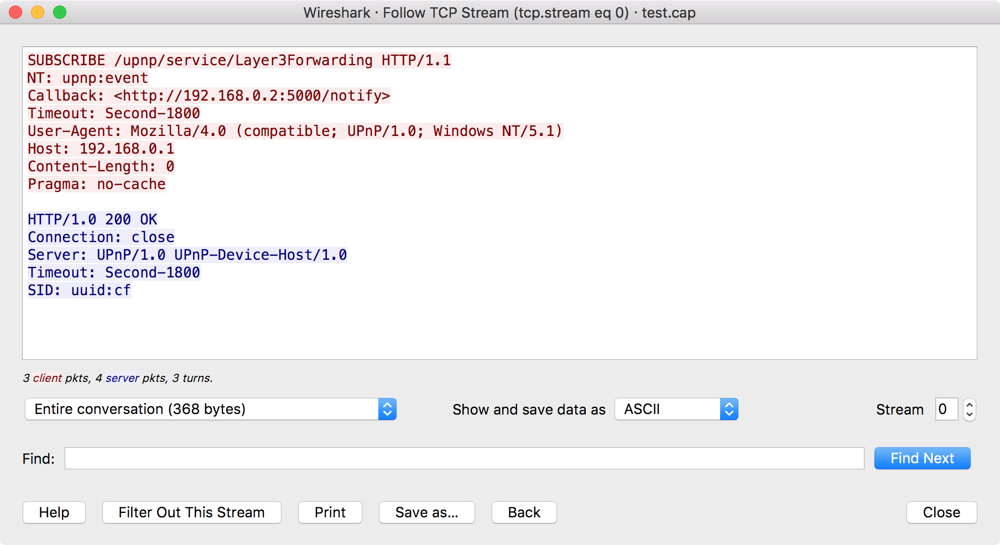
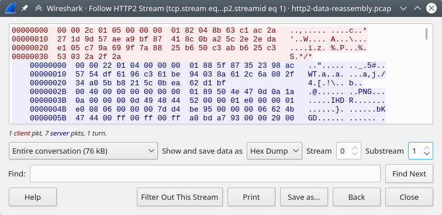
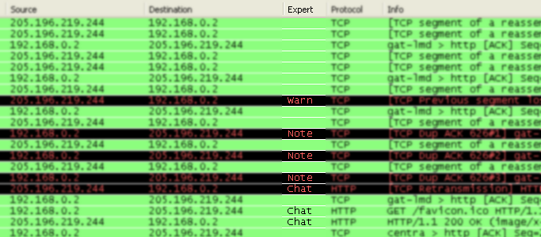

// WSUG Chapter Advanced

[#ChapterAdvanced]

== Advanced Topics

[#ChAdvIntroduction]

=== Introduction

This chapter will describe some of Wireshark’s advanced features.

// We switched from FollowTCP to FollowStream in June 2018.
// This is apparently how you assign multiple anchors.
// https://docs.asciidoctor.org/asciidoc/latest/attributes/id/#add-additional-anchors-to-a-section

[#ChAdvFollowStreamSection]
=== [[ChAdvFollowTCPSection]]Following Protocol Streams

It can be very helpful to see a protocol in the way that the application
layer sees it. Perhaps you are looking for passwords in a Telnet stream,
or you are trying to make sense of a data stream. Maybe you just need a
display filter to show only the packets in a TLS or SSL stream. If so,
Wireshark’s ability to follow protocol streams will be useful to you.

To filter to a particular stream,
select a TCP, UDP, DCCP, TLS, HTTP, HTTP/2, QUIC or SIP packet in the packet list of the stream/connection you are
interested in and then select the menu item menu:Analyze[Follow > TCP Stream]
(or use the context menu in the packet list). Wireshark will set an
appropriate display filter and display a dialog box with the data from the
stream laid out, as shown in <<ChAdvFollowStream>>.

[TIP]
====
Following a protocol stream applies a display filter which selects all
the packets in the current stream. Some people open the “Follow TCP
Stream” dialog and immediately close it as a quick way to isolate a
particular stream. Closing the dialog with the “Back” button will reset
the display filter if this behavior is not desired.
====

[#ChAdvFollowStream]

.The “Follow TCP Stream” dialog box

The stream content is displayed in the same sequence as it appeared on the
network. Non-printable characters are replaced by dots.
Traffic from the client to the server is colored red, while traffic
from the server to the client is
colored blue. These colors can be changed by opening menu:Edit[Preferences] and
under menu:Appearance[Font and Colors], selecting different colors for the
btn:[Sample "Follow Stream" client text] and btn:[Sample "Follow Stream" server text]
options.

// XXX - What about line wrapping (maximum line length) and CRNL conversions?

The stream content won’t be updated while doing a live capture. To get the
latest content you’ll have to reopen the dialog.

You can choose from the following actions:

btn:[Help]:: Show this help.

btn:[Filter out this stream]:: Apply a display filter removing the current
  stream data from the display.

btn:[Print]:: Print the stream data in the currently selected format.

btn:[Save as...]:: Save the stream data in the currently selected format.

btn:[Back]:: Close this dialog box and restore the previous display filter.

btn:[Close]:: Close this dialog box, leaving the current display filter in
  effect.

By default, Wireshark displays both client and server data. You can select the
menu:Entire conversation[] to switch between both, client to server, or
server to client data.

You can choose to view the data in one of the following formats:

menu:ASCII[]:: In this view you see the data from each direction in ASCII.
  Obviously best for ASCII based protocols, e.g., HTTP.

menu:C Arrays[]:: This allows you to import the stream data into your own C
  program.

menu:EBCDIC[]:: For the big-iron freaks out there.

menu:HEX Dump[]:: This allows you to see all the data. This will require a lot of
  screen space and is best used with binary protocols.

menu:UTF-8[]:: Like ASCII, but decode the data as UTF-8.

menu:UTF-16[]:: Like ASCII, but decode the data as UTF-16.

menu:YAML[]:: This allows you to load the stream as YAML.

The YAML output is divided into 2 main sections:

* The `peers` section where for each `peer` you found the peer index, the `host` address and the `port` number.

* The `packets` section where for each `packet` you found the packet number in the original capture, the `peer` index,
the packet `index` for this peer, the `timestamp` in seconds and the `data` in base64 encoding.

.Follow Stream YAML output
====
[source,yaml]
----
peers:
  - peer: 0
    host: 127.0.0.1
    port: 54048
  - peer: 1
    host: 127.0.10.1
    port: 5000
packets:
  - packet: 1
    peer: 0
    index: 0
    timestamp: 1599485409.693955274
    data: !!binary |
      aGVsbG8K
  - packet: 3
    peer: 1
    index: 0
    timestamp: 1599485423.885866692
    data: !!binary |
      Ym9uam91cgo=
----
====

The same example but in old YAML format (before version 3.5):
[source,yaml]
----
# Packet 1
peer0_0: !!binary |
  aGVsbG8K
# Packet 3
peer1_0: !!binary |
  Ym9uam91cgo=
----

How the old format data can be found in the new format:
[options="header"]
|===
|New YAML format |Old YAML format |
a|
----
...
packets:
  - packet: AAA
    peer: BBB
    index: CCC
    data: !!binary \|
      DDD
----
a|
----
# Packet AAA
peerBBB_CCC !!binary \|
  DDD
----
a|
 AAA: packet number in the original capture
 BBB: peer index
 CCC: packet index for this peer
 DDD: data in base64 encoding
|===

menu:Raw[]:: This allows you to load the unaltered stream data into a different
  program for further examination. The display will show the data as strings
  of hex characters with each frame on a separate line, but “Save As”
  will result in a binary file without any added line separators.

You can optionally show the delta time each time the direction changes (turns) or for every packet or event.

You can switch between streams using the “Stream” selector.

You can search for text by entering it in the “Find” entry box and
pressing btn:[Find Next].

.The “Follow HTTP/2 Stream” dialog box

The HTTP/2 Stream dialog is similar to the "Follow TCP Stream" dialog, except
for an additional "Substream" dialog field. HTTP/2 Streams are identified by
a HTTP/2 Stream Index (field name `http2.streamid`) which are unique within a
TCP connection. The “Stream” selector determines the TCP connection whereas the
“Substream” selector is used to pick the HTTP/2 Stream ID.

The QUIC protocol is similar, the first number selects the QUIC connection number
while the "Substream" field selects the QUIC Stream ID.

.The “Follow SIP Call” dialog box
image::images/ws-follow-sip-stream.png[{screenshot-attrs}]

The SIP call is shown with same dialog, just filter is based on sip.Call-ID
field. Count of streams is fixed to 0 and the field is disabled.

[#ChAdvShowPacketBytes]

=== Show Packet Bytes

If a selected packet field does not show all the bytes (i.e., they are truncated
when displayed) or if they are shown as bytes rather than string or if they require
more formatting because they contain an image or HTML then this dialog can be used.

This dialog can also be used to decode field bytes from base64, various compressed
formats or quoted-printable and show the decoded bytes as configurable output.
It’s also possible to select a subset of bytes setting the start byte and end byte.

You can choose from the following actions:

btn:[Help]:: Show this help.

btn:[Print]:: Print the bytes in the currently selected format.

btn:[Copy]:: Copy the bytes to the clipboard in the currently selected format.

btn:[Save As]:: Save the bytes in the currently selected format.

btn:[Close]:: Close this dialog box.

You can choose to decode the data from one of the following formats:

menu:None[]:: This is the default which does not decode anything.

menu:Base64[]:: This will decode from Base64 or Base64Url.

menu:Compressed[]:: This will decompress the buffer using lz77, lz77huff, lznt1, snappy, zlib or zstd.

menu:Hex Digits[]:: This will decode from a string of hex digits. Non-hex characters are skipped.

menu:Percent-Encoding[]:: This will decode from a Percent-Encoded string.

menu:Quoted-Printable[]:: This will decode from a Quoted-Printable string.

menu:ROT-13[]:: This will decode ROT-13 encoded text.

You can choose to view the data in one of the following formats:

menu:ASCII[]:: In this view you see the bytes as ASCII.
  All control characters and non-ASCII bytes are replaced by dot.

menu:ASCII & Control[]:: In this view all control characters are shown using a
  UTF-8 symbol and all non-ASCII bytes are replaced by dot.

menu:C Array[]:: This allows you to import the field data into your own C program.

menu:EBCDIC[]:: For the big-iron freaks out there.

menu:Hex Dump[]:: This allows you to see all the data. This will require a lot of
  screen space and is best used with binary protocols.

menu:HTML[]:: This allows you to see all the data formatted as a HTML document.
  The HTML supported is what’s supported by the Qt QTextEdit class.

menu:Image[]:: This will try to convert the bytes into an image.
  Most popular formats are supported including PNG, JPEG, GIF, and BMP.

menu:ISO 8859-1[]:: In this view you see the bytes as ISO 8859-1.

menu:Raw[]:: This allows you to load the bytes into a different
  program for further examination. The display will show HEX data, but
  “Save As” will result in a binary file.

menu:UTF-8[]:: In this view you see the bytes as UTF-8.

menu:UTF-16[]:: In this view you see the bytes as UTF-16.

menu:YAML[]:: This will show the bytes as a YAML binary dump.

You can search for text by entering it in the “Find” entry box and
pressing btn:[Find Next].

[#ChAdvExpert]

=== Expert Information

Wireshark keeps track of any anomalies and other items of interest it finds in a capture file and shows them in the Expert Information dialog.
The goal is to give you a better idea of uncommon or notable network behavior and to let novice and expert users find network problems faster than manually scanning through the packet list.

[WARNING]
.Expert information is only a hint
====
Expert information is the starting point for investigation, not the stopping point.
Every network is different, and it's up to you to verify that Wireshark’s expert information applies to your particular situation.
The presence of expert information doesn't necessarily indicate a problem and absence of expert information doesn’t necessarily mean everything is OK.
====

The amount of expert information largely depends on the protocol being used.
While dissectors for some common protocols like TCP and IP will show detailed information, other dissectors will show little or none.

The following describes the components of a single expert information entry along with the expert user interface.

[#ChAdvExpertInfoEntries]

==== Expert Information Entries

Expert information entries are grouped by severity level (described below) and contain the following:

[#ChAdvTabExpertInfoEntries]

.Example expert information items
[options="header"]
|===
|Packet #|Summary|Group|Protocol
|592|TCP: [TCP Out-Of-Order] ...|Malformed|TCP
|1202|DNS: Standard query response ...|Protocol|DNS
|443|TCP: 80 → 59322 [RST] Seq=12761 Win=0 Len=0|Sequence|TCP
|===

[#ChAdvExpertSeverity]

===== Severity

Every expert information item has a severity level.
The following levels are used, from lowest to highest.
Wireshark marks them using different colors, which are shown in parentheses:

Chat [white blue-background]#(blue)#::
Information about usual workflow, e.g., a TCP packet with the SYN flag set.

Note [black aqua-background]#(cyan)#::
Notable events, e.g., an application returned a common error code such as HTTP 404.

Warn [black yellow-background]#(yellow)#::
Warnings, e.g., application returned an unusual error code like a connection problem.

Error [white red-background]#(red)#::
Serious problems, such as malformed packets.

[#ChAdvExpertGroup]

===== Summary

Short explanatory text for each expert information item.

===== Group

Along with severity levels, expert information items are categorized by group.
The following groups are currently implemented:

Assumption::
The protocol field has incomplete data and was dissected based on assumed value.

Checksum::
A checksum was invalid.

Comment::
Packet comment.

Debug::
Debugging information.
You shouldn’t see this group in release versions of Wireshark.

Decryption::
A decryption issue.

Deprecated::
The protocol field has been deprecated.

Malformed::
Malformed packet or dissector has a bug.
Dissection of this packet aborted.

Protocol::
Violation of a protocol’s specification (e.g., invalid field values or illegal lengths).
Dissection of this packet probably continued.

Reassemble::
Problems while reassembling, e.g., not all fragments were available or an exception happened during reassembly.

Request Code::
An application request (e.g., File Handle == _x_). Usually assigned the Chat severity level.

Response Code::
An application response code indicates a potential problem, e.g., HTTP 404 page not found.

Security::
A security problem, e.g., an insecure implementation.

Sequence::
A protocol sequence number was suspicious, e.g., it wasn’t continuous or a retransmission was detected.

Undecoded::
Dissection incomplete or data can’t be decoded for other reasons.

It’s possible that more groups will be added in the future.

[#ChAdvExpertProtocol]

===== Protocol

The protocol dissector that created the expert information item.

[#ChAdvExpertSummary]

[#ChAdvExpertDialog]

==== The “Expert Information” Dialog

You can open the expert info dialog by selecting menu:Analyze[Expert Info] or by clicking the expert level indicator in the main status bar.

Right-clicking on an item will allow you to apply or prepare a filter based on the item, copy its summary text, and other tasks.

.The “Expert Information” dialog box
image::images/ws-expert-information.png[{screenshot-attrs}]

You can choose from the following actions:

Limit to display filter::
Only show expert information items present in packets that match the current display filter.

Group by summary::
Group items by their summary instead of the groups described above.

Search::
Only show items that match the search string, such as “dns”.
Regular expressions are supported.

menu:Show...[]::
Lets you show or hide each severity level.
For example, you can deselect Chat and Note severities if desired.

btn:[Help]::
Takes you to this section of the User’s Guide.

btn:[Close]::
Closes the dialog

// ===== Errors / Warnings / Notes / Chats tabs

// An easy and quick way to find the most interesting infos (rather than using the
// Details tab), is to have a look at the separate tabs for each severity level. As
// the tab label also contains the number of existing entries, it’s easy to find
// the tab with the most important entries.

// There are usually a lot of identical expert infos only differing in the packet
// number. These identical infos will be combined into a single line - with a count
// column showing how often they appeared in the capture file. Clicking on the plus
// sign shows the individual packet numbers in a tree view.

// [[ChAdvExpertDialogDetails]]

// ===== Details tab

// The Details tab provides the expert infos in a “log like” view, each entry on
// its own line (much like the packet list). As the amount of expert infos for a
// capture file can easily become very large, getting an idea of the interesting
// infos with this view can take quite a while. The advantage of this tab is to
// have all entries in the sequence as they appeared, this is sometimes a help to
// pinpoint problems.

[#ChAdvExpertColorizedTree]

==== “Colorized” Protocol Details Tree

.The “Colorized” protocol details tree
image::images/ws-expert-colored-tree.png[{screenshot-attrs}]

The packet detail tree marks fields with expert information based on their severity level color, e.g., “Warning” severities have a yellow background.
This color is propagated to the top-level protocol item in the tree in order to make it easy to find the field that created the expert information.

For the example screenshot above, the IP “Time to live” value is very low (only 1), so the corresponding protocol field is marked with a cyan background.
To make it easier find that item in the packet tree, the IP protocol toplevel item is marked cyan as well.

[#ChAdvExpertColumn]

==== “Expert” Packet List Column (Optional)

.The “Expert” packet list column

An optional “Expert Info Severity” packet list column is available that
displays the most significant severity of a packet or stays empty if everything
seems OK. This column is not displayed by default but can be easily added using
the Preferences Columns page described in <<ChCustPreferencesSection>>.

[#ChAdvTCPAnalysis]

=== TCP Analysis

By default, Wireshark’s TCP dissector tracks the state of each TCP
session and provides additional information when problems or potential
problems are detected. Analysis is done once for each TCP packet when a
capture file is first opened. Packets are processed in the order in
which they appear in the packet list. You can enable or disable this
feature via the “Analyze TCP sequence numbers” TCP dissector preference.

For analysis of data or protocols layered on top of TCP (such as HTTP), see
<<ChAdvReassemblyTcp>>.

.“TCP Analysis” packet detail items
image::images/ws-tcp-analysis.png[{screenshot-attrs}]

TCP Analysis flags are added to the TCP protocol tree under “SEQ/ACK
analysis”. Each flag is described below. Terms such as “next expected
sequence number” and “next expected acknowledgment number” refer to
the following”:

// tcp_analyze_seq_info->nextseq
Next expected sequence number:: The last-seen sequence number plus
segment length. Set when there are no analysis flags and for zero
window probes. This is initially zero and calculated based on the
previous packet in the same TCP flow. Note that this may not be the same
as the tcp.nxtseq protocol field.

// tcp_analyze_seq_info->maxseqtobeacked
Next expected acknowledgment number:: The last-seen sequence number for
segments. Set when there are no analysis flags and for zero window probes.

// tcp_analyze_seq_info->lastack
Last-seen acknowledgment number:: Always updated for each packet. Note
that this is not the same as the next expected acknowledgment number.

// TCP_A_ACK_LOST_PACKET
[discrete]
==== TCP ACKed unseen segment

Set when the expected next acknowledgment number is set for the reverse
direction and it’s less than the current acknowledgment number.

// TCP_A_DUPLICATE_ACK
[discrete]
==== TCP Dup ACK __<frame>__#__<acknowledgment number>__

Set when all of the following are true:

* The segment size is zero.
* The window size is non-zero and hasn’t changed, or there is valid SACK data.
* The next expected sequence number and last-seen acknowledgment number are non-zero (i.e., the connection has been established).
* SYN, FIN, and RST are not set.

// TCP_A_FAST_RETRANSMISSION
[discrete]
==== TCP Fast Retransmission

Set when all of the following are true:

* This is not a keepalive packet.
* In the forward direction, the segment size is greater than zero or the SYN or FIN is set.
* The next expected sequence number is greater than the current sequence number.
* We have at least two duplicate ACKs in the reverse direction.
* The current sequence number equals the next expected acknowledgment number.
* We saw the last acknowledgment less than 20ms ago.

Supersedes “Out-Of-Order” and “Retransmission”.

// TCP_A_KEEP_ALIVE
[discrete]
==== TCP Keep-Alive

Set when the segment size is zero or one, the current sequence number
is one byte less than the next expected sequence number, and none of SYN,
FIN, or RST are set.

Supersedes “Fast Retransmission”, “Out-Of-Order”, “Spurious
Retransmission”, and “Retransmission”.

// TCP_A_KEEP_ALIVE_ACK
[discrete]
==== TCP Keep-Alive ACK

Set when all of the following are true:

* The segment size is zero.
* The window size is non-zero and hasn’t changed.
* The current sequence number is the same as the next expected sequence number.
* The current acknowledgment number is the same as the last-seen acknowledgment number.
* The most recently seen packet in the reverse direction was a keepalive.
* The packet is not a SYN, FIN, or RST.

Supersedes “Dup ACK” and “ZeroWindowProbeAck”.

// TCP_A_OUT_OF_ORDER
[discrete]
==== TCP Out-Of-Order

Set when all of the following are true:

* This is not a keepalive packet.
* In the forward direction, the segment length is greater than zero or the SYN or FIN is set.
* The next expected sequence number is greater than the current sequence number.
* The next expected sequence number and the next sequence number differ.
* The last segment arrived within the Out-Of-Order RTT threshold.
  The threshold is either the value shown in the “iRTT” (tcp.analysis.initial_rtt) field under “SEQ/ACK analysis” if it is present, or the default value of 3ms if it is not.

Supersedes “Retransmission”.

// TCP_A_REUSED_PORTS
[discrete]
==== TCP Port numbers reused

Set when the SYN flag is set (not SYN+ACK), we have an existing conversation using the same addresses and ports, and the sequence number is different than the existing conversation’s initial sequence number.

// TCP_A_LOST_PACKET
[discrete]
==== TCP Previous segment not captured

Set when the current sequence number is greater than the next expected sequence number.

// TCP_A_SPURIOUS_RETRANSMISSION
[discrete]
==== TCP Spurious Retransmission

Checks for a retransmission based on analysis data in the reverse
direction. Set when all of the following are true:

* The SYN or FIN flag is set.
* This is not a keepalive packet.
* The segment length is greater than zero.
* Data for this flow has been acknowledged. That is, the last-seen acknowledgment number has been set.
* The next sequence number is less than or equal to the last-seen acknowledgment number.

Supersedes “Fast Retransmission”, “Out-Of-Order”, and “Retransmission”.

// TCP_A_RETRANSMISSION
[discrete]
==== TCP Retransmission

Set when all of the following are true:

* This is not a keepalive packet.
* In the forward direction, the segment length is greater than zero or the SYN or FIN flag is set.
* The next expected sequence number is greater than the current sequence number.

// TCP_A_WINDOW_FULL
[discrete]
==== TCP Window Full

Set when the segment size is non-zero, we know the window size in the
reverse direction, and our segment size exceeds the window size in the
reverse direction.

// TCP_A_WINDOW_UPDATE
[discrete]
==== TCP Window Update

Set when the all of the following are true:

* The segment size is zero.
* The window size is non-zero and not equal to the last-seen window size, and there is no valid SACK data.
* The sequence number is equal to the next expected sequence number.
* The acknowledgment number is equal to the last-seen acknowledgment number,
* or to the next expected sequence number when answering to a ZeroWindowProbe.
* None of SYN, FIN, or RST are set.

// TCP_A_ZERO_WINDOW
[discrete]
==== TCP ZeroWindow

Set when the receive window size is zero and none of SYN, FIN, or RST are set.

The _window_ field in each TCP header advertises the amount of data a receiver can accept.
If the receiver can’t accept any more data it will set the window value to zero, which tells the sender to pause its transmission.
In some specific cases this is normal -- for example, a printer might use a zero window to pause the transmission of a print job while it loads or reverses a sheet of paper.
However, in most cases this indicates a performance or capacity problem on the receiving end.
It might take a long time (sometimes several minutes) to resume a paused connection, even if the underlying condition that caused the zero window clears up quickly.

// TCP_A_ZERO_WINDOW_PROBE
[discrete]
==== TCP ZeroWindowProbe

Set when the sequence number is equal to the next expected sequence
number, the segment size is one, and last-seen window size in the
reverse direction was zero.

If the single data byte from a Zero Window Probe is dropped by the receiver (not
ACKed), then a subsequent segment should not be flagged as retransmission if all
of the following conditions are true for that segment:
* The segment size is larger than one.
* The next expected sequence number is one less than the current sequence number.

This affects “Fast Retransmission”, “Out-Of-Order”, or “Retransmission”.

// TCP_A_ZERO_WINDOW_PROBE_ACK
[discrete]
==== TCP ZeroWindowProbeAck

Set when the all of the following are true:

* The segment size is zero.
* The window size is zero.
* The sequence number is equal to the next expected sequence number.
* The acknowledgment number is equal to the last-seen acknowledgment number.
* The last-seen packet in the reverse direction was a zero window probe.

Supersedes “TCP Dup ACK”.

// TCP_A_AMBIGUOUS_INTERPRETATIONS
[discrete]
==== TCP Ambiguous Interpretations

Some captures are quite difficult to analyze automatically, particularly when the
time frame may cover both Fast Retransmission and Out-Of-Order packets. A TCP
preference allows to switch the precedence of these two interpretations at the
protocol level.

// TCP_A_CONVERSATION_COMPLETENESS
[discrete]
==== TCP Conversation Completeness

TCP conversations are said to be complete when they have both opening and closing
handshakes, independently of any data transfer. However, we might be interested in
identifying complete conversations with some data sent, and we are using the
following bit values to build a filter value on the tcp.completeness field :

* 1 : SYN
* 2 : SYN-ACK
* 4 : ACK
* 8 : DATA
* 16 : FIN
* 32 : RST

For example, a conversation containing only a three-way handshake will be found
with the filter 'tcp.completeness==7' (1+2+4) while a complete conversation with
data transfer will be found with a longer filter as closing a connection can be
associated with FIN or RST packets, or even both :
'tcp.completeness==31 or tcp.completeness==47 or tcp.completeness==63'

Another way to select specific conversation values is to filter on individual
flags, the summary field, or a combination of them.
Thus, '(tcp.completeness.fin==1 || tcp.completeness.rst==1) && tcp.completeness.str contains "DASS"'
will find all 'Complete, WITH_DATA' conversations, while the 'Complete, NO_DATA'
ones will be found with
'(tcp.completeness.fin==1 || tcp.completeness.rst==1) && tcp.completeness.data==0 && tcp.completeness.str contains "ASS"'.

[#ChAdvTimestamps]

=== Time Stamps

Time stamps, their precisions and all that can be quite confusing. This section
will provide you with information about what’s going on while Wireshark
processes time stamps.

While packets are captured, each packet is time stamped as it comes in. These
time stamps will be saved to the capture file, so they also will be available
for (later) analysis.

So where do these time stamps come from? While capturing, Wireshark gets the
time stamps from the libpcap (Npcap) library, which in turn gets them from the
operating system kernel. If the capture data is loaded from a capture file,
Wireshark obviously gets the data from that file.

==== Wireshark Internals

The internal format that Wireshark uses to keep a packet time stamp consists of
the date (in days since 1.1.1970) and the time of day (in nanoseconds since
midnight). You can adjust the way Wireshark displays the time stamp data in the
packet list, see the “Time Display Format” item in the
<<ChUseViewMenuSection>> for details.

While reading or writing capture files, Wireshark converts the time stamp data
between the capture file format and the internal format as required.

While capturing, Wireshark uses the libpcap (Npcap) capture library which
supports nanosecond resolution for both pcapng and pcap files, though some
devices may only provide microsecond resolution, in which case that will be
used. Unless you are working with specialized capturing hardware, this
resolution should be adequate.

==== Capture File Formats

The vast majority of capture file formats that Wireshark knows support time
stamps.  The time stamp precision supported by a specific capture file format
differs widely and varies from one second “0” to one nanosecond “0.123456789”.
Most file formats store the time stamps with a fixed precision (e.g., microseconds,
“0.123456”), while some file formats are capable of storing the time stamp
precision itself or even having a different precision for different records
in the file (whatever the benefit may be).

The pcapng capture file format supports a wide range of time stamp resolutions,
which can be different for each interface in the file, as well as records without
time stamps. The common libpcap capture file format, which is widely supported by
many other tools, supports two possible fixed resolutions, microsecond or
nanosecond, indicated by a magic number at the start of the file. Wireshark and
tools like editcap can convert pcap files with nanosecond resolution to microsecond
resolution for use with tools that only support the original time stamp precision.

Writing data into a capture file format that doesn’t provide the capability to
store the actual precision will lead to loss of information. For example, if you
load a capture file with nanosecond resolution and store the capture data in a
libpcap file (with microsecond resolution) Wireshark obviously must reduce the
precision from nanosecond to microsecond.

==== Accuracy

People often ask “Which time stamp accuracy is provided by Wireshark?”. Well,
Wireshark doesn’t create any time stamps itself but simply gets them from
“somewhere else” and displays them. So accuracy will depend on the capture
system (operating system, performance, etc.) that you use. Because of this, the
above question is difficult to answer in a general way.

[NOTE]
====
USB connected network adapters often provide a very bad time stamp accuracy. The
incoming packets have to take “a long and winding road” to travel through the
USB cable until they actually reach the kernel. As the incoming packets are time
stamped when they are processed by the kernel, this time stamping mechanism
becomes very inaccurate.

Don’t use USB connected NICs when you need precise time stamp
accuracy.
====

// (XXX - are there any such NIC’s that generate time stamps on the USB
// hardware?)

[#ChAdvTimezones]

=== Time Zones

If you travel across the planet, time zones can be confusing. If you get a
capture file from somewhere around the world time zones can even be a lot more
confusing ;-)

First of all, there are two reasons why you may not need to think about time
zones at all:

* You are only interested in the time differences between the packet time stamps
  and don’t need to know the exact date and time of the captured packets (which
  is often the case).

* You don’t get capture files from different time zones than your own, so there
  are simply no time zone problems. For example, everyone in your team is
  working in the same time zone as yourself.

.What are time zones?
****
People expect that the time reflects the sunset. Dawn should be in the morning
maybe around 06:00 and dusk in the evening maybe at 20:00. These times will
obviously vary depending on the season. It would be very confusing if everyone
on earth would use the same global time as this would correspond to the sunset
only at a small part of the world.

For that reason, the earth is split into several different time zones, each zone
with a local time that corresponds to the local sunset.

The time zone’s base time is UTC (Coordinated Universal Time) or Zulu Time
(military and aviation). The older term GMT (Greenwich Mean Time) shouldn’t be
used as it is slightly incorrect (up to 0.9 seconds difference to UTC). The UTC
base time equals to 0 (based at Greenwich, England) and all time zones have an
offset to UTC between -12 to +14 hours!

For example: If you live in Berlin, you are in a time zone one hour earlier than
UTC, so you are in time zone “+1” (time difference in hours compared to UTC).
If it’s 3 o’clock in Berlin it’s 2 o’clock in UTC “at the same moment”.

Be aware that at a few places on earth don’t use time zones with even hour
offsets (e.g., New Delhi uses UTC+05:30)!

Further information can be found at: {wikipedia-main-url}Time_zone and
{wikipedia-main-url}Coordinated_Universal_Time.
****

.What is daylight saving time (DST)?
****
Daylight Saving Time (DST), also known as Summer Time is intended to “save”
some daylight during the summer months. To do this, a lot of countries (but not
all!) add a DST hour to the already existing UTC offset. So you may need to take
another hour (or in very rare cases even two hours!) difference into your “time
zone calculations”.

Unfortunately, the date at which DST actually takes effect is different
throughout the world. You may also note, that the northern and southern
hemispheres have opposite DST’s (e.g., while it’s summer in Europe it’s winter in
Australia).

Keep in mind: UTC remains the same all year around, regardless of DST!

Further information can be found at
link:{wikipedia-main-url}Daylight_saving[].
****

Further time zone and DST information can be found at
{greenwichmeantime-main-url} and {timeanddate-main-url}.

[discrete]
==== Set your computer’s time correctly!

If you work with people around the world it’s very helpful to set your
computer’s time and time zone right.

You should set your computers time and time zone in the correct sequence:

. Set your time zone to your current location

. Set your computer’s clock to the local time

This way you will tell your computer both the local time and also the time
offset to UTC. Many organizations simply set the time zone on their servers and
networking gear to UTC in order to make coordination and troubleshooting easier.

[TIP]
====
If you travel around the world, it’s an often-made mistake to adjust the hours
of your computer clock to the local time. Don’t adjust the hours but your time
zone setting instead! For your computer, the time is essentially the same as
before, you are simply in a different time zone with a different local time.
====

You can use the Network Time Protocol (NTP) to automatically adjust your
computer to the correct time, by synchronizing it to Internet NTP clock servers.
NTP clients are available for all operating systems that Wireshark supports (and
for a lot more), for examples see {ntp-main-url}.

==== Wireshark and Time Zones

So what’s the relationship between Wireshark and time zones anyway?

Wireshark’s native capture file format (libpcap format), and some
other capture file formats, such as the Windows Sniffer, *Peek, Sun
snoop formats, and newer versions of the Microsoft Network Monitor and
Network Instruments/Viavi Observer formats, save the arrival time of
packets as UTC values.  UN*X systems, and “Windows NT based” systems
represent time internally as UTC.  When Wireshark is capturing, no
conversion is necessary.  However, if the system time zone is not set
correctly, the system’s UTC time might not be correctly set even if
the system clock appears to display correct local time.  When capturing,
Npcap has to convert the time to UTC before supplying it to Wireshark.
If the system’s time zone is not set correctly, that conversion will
not be done correctly.

Other capture file formats, such as the OOS-based Sniffer format and
older versions of the Microsoft Network Monitor and Network
Instruments/Viavi Observer formats, save the arrival time of packets as
local time values.

Internally to Wireshark, time stamps are represented in UTC. This means that
when reading capture files that save the arrival time of packets as local time
values, Wireshark must convert those local time values to UTC values.

Wireshark in turn will display the time stamps always in local time. The
displaying computer will convert them from UTC to local time and displays this
(local) time. For capture files saving the arrival time of packets as UTC
values, this means that the arrival time will be displayed as the local time in
your time zone, which might not be the same as the arrival time in the time zone
in which the packet was captured. For capture files saving the arrival time of
packets as local time values, the conversion to UTC will be done using your time
zone’s offset from UTC and DST rules, which means the conversion will not be
done correctly; the conversion back to local time for display might undo this
correctly, in which case the arrival time will be displayed as the arrival time
in which the packet was captured.

[#ChAdvTabTimezones]

.Time zone examples for UTC arrival times (without DST)
[options="header"]
|===
||Los Angeles|New York|Madrid|London|Berlin|Tokyo
|_Capture File (UTC)_|10:00|10:00|10:00|10:00|10:00|10:00
|_Local Offset to UTC_|-8|-5|-1|0|+1|+9
|_Displayed Time (Local Time)_|02:00|05:00|09:00|10:00|11:00|19:00
|===

For example, let’s assume that someone in Los Angeles captured a packet with
Wireshark at exactly 2 o’clock local time and sends you this capture file. The
capture file’s time stamp will be represented in UTC as 10 o’clock. You are
located in Berlin and will see 11 o’clock on your Wireshark display.

Now you have a phone call, video conference or Internet meeting with that one to
talk about that capture file. As you are both looking at the displayed time on
your local computers, the one in Los Angeles still sees 2 o’clock but you in
Berlin will see 11 o’clock. The time displays are different as both Wireshark
displays will show the (different) local times at the same point in time.

__Conclusion__: You may not bother about the date/time of the time stamp you
currently look at unless you must make sure that the date/time is as expected.
So, if you get a capture file from a different time zone and/or DST, you’ll have
to find out the time zone/DST difference between the two local times and
“mentally adjust” the time stamps accordingly. In any case, make sure that
every computer in question has the correct time and time zone setting.

[#ChAdvReassemblySection]

=== Packet Reassembly

==== What Is It?

Network protocols often need to transport large chunks of data which are
complete in themselves, e.g., when transferring a file. The underlying protocol
might not be able to handle that chunk size (e.g., limitation of the network
packet size), or is stream-based like TCP, which doesn’t know data chunks at
all.

In that case the network protocol has to handle the chunk boundaries itself and
(if required) spread the data over multiple packets. It obviously also needs a
mechanism to determine the chunk boundaries on the receiving side.

Wireshark calls this mechanism reassembly, although a specific protocol
specification might use a different term for this (e.g., desegmentation,
defragmentation, etc.).

==== How Wireshark Handles It

For some of the network protocols Wireshark knows of, a mechanism is implemented
to find, decode and display these chunks of data. Wireshark will try to find the
corresponding packets of this chunk, and will show the combined data as
additional tabs in the “Packet Bytes” pane (for information about this pane.
See <<ChUsePacketBytesPaneSection>>).

[#ChAdvWiresharkBytesPaneTabs]

.The “Packet Bytes” pane with a reassembled tab
image::images/ws-bytes-pane-tabs.png[{screenshot-attrs}]

Reassembly might take place at several protocol layers, so it’s possible that
multiple tabs in the “Packet Bytes” pane appear.

[NOTE]
====
You will find the reassembled data in the last packet of the chunk.
====

For example, in a _HTTP_ GET response, the requested data (e.g., an HTML page) is
returned. Wireshark will show the hex dump of the data in a new tab
“Uncompressed entity body” in the “Packet Bytes” pane.

Reassembly is enabled in the preferences by default but can be disabled in the
preferences for the protocol in question. Enabling or disabling reassembly
settings for a protocol typically requires two things:

. The lower-level protocol (e.g., TCP) must support reassembly. Often this
  reassembly can be enabled or disabled via the protocol preferences.

. The higher-level protocol (e.g., HTTP) must use the reassembly mechanism to
  reassemble fragmented protocol data. This too can often be enabled or disabled
  via the protocol preferences.

The tooltip of the higher-level protocol setting will notify you if and which
lower-level protocol setting also has to be considered.

[#ChAdvReassemblyTcp]

==== TCP Reassembly

Protocols such as HTTP or TLS are likely to span multiple TCP segments. The
TCP protocol preference “Allow subdissector to reassemble TCP streams” (enabled
by default) makes it possible for Wireshark to collect a contiguous sequence of
TCP segments and hand them over to the higher-level protocol (for example, to
reconstruct a full HTTP message). All but the final segment will be marked with
“[TCP segment of a reassembled PDU]” in the packet list.

Disable this preference to reduce memory and processing overhead if you are only
interested in TCP sequence number analysis (<<ChAdvTCPAnalysis>>). Keep in mind,
though, that higher-level protocols might be wrongly dissected. For example,
HTTP messages could be shown as “Continuation” and TLS records could be shown as
“Ignored Unknown Record”. Such results can also be observed if you start
capturing while a TCP connection was already started or when TCP segments
are lost or delivered out-of-order.

To reassemble of out-of-order TCP segments, the TCP protocol preference
“Reassemble out-of-order segments” (currently disabled by default) must be
enabled in addition to the previous preference.
If all packets are received in-order, this preference will not have any effect.
Otherwise (if missing segments are encountered while sequentially processing a
packet capture), it is assuming that the new and missing segments belong to the
same PDU. Caveats:

* Lost packets are assumed to be received out-of-order or retransmitted later.
  Applications usually retransmit segments until these are acknowledged, but if
  the packet capture drops packets, then Wireshark will not be able to
  reconstruct the TCP stream. In such cases, you can try to disable this
  preference and hopefully have a partial dissection instead of seeing just
  “[TCP segment of a reassembled PDU]” for every TCP segment.
// See test/suite_decryption.py (suite_decryption.case_decrypt_80211)
// which would break when enabling the preference.
* When doing a capture in monitor mode (IEEE 802.11), packets are more likely to
  get lost due to signal reception issues. In that case it is recommended to
  disable the option.
// See test/suite_dissection.py (case_dissect_tcp.check_tcp_out_of_order)
* If the new and missing segments are in fact part of different PDUs,
  then processing is currently delayed until no more segments are missing, even
  if the begin of the missing segments completed a PDU. For example, assume six
  segments forming two PDUs `ABC` and `DEF`. When received as `ABECDF`, an
  application can start processing the first PDU after receiving `ABEC`.
  Wireshark however requires the missing segment `D` to be received as well.
  This issue will be addressed in the future.
// See test/suite_dissection.py (case_dissect_tcp.test_tcp_out_of_order_twopass)
* In the GUI and during a two-pass dissection (`tshark -2`), the previous
  scenario will display both PDUs in the packet with last segment (`F`) rather
  than displaying it in the first packet that has the final missing segment of a
  PDU. This issue will be addressed in the future.
* When enabled, fields such as the SMB “Time from request” (`smb.time`) might be
  smaller if the request follows other out-of-order segments (this reflects
  application behavior). If the previous scenario however occurs, then the time
  of the request is based on the frame where all missing segments are received.

Regardless of the setting of these two reassembly-related preferences, you can
always use the “Follow TCP Stream” option (<<ChAdvFollowStreamSection>>) which
displays segments in the expected order.

[#ChAdvNameResolutionSection]

=== Name Resolution

Name resolution tries to convert some of the numerical address values into a
human readable format. There are two possible ways to do these conversions,
depending on the resolution to be done: calling system/network services (like
the gethostname() function) and/or resolving from Wireshark specific
configuration files. For details about the configuration files Wireshark uses
for name resolution and alike, see <<AppFiles>>.

The name resolution feature can be enabled individually for the protocol layers
listed in the following sections.

==== Name Resolution Drawbacks

Name resolution can be invaluable while working with Wireshark and may even save
you hours of work. Unfortunately, it also has its drawbacks.

* _Name resolution can often fail._ The name to be resolved might simply be
  unknown by the name servers asked, or the servers are just not available and
  the name is also not found in Wireshark’s configuration files.

* _Resolved names might not be available._
Wireshark obtains name resolution information from a variety of sources, including DNS servers, the capture file itself (e.g., for a pcapng file), and the _hosts_ files on your system and in your <<ChAppFilesConfigurationSection,profile directory>>.
The resolved names might not be available if you open the capture file later or on a different machine. As a result, each time you or someone else opens a particular capture file it may look slightly different due to changing environments.

* _DNS may add additional packets to your capture file._
You might run into the link:{wikipedia-main-url}Observer_effect_(information_technology)[observer effect] if the extra traffic from Wireshark’s DNS queries and responses affects the problem you're trying to troubleshoot or any subsequent analysis.
+
The same sort of thing can happen when capturing over a remote connection, e.g., SSH or RDP.

// XXX Are there any other such packets than DNS ones?

* _Resolved DNS names are cached by Wireshark._ This is required for acceptable
  performance. However, if the name resolution information should change while
  Wireshark is running, Wireshark won’t notice a change in the name resolution
  information once it gets cached. If this information changes while Wireshark
  is running, e.g., a new DHCP lease takes effect, Wireshark won’t notice it.

// XXX Is this true for all or only for DNS info?

Name resolution in the packet list is done while the list is filled. If a name
can be resolved after a packet is added to the list, its former entry won’t be
changed. As the name resolution results are cached, you can use
menu:View[Reload] to rebuild the packet list with the correctly resolved names.
However, this isn’t possible while a capture is in progress.

// XXX Add information about the address editor frame (View -> Name Resolution -> Edit Resolved Name)

==== Ethernet Name Resolution (MAC Layer)

Try to resolve an Ethernet MAC address (e.g., 00:09:5b:01:02:03) to a human readable name.

__ARP name resolution (system service)__: Wireshark will ask the operating
system to convert an Ethernet address to the corresponding IP address (e.g.
00:09:5b:01:02:03 → 192.168.0.1).

__Ethernet codes (ethers file)__: If the ARP name resolution failed, Wireshark
tries to convert the Ethernet address to a known device name, which has been
assigned by the user using an _ethers_ file (e.g., 00:09:5b:01:02:03 →
homerouter).

__Ethernet manufacturer codes (manuf file)__: If neither ARP or ethers returns a
result, Wireshark tries to convert the first 3 bytes of an ethernet address to
an abbreviated manufacturer name, which has been assigned by the IEEE (e.g.
00:09:5b:01:02:03 → Netgear_01:02:03).

==== IP Name Resolution (Network Layer)

Try to resolve an IP address (e.g., 216.239.37.99) to a human readable name.

__DNS name resolution (system/library service)__: Wireshark will use a name
resolver to convert an IP address to the hostname associated with it
(e.g., 216.239.37.99 -> www.1.google.com).

Most applications use synchronously DNS name resolution.
For example, your web browser must resolve the host name portion of a URL before it can connect to the server.
Capture file analysis is different.
A given file might have hundreds, thousands, or millions of IP addresses so for usability and performance reasons Wireshark uses asynchronous resolution.
Both mechanisms convert IP addresses to human readable (domain) names and typically use different sources such as the system hosts file (__/etc/hosts__) and any configured DNS servers.

Since Wireshark doesn’t wait for DNS responses, the host name for a given address might be missing from a given packet when you view it the first time but be present when you view it subsequent times.

You can adjust name resolution behavior in the Name Resolution section in the <<ChCustPreferencesSection,Preferences Dialog>>.
You can control resolution itself by adding a __hosts__ file to your <<ChAppFilesConfigurationSection,personal configuration directory>>.
You can also edit your system __hosts__ file, but that isn’t generally recommended.

==== TCP/UDP Port Name Resolution (Transport Layer)

Try to resolve a TCP/UDP port (e.g., 80) to a human readable name.

__TCP/UDP port conversion (system service)__: Wireshark will ask the operating
system to convert a TCP or UDP port to its well-known name (e.g., 80 -> http).

==== VLAN ID Resolution

To get a descriptive name for a VLAN tag ID a vlans file can be used.

==== SS7 Point Code Resolution

To get a node name for a SS7 point code a ss7pcs file can be used.

// XXX - mention the role of the /etc/services file (but don’t forget the files and folders section)!

[#ChAdvChecksums]

=== Checksums

Several network protocols use checksums to ensure data integrity. Applying
checksums as described here is also known as _redundancy checking_.

.What are checksums for?
****
Checksums are used to ensure the integrity of data portions for data
transmission or storage. A checksum is basically a calculated summary of such a
data portion.

Network data transmissions often produce errors, such as toggled, missing or
duplicated bits. As a result, the data received might not be identical to the
data transmitted, which is obviously a bad thing.

Because of these transmission errors, network protocols very often use checksums
to detect such errors. The transmitter will calculate a checksum of the data and
transmits the data together with the checksum. The receiver will calculate the
checksum of the received data with the same algorithm as the transmitter. If the
received and calculated checksums don’t match a transmission error has occurred.

Some checksum algorithms are able to recover (simple) errors by calculating
where the expected error must be and repairing it.

If there are errors that cannot be recovered, the receiving side throws away the
packet. Depending on the network protocol, this data loss is simply ignored or
the sending side needs to detect this loss somehow and retransmits the required
packet(s).

Using a checksum drastically reduces the number of undetected transmission
errors. However, the usual checksum algorithms cannot guarantee an error
detection of 100%, so a very small number of transmission errors may remain
undetected.

There are several different kinds of checksum algorithms; an example of an often
used checksum algorithm is CRC32. The checksum algorithm actually chosen for a
specific network protocol will depend on the expected error rate of the network
medium, the importance of error detection, the processor load to perform the
calculation, the performance needed and many other things.

Further information about checksums can be found at:
{wikipedia-main-url}Checksum.
****

==== Wireshark Checksum Validation

Wireshark will validate the checksums of many protocols, e.g., IP, TCP, UDP, etc.

It will do the same calculation as a “normal receiver” would do, and shows the
checksum fields in the packet details with a comment, e.g., [correct] or
[invalid, must be 0x12345678].

Checksum validation can be switched off for various protocols in the Wireshark
protocol preferences, e.g., to (very slightly) increase performance.

If the checksum validation is enabled and it detected an invalid checksum,
features like packet reassembly won’t be processed. This is avoided as
incorrect connection data could “confuse” the internal database.

==== Checksum Offloading

The checksum calculation might be done by the network driver, protocol driver or
even in hardware.

For example: The Ethernet transmitting hardware calculates the Ethernet CRC32
checksum and the receiving hardware validates this checksum. If the received
checksum is wrong Wireshark won’t even see the packet, as the Ethernet hardware
internally throws away the packet.

Higher-level checksums are “traditionally” calculated by the protocol
implementation and the completed packet is then handed over to the hardware.

Recent network hardware can perform advanced features such as IP checksum
calculation, also known as checksum offloading. The network driver won’t
calculate the checksum itself but will simply hand over an empty (zero or
garbage filled) checksum field to the hardware.

[NOTE]
====
Checksum offloading often causes confusion as network packets to be
transmitted are given to Wireshark before they are handed over to the
hardware. Wireshark gets these “empty” checksums and displays them as
invalid, even though the packets will contain valid checksums when they
transit the network.

This only applies to packets that are locally generated by the capture
point. Received packets will have traveled through network hardware
and should have correct checksums.
====

Checksum offloading can be confusing and having a lot of [invalid] messages on
the screen can be quite annoying. As mentioned above, invalid checksums may lead
to unreassembled packets, making the analysis of the packet data much harder.

You can do two things to avoid this checksum offloading problem:

* Turn off the checksum offloading in the network driver, if this option is available.

* Turn off checksum validation of the specific protocol in the Wireshark preferences.
  Recent releases of Wireshark disable checksum validation by default due to the
  prevalence of offloading in modern hardware and operating systems.

==== Partial Checksums

TCP and UDP checksums are calculated over both the payload and from selected
elements from the IPv4 or IPv6 header, known as the pseudo header. Linux
and Windows, when offloading checksums, will calculate the contribution from
the pseudo header and place it in the checksum field. The driver then directs
the hardware to calculate the checksum over the payload area, which will
produce the correct result including the pseudo header's portion of the sum
as a matter of mathematics.

This precomputation speeds up the hardware checksum calculation later,
allows the driver to direct the hardware to do checksums over encapsulated
payloads (__Local Checksum Offload__), and allows applications to send
the kernel large "superpacket" buffers that will be later divided by
the hardware into multiple maximum size packets when sent on the network
(__TCP Segmentation Offload (TSO)__ and __Generic Segmentation Offload (GSO)__).

[NOTE]
====
Wireshark 4.2.0 and later can calculate the partial checksum contribution
from the pseudo header, and when validating TCP and UDP checksums will
mark partial checksums as valid but partial. The packets with partial
checksums will not be colored as Bad Checksums by the default coloring rules,
and will still be used for reassembly. This eliminates spurious checksum
errors seen on packets transmitted from the capturing host on those platforms
that use partial checksums when offloading.
====

// End of WSUG Chapter Advanced
