// WSUG Chapter Customizing

[#ChapterCustomize]

== Customizing Wireshark

[#ChCustIntroduction]

=== Introduction

Wireshark’s default behavior will usually suit your needs pretty well. However,
as you become more familiar with Wireshark, it can be customized in various ways
to suit your needs even better. In this chapter we explore:

* How to start Wireshark with command line parameters

* How to colorize the packet list

* How to control protocol dissection

* How to use the various preference settings

[#ChCustCommandLine]

=== Start Wireshark from the command line

You can start Wireshark from the command line, but it can also be started from
most Window managers as well. In this section we will look at starting it from
the command line.

Wireshark supports a large number of command line parameters. To see what they
are, simply enter the command _wireshark -h_ and the help information shown in
<<ChCustEx1>> (or something similar) should be printed.

[#ChCustEx1]
.Help information available from Wireshark
----
include::wireshark-h.txt[]
----

We will examine each of the command line options in turn.

The first thing to notice is that issuing the command `wireshark` by itself will
launch Wireshark. However, you can include as many of the command line
parameters as you like. Their meanings are as follows ( in alphabetical order ):

// XXX - is the alphabetical order a good choice? Maybe better task based?

-a <capture autostop condition>::
--autostop <capture autostop condition>::
Specify a criterion that specifies when Wireshark is to stop writing
to a capture file. The criterion is of the form test:value, where test
is one of:
+
--
    duration:value::
    Stop writing to a capture file after value of seconds have elapsed.

    filesize:value::
    Stop writing to a capture file after it reaches a size of value
    kilobytes (where a kilobyte is 1000 bytes, not 1024 bytes). If
    this option is used together with the -b option, Wireshark will
    stop writing to the current capture file and switch to the next
    one if filesize is reached.

    files:value::
    Stop writing to capture files after value number of files were
    written.

    packets:value::
    Stop writing to a capture file after value number of packets were written.
--

-b <capture ring buffer option>::
If a maximum capture file size was specified, this option causes Wireshark to
run in “ring buffer” mode, with the specified number of files. In “ring
buffer” mode, Wireshark will write to several capture files. Their
name is based on the number of the file and on the creation date and
time.
+
When the first capture file fills up Wireshark will switch to writing
to the next file, and so on.  With the files option it’s
also possible to form a “ring buffer.”  This will fill up new files until the
number of files specified, at which point the data in the first file will be
discarded so a new file can be written.
+
If the optional duration is specified, Wireshark will also
switch to the next file when the specified number of seconds has elapsed even
if the current file is not completely filled up.
+
--
    duration:value::
    Switch to the next file after value seconds have elapsed, even
    if the current file is not completely filled up.

    filesize:value::
    Switch to the next file after it reaches a size of value kilobytes
    (where a kilobyte is 1000 bytes, not 1024 bytes).

    files:value::
    Begin again with the first file after value number of files were
    written (form a ring buffer).

    packets:value::
    Switch to the next file after value number of packets were written, even
    if the current file is not completely filled up.

    interval:value::
    Switch to the next file when the time is an exact multiple of value seconds.
--

-B <capture buffer size>::
--buffer-size <capture buffer size>::
Set capture buffer size (in MB, default is 2MB). This is used by the capture
driver to buffer packet data until that data can be written to disk. If you
encounter packet drops while capturing, try to increase this size. Not supported
on some platforms.

-C <config profile>::
Start with the specified configuration profile.

-c <capture packet count>::
This option specifies the maximum number of packets to capture when capturing
live data. It would be used in conjunction with the `-k` option.

--capture-comment <comment>::
Add the comment string to the capture file, if supported by the file format.

-d <layer_type>==<selector>,<decode_as_protocol>::
"Decode As", see <<ChAdvDecodeAs>> for details. Example: tcp.port==8888,http

-D::
--list-interfaces::
Print a list of the interfaces on which Wireshark can capture, then exit. For
each network interface, a number and an interface name, possibly followed by a
text description of the interface, is printed. The interface name or the number
can be supplied to the `-i` flag to specify an interface on which to capture.
+
This can be useful on systems that don’t have a command to list them (e.g.,
Windows systems, or UNIX systems lacking `ifconfig -a`). The number can be
especially useful on Windows, where the interface name is a GUID.
+
Note that “can capture” means that Wireshark was able to open that device to
do a live capture. If, on your system, a program doing a network capture must be
run from an account with special privileges, then, if
Wireshark is run with the `-D` flag and is not run from such an account, it will
not list any interfaces.

--display <DISPLAY>::
Set the X display to use, instead of the one defined in the environment, or
the default display.

--enable-protocol <proto_name>::
--disable-protocol <proto_name>::
Enable and disable the dissection of the protocol.

--enable-heuristic <short_name>::
--disable-heuristic <short_name>::
Enable and disable the dissection of the heuristic protocol.

-f <capture filter>::
This option sets the initial capture filter expression to be used when capturing
packets.

--fullscreen::
Start Wireshark in full screen.

-g <packet number>::
After reading in a capture file using the -r flag, go to the given packet
number.

-h::
--help::
This option requests Wireshark to print its version and usage instructions
(as shown here) and exit.

-H::
Hide the capture info dialog during live packet capture.

-i <capture interface>::
--interface <capture interface>::
Set the name of the network interface or pipe to use for live packet capture.
+
Network interface names should match one of the names listed in `wireshark -D`
(described above). A number, as reported by `wireshark -D`, can also be used. If
you’re using UNIX, `netstat -i`, `ifconfig -a` or `ip link` might also work to
list interface names, although not all versions of UNIX support the `-a` flag to
`ifconfig`.
+
If no interface is specified, Wireshark searches the list of interfaces,
choosing the first non-loopback interface if there are any non-loopback
interfaces, and choosing the first loopback interface if there are no
non-loopback interfaces; if there are no interfaces, Wireshark reports an error
and doesn’t start the capture.
+
Pipe names should be either the name of a FIFO (named pipe) or “-” to read
data from the standard input. Data read from pipes must be in standard libpcap
format.

-J <jump filter>::
After reading in a capture file using the `-r` flag, jump to the first packet
which matches the filter expression. The filter expression is in display filter
format. If an exact match cannot be found the first packet afterwards is
selected.

-I::
--monitor-mode::
Capture wireless packets in monitor mode if available.

-j::
Use this option after the `-J` option to search backwards for a first packet to
go to.

-k::
The `-k` option specifies that Wireshark should start capturing packets
immediately. This option requires the use of the `-i` parameter to specify the
interface that packet capture will occur from.

-K <keytab file>::
Use the specified file for Kerberos decryption.

-l::
This option turns on automatic scrolling if the packet list pane is being
updated automatically as packets arrive during a capture (as specified by the
`-S` flag).

-L::
--list-data-link-types::
List the data link types supported by the interface and exit.

--list-time-stamp-types::
List timestamp types configurable for the interface and exit.

-m ::
This option sets the name of the font used for most text displayed by Wireshark.

// XXX - add an example!

-n::
Disable network object name resolution (such as hostname, TCP and UDP port
names).

-N <name resolving flags>::
Turns on name resolving for particular types of addresses and port numbers. The
argument is a string that may contain the following letters:
+
--
    N::
    Use external name resolver.

    d::
    Enable name resolution from captured DNS packets.

    m::
    Enable MAC address resolution.

    n::
    Enable network address resolution.

    t::
    Enable transport layer port number resolution.

    v::
    Enable VLAN ID resolution.
--

-o <preference or recent settings>::
Sets a preference or recent value, overriding the default value and any value
read from a preference or recent file. The argument to the flag is a string of
the form _prefname:value_, where _prefname_ is the name of the preference (which
is the same name that would appear in the `preferences` or `recent` file), and
_value_ is the value to which it should be set. Multiple instances of `-o
<preference settings> ` can be given on a single command line.
+
--

[NOTE]
.Preferences and Profiles
====
The preferences you specify on the command line will override any settings
you have changed in any of your profiles; this includes when switching from
one profile to another.

If you change a setting using the Preferences dialog
(see <<ChCustPreferencesSection>>) that you have also set on the command line,
the command line option will then be ignored, and the setting will change
as normal when you switch profiles.
====

An example of setting a single preference would be:

----
wireshark -o mgcp.display_dissect_tree:TRUE
----

An example of setting multiple preferences would be:
----
wireshark -o mgcp.display_dissect_tree:TRUE -o mgcp.udp.callagent_port:2627
----

You can get a list of all available preference strings from the
preferences file. See <<AppFiles>> for details.

<<ChUserTable,User Accessible Tables>> can be overridden using “uat,”
followed by the UAT file name and a valid record for the file:

----
wireshark -o "uat:user_dlts:\"User 0 (DLT=147)\",\"http\",\"0\",\"\",\"0\",\"\""
----

The example above would dissect packets with a libpcap data link type 147 as
HTTP, just as if you had configured it in the DLT_USER protocol preferences.
--

-p::
--no-promiscuous-mode::
Don’t put the interface into promiscuous mode. Note that the interface might be
in promiscuous mode for some other reason. Hence, `-p` cannot be used to ensure
that the only traffic that is captured is traffic sent to or from the machine on
which Wireshark is running, broadcast traffic, and multicast traffic to
addresses received by that machine.

-P <path setting>::
Special path settings usually detected automatically. This is used for special
cases, e.g., starting Wireshark from a known location on an USB stick.
+
The criterion is of the form key:path, where key is one of:
+
--
    persconf:path::
    Path of personal configuration files, like the preferences files.

    persdata:path::
    Path of personal data files, it’s the folder initially opened. After the
    initialization, the recent file will keep the folder last used.
--

-r <infile>::
--read-file <infile>::
This option provides the name of a capture file for Wireshark to read and
display. This capture file can be in one of the formats Wireshark understands.

-R <read (display) filter>::
--read-filter <read (display) filter>::
This option specifies a display filter to be applied when reading packets from a
capture file. The syntax of this filter is that of the display filters discussed
in <<ChWorkDisplayFilterSection>>. Packets not matching the filter
are discarded.

-s <capture snapshot length>::
--snapshot-length <capture snapshot length>::
This option specifies the snapshot length to use when capturing packets.
Wireshark will only capture _snaplen_ bytes of data for each packet.

-S::
This option specifies that Wireshark will display packets as it captures them.
This is done by capturing in one process and displaying them in a separate
process. This is the same as “Update list of packets in real time” in the
“Capture Options” dialog box.

-t <time stamp format>::
This option sets the format of packet timestamps that are displayed in the
packet list window. The format can be one of:
+
--
r:: Relative, which specifies timestamps are
displayed relative to the first packet captured.

a:: Absolute, which specifies that actual times
be displayed for all packets.

ad:: Absolute with date, which specifies that
actual dates and times be displayed for all packets.

adoy:: Absolute with YYYY/DOY date, which specifies that
actual dates and times be displayed for all packets.

d:: Delta, which specifies that timestamps
are relative to the previous packet.

dd: Delta,  which specifies that timestamps
are relative to the previous displayed packet.

e:: Epoch, which specifies that timestamps
are seconds since epoch (Jan 1, 1970 00:00:00)

u:: Absolute, which specifies that actual times
be displayed for all packets in UTC.

ud:: Absolute with date, which specifies that
actual dates and times be displayed for all packets in UTC.

udoy:: Absolute with YYYY/DOY date, which specifies that
actual dates and times be displayed for all packets in UTC.
--

-u <s | hms>::
Show timesamps as seconds (“s”, the default) or hours, minutes, and seconds (“hms”)

-v::
--version::
This option requests Wireshark to print out its version information and
exit.

-w <savefile>::
This option sets the name of the file to be used to save captured packets.
This can be '-' for stdout.

-y <capture link type>::
--link-type <capture like types>::
If a capture is started from the command line with `-k`, set the data
link type to use while capturing packets. The values reported by `-L`
are the values that can be used.

--time-stamp-type <type>::
If a capture is started from the command line with `-k`, set the time
stamp type to use while capturing packets. The values reported by
`--list-time-stamp-types` are the values that can be used.

-X <eXtension option>::
Specify an option to be passed to a Wireshark/TShark module. The eXtension
option is in the form extension_key:value, where extension_key can be:
+
--
lua_script:<lua_script_filename>::
Tells Wireshark to load the given script in addition to the default Lua scripts.

lua_script[num]:argument::
Tells Wireshark to pass the given argument to the lua script identified by
_num_, which is the number indexed order of the _lua_script_ command. For
example, if only one script was loaded with `-X lua_script:my.lua`, then `-X
lua_script1:foo` will pass the string _foo_ to the _my.lua_ script. If two
scripts were loaded, such as `-X lua_script:my.lua -X lua_script:other.lua`
in that order, then a `-X lua_script2:bar` would pass the
string _bar_ to the second lua script, ie., _other.lua_.

read_format:<file_type>::
Tells Wireshark to use a specific input file type, instead of determining it
automatically.

stdin_descr:<description>::
Define a description for the standard input interface, instead of the default:
"Standard input".
--

-Y <display filter>::
--display-filter <display filter>::
Start with the given display filter.

-z <statistics-string>::
Get Wireshark to collect various types of statistics and display the
result in a window that updates in semi-real time. For the currently
implemented statistics consult the Wireshark manual page.

// XXX - add more details here!

[#ChCustColorizationSection]

=== Packet colorization

A very useful mechanism available in Wireshark is packet colorization.
You can set up Wireshark so that it will colorize packets according to a
display filter.  This allows you to emphasize the packets you might be
interested in.

You can find a lot of coloring rule examples at the _Wireshark Wiki
Coloring Rules page_ at {wireshark-wiki-url}ColoringRules.

There are two types of coloring rules in Wireshark: temporary rules that
are only in effect until you quit the program, and permanent rules that
are saved in a preference file so that they are available the next time
you run Wireshark.

Temporary rules can be added by selecting a packet and pressing the kbd:[Ctrl]
key together with one of the number keys. This will create a coloring rule based
on the currently selected conversation. It will try to create a conversation
filter based on TCP first, then UDP, then IP and at last Ethernet. Temporary
filters can also be created by selecting the menu:Colorize with Filter[Color X]
menu items when right-clicking in the packet detail pane.

To permanently colorize packets, select menu:View[Coloring Rules...]. Wireshark
will display the “Coloring Rules” dialog box as shown in
<<ChCustColoringRulesDialog>>.

[#ChCustColoringRulesDialog]
.The “Coloring Rules” dialog box
image::images/ws-coloring-rules-dialog.png[{screenshot-attrs}]

If this is the first time using the Coloring Rules dialog and you’re using the
default configuration profile you should see the default rules, shown above.

[NOTE]
.The first match wins
====
More specific rules should usually be listed before more general rules. For
example, if you have a coloring rule for UDP before the one for DNS, the rule
for DNS may not be applied (DNS is typically carried over UDP and the UDP rule
will match first).
====

You can create a new rule by clicking on the btn:[+] button. You can delete
one or more rules by clicking the btn:[-] button. The “copy” button will
duplicate a rule.

You can edit a rule by double-clicking on its name or filter. In
<<ChCustColoringRulesDialog>> the name of the rule “Checksum Errors” is being
edited. Clicking on the btn:[Foreground] and btn:[Background] buttons will
open a color chooser (<<ChCustChooseColorDialog>>) for the foreground (text) and
background colors respectively.

[#ChCustChooseColorDialog]
.A color chooser
image::images/ws-choose-color-rule.png[{small-screenshot-attrs}]

The color chooser appearance depends on your operating system. The macOS color
picker is shown. Select the color you desire for the selected packets and click
btn:[OK].

<<ChCustColorFilterMany>> shows an example of several color filters being used
in Wireshark. Note that the frame detail shows that the “Bad TCP” rule
was applied, along with the matching filter.

[#ChCustColorFilterMany]
.Using color filters with Wireshark
image::images/ws-coloring-fields.png[{screenshot-attrs}]

[#ChCustProtocolDissectionSection]

=== Control Protocol Dissection

The user can control how protocols are dissected.

Each protocol has its own dissector, so dissecting a complete packet will
typically involve several dissectors. As Wireshark tries to find the right
dissector for each packet (using static “routes” and heuristics “guessing”),
it might choose the wrong dissector in your specific case. For example,
Wireshark won’t know if you use a common protocol on an uncommon TCP port, e.g.,
using HTTP on TCP port 800 instead of the standard port 80.

There are two ways to control the relations between protocol dissectors: disable
a protocol dissector completely or temporarily divert the way Wireshark calls
the dissectors.

[#ChAdvEnabledProtocols]

==== The “Enabled Protocols” dialog box

The Enabled Protocols dialog box lets you enable or disable specific protocols.
Most protocols are enabled by default. When a protocol is disabled, Wireshark
stops processing a packet whenever that protocol is encountered.

[NOTE]
====
Disabling a protocol will prevent information about higher-layer protocols from
being displayed. For example, suppose you disabled the IP protocol and selected
a packet containing Ethernet, IP, TCP, and HTTP information. The Ethernet
information would be displayed, but the IP, TCP and HTTP information would not -
disabling IP would prevent it and the higher-layer protocols from being displayed.
====

To enable or disable protocols select menu:Analyze[Enabled Protocols...].
Wireshark will pop up the “Enabled Protocols” dialog box as shown in
<<ChAdvEnabledProtocolsFig>>.

[#ChAdvEnabledProtocolsFig]
.The “Enabled Protocols” dialog box
image::images/ws-enabled-protocols.png[{screenshot-attrs}]

To disable or enable a protocol, simply click the checkbox using the mouse.
Note that typing a few letters of the protocol name in the search box will limit
the list to those protocols that contain these letters.

You can choose from the following actions:

btn:[Enable All]:: Enable all protocols in the list.

btn:[Disable All]:: Disable all protocols in the list.

btn:[Invert]:: Toggle the state of all protocols in the list.

btn:[OK]:: Save and apply the changes and close the dialog box, see <<AppFiles>> for details.

btn:[Cancel]:: Cancel the changes and close the dialog box.

[#ChAdvDecodeAs]

==== User Specified Decodes

The “Decode As” functionality lets you temporarily divert specific protocol
dissections. This might be useful for example, if you do some uncommon
experiments on your network.

Decode As is accessed by selecting the menu:Analyze[Decode As...]. Wireshark
will pop up the “Decode As” dialog box as shown in <<ChAdvDecodeAsFig>>.

[#ChAdvDecodeAsFig]
.The “Decode As” dialog box
image::images/ws-decode-as.png[{screenshot-attrs}]

In this dialog you are able to edit entries by means of the edit buttons on the
left.

You can also pop up this dialog box from the context menu in the packet list or
packet details. It will then contain a new line based on the currently selected
packet.

These settings will be lost if you quit Wireshark or change profile unless you
save the entries.

btn:[+]:: Add new entry for selected packet

btn:[-]:: Remove the selected entry.

btn:[Copy]:: Copy the selected entry.

btn:[Clear]:: Clear the list of user specified decodes.

btn:[OK]:: Apply the user specified decodes and close the dialog box.

btn:[Save]:: Save and apply the user specified decodes and close the dialog box.

btn:[Cancel]:: Cancel the changes and close the dialog box.

[#ChCustPreferencesSection]

=== Preferences

There are a large number of preferences you can set. Simply select the menu:Edit[Preferences...] (menu:Wireshark[Preferences...] on macOS) and Wireshark will pop up the Preferences dialog box as shown in <<ChCustGUIPrefPage>>, with the “Appearance” page as default.
On the left side is a tree where you can select the page to be shown.

* The btn:[OK] button will apply the preferences settings and close the dialog.

// Uncomment if bug 12566 is ever fixed.
// * The btn:[Apply] button will apply the preferences settings and keep the dialog open.

* The btn:[Cancel] button will restore all preferences settings to the last saved state.

==== Appearance

These preferences give you the option to control the makeup of the GUI.

[#ChCustGUIPrefPage]
.The preferences dialog box
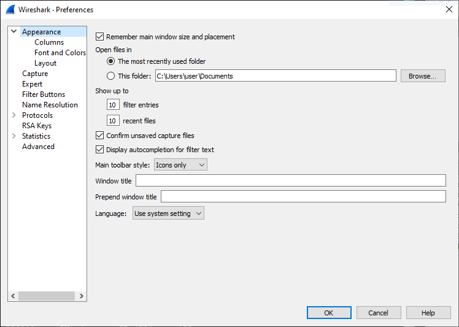

Selecting _Remember main window size and placement_ allow for a repeatable experience when restarting Wireshark.

Selecting _Open files in_ allows you to determine where to start the file selection dialog when opening capture files.

The preference _Show up to_ allows you to determine how much history is tracked for display filter entries and recent files shown in the main application window.

Selecting _Confirm unsaved capture files_ causes a dialog to appear when closing a capture file when it was not yet saved.
This may help preventing inadvertent loss of data, eg., when Wireshark is closed.

Selecting _Display autocompletion for filter text_ causes a drop down list to appear when you enter a display filter.
This drop down list contains known display filters for easy selection.

The preference _Main toolbar style_ allows you to tailor the toolbar style in one of three ways.

The Wireshark main window title is replaced by the name of the opened capture file.
The preferences _Window title_ and _Prepend window title_ allow you to add bracketed strings after and before the window title.
These window title strings can contain variables which will be replaced by their respective values.

The following variables are available.

* %C = Capture comment from command line
* %F = File path of the capture file
* %P = Currently selected profile name
* %S = Conditional separator (dash) that only shows when surrounded by variables with values or static text
* %V = Wireshark version info

The _Language_ preference allows you to select the language used in the GUI.
Note that the protocol information and details are kept in the language commonly used in this field, that being English.

==== Columns

These preferences give you the option to control the definition of the columns shown in the packet list, once a capture file is loaded.

.Column preferences
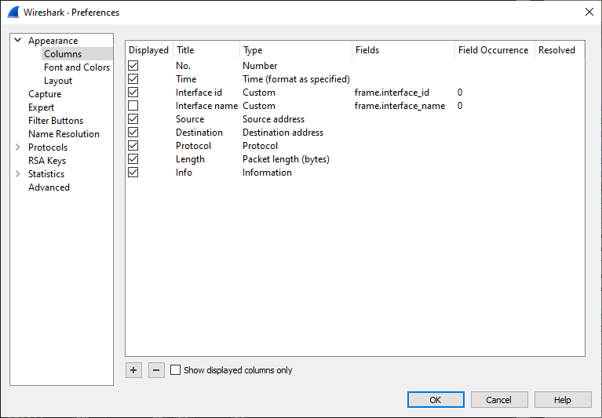

btn:[+]:: Add new entry to the list.

btn:[-]:: Remove the selected entry.

Selecting _Show displayed columns only_ hides all non-displayed columns from the list, possibly making navigating the list easier.

The rows can be dragged and dropped to arrange them in the desired order.

The columns in the entries are as follows.

Selecting _Displayed_ causes the column to be shown in the packet list.

The _Title_ is the text shown in the header of the column in the packet list.

The _Type_ is the type of value to be shown. This can be a predefined type, ie. a value in a defined format, or custom.

The following settings are applicable when the _Type_ is set to "custom"

The _Fields_ setting is the display filter name of the field to be shown in the column in the packet list.

The _Field Occurrence_ setting is count of the given field in the frame, for fields that appear more than once in a frame.

Selecting _Resolved_ causes name resolution to be applied to the field value, when available.

==== Font and Colors

These preferences give you the option to select the font and colors used in the various packet panes.
Most usable is to select a mono spaced font, which allows for a cleaner presentation, but using a proportional font is possible too.

.Font and colors preferences
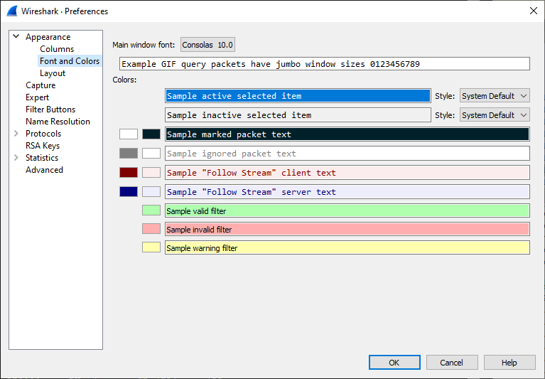

==== Layout

These preferences allow you to define the layout of the GUI once a capture file is loaded.

.Layout preferences
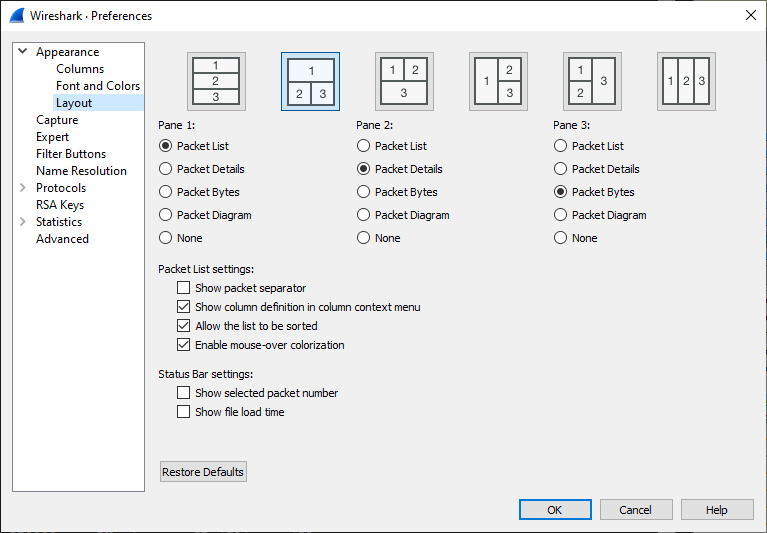

Make sure that you have at least one pane configured to contain the Packet list.
Three panes can be active at the same time and they can be laid out as shown in the top layer.
The exact sizes of these panes can be changed as needed once a capture file is opened.

Selecting _Show packet list separator_ causes the packet list entries to be slightly set apart, which may improve readability at the cost of the amount of packets shown in the packet list.

Selecting _Show column definition in column context menu_ make the column context menu wider to show the currently configured field type for the column.
This may help identify the column to select or modify.

Selecting _Allow the list to be sorted_ enables the sort operator on all the columns.
This may prevent inadvertently triggering a sort, which may take considerable time for larger capture files.

The _Maximum number of cached rows_ setting determines how much packet list information is cached to speed up sort operations, where a larger number causes more memory to be consumed by the cache.
Be aware that changing other dissection settings may invalidate the cache content.

Selecting _Enable mouse-over colorization_ enables the highlighting of the currently pointed to packet in the packet list.
The currently selected packet is always highlighted.

Selecting _Show selected packet number_ adds the selected packet number to the capture file details in the status bar, taking up some space in the status bar.

Selecting _Show file load time_ adds the time it took to load the capture file to the status bar, taking up some space in the status bar.

==== Capture

These preferences allow you to set the default conditions for packet capture.

.Capture preferences
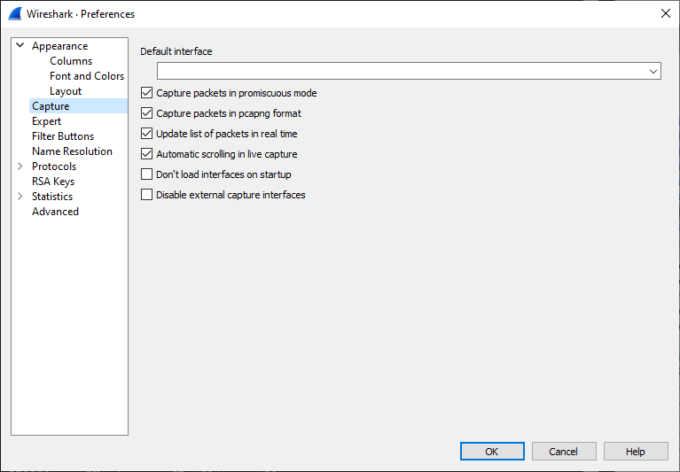

The default interface is the interface used for packet capture in case no other is selected on the opening page of GUI.
Note that this can be multiple interfaces separated by a comma.

Selecting _Capture packets in promiscuous mode_ causes the network interface(s) to capture on to be configured in promiscuous mode.
This allows all (Ethernet) frames to be received by the network interface to be capture, not only those that are addressed to the capture interface.

Selecting _Capture packets in pcapng format_ causes the Next-Generation packet capture file format to be used when capturing.
This much more capable packet capture file format has many advantages over the original format, although not every external tool may be capable of handling packet captures in this format.

Selecting _Update list of packets in real time_ causes the packet list to fill up and possibly scroll up during the packet capture process.
This does give an insight in the packets captured, although it takes processing power to dissect the capture packets.

The preference _Interval between updates (ms)_ allows you to configure how often the packet list is updated during the packet capture process.
A higher interval reduces processing, but causes more delay between capture and display in the packet list.

Selecting _Don't load interfaces on startup_ prevents Wireshark from spawning dumpcap to populate the list of capture interfaces on the local system.
This might be a time consuming operation delaying the start of the program, however on most systems this is not an issue.
The interface list can always be populated after Wireshark is started via menu:Capture[Refresh Interfaces].

Selecting _Disable external capture interfaces_ prevents Wireshark from spawning extcap programs to list off their capture interfaces.
This might be a time consuming operation delaying the start of the program, however on most systems this is not an issue.

[#ChCustPrefsExpertSection]

==== Expert Items

These preferences allow you to modify the severity set for expert items.

.Expert item preferences
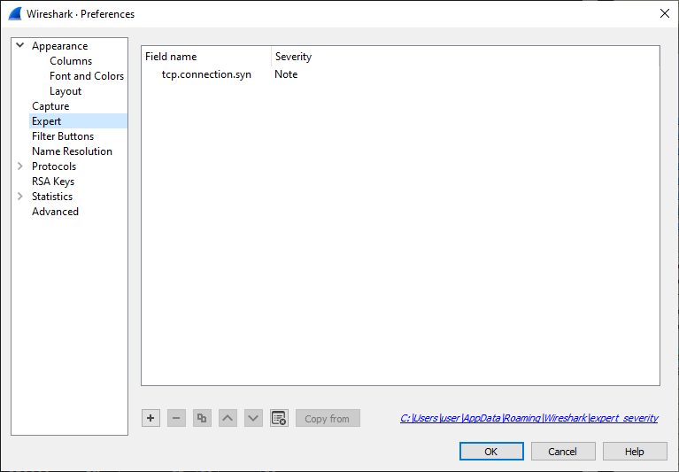

If, for whatever reason, you find that the severity for certain expert items does not match your needs you can change them here and have them used as such, showing up in the appropriate lists and overviews.
Get the Field name from selecting the field in the packet details pane, then observe the name shown in the status bar.
This is the name you enter on a new line in the list, while setting the desired _Severity_ in the next column.

btn:[+]:: Add new entry to the list.

btn:[-]:: Remove the selected entry.

btn:[Copy]:: Copy the selected entry.

btn:[⌃]:: Move the selected entry up in the list.

btn:[⌄]:: Move the selected entry down in the list.

btn:[Clear]:: Clear the list of user specified expert item severities.

btn:[Copy from]:: Copy the list of user specified expert item severities from another profile.

[#ChCustFilterButtons]
==== Filter Buttons

Having quick access to regularly used display filter expressions can be a real productivity boost.
Here you can define your own display filter buttons.

.Filter buttons
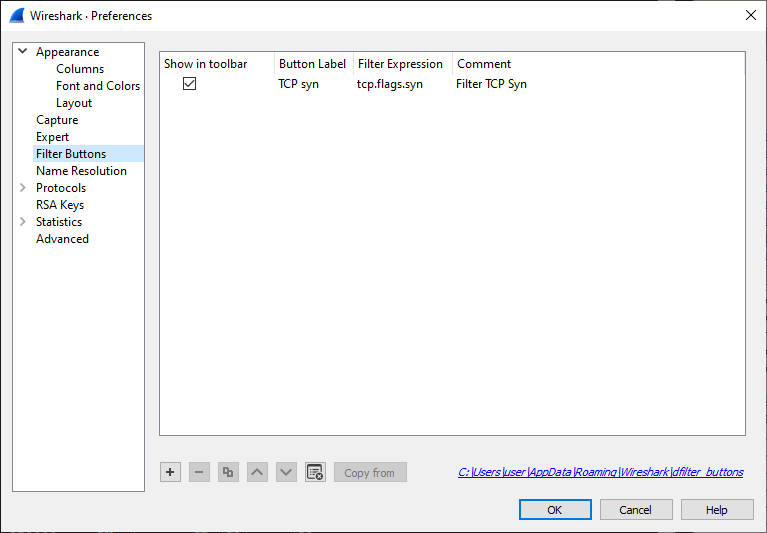

btn:[+]:: Add new entry to the list.

btn:[-]:: Remove the selected entry.

btn:[Copy]:: Copy the selected entry.

btn:[⌃]:: Move the selected entry up in the list.

btn:[⌄]:: Move the selected entry down in the list.

btn:[Clear]:: Clear the list of user specified display filter buttons.

btn:[Copy from]:: Copy the list of user specified display filter buttons from another profile.

The columns in the entries are as follows.

Selecting _Show in toolbar_ causes the button to be shown in the toolbar besides the display filter text entry.

The _Button Label_ is the text shown on the button in the toolbar.
The use of a double slash causes the button to create a dropdown list to allow grouping of multiple buttons, e.g. TCP//Syn and TCP//Res.

The _Filter Expression_ is the <<ChWorkBuildDisplayFilterSection,display filter expression>> entered into the display filter text entry when the button is clicked.

The _Comment_ is the comment text which appears in a bubble when the mouse hovers over the button.

[#ChCustPrefsNameSection]

==== Name Resolution

These preferences allow you to configure which numeric identifiers in protocols are translated into human readable text.
For some of these identifiers the readable texts are read from configurable external sources.

.Name resolution preferences
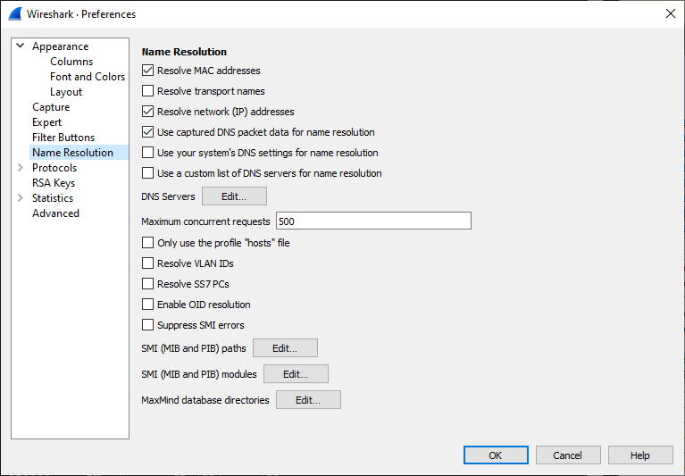

Selecting _Resolve MAC addresses_ causes the OUI (Organizationally Unique Identifier) at the start of an Ethernet address to be translated into the name registered with the IEEE for that OUI.

Selecting _Resolve transport names_ causes the UDP and TCP port numbers to be translated into the service registered to these ports by IANA.

Selecting _Resolve network (IP) addresses_ causes IPv4, IPv6 and IPX addresses to be translated into their corresponding host name.
To do this Wireshark reaches out to DNS servers to request names for addresses it finds in packets.
There are several way to do this, which can be controlled through the following preferences.

Selecting _Use captured DNS packet data for name resolution_ causes DNS response packets in the capture file to fill the network address resolution table.
These can then be used to resolve addresses found in the packets.

Selecting _Use your system's DNS settings for name resolution_ causes DNS requests to be made as would be for other network applications.

Selecting _Use a custom list of DNS servers for name resolution_ causes DNS requests to be made to manually configured DNS servers.

The _DNS Servers_ btn:[Edit...] button provides access to the dialog to manage these manually configured DNS servers.

The _Maximum concurrent requests_ input field allows you to limit the amount of DNS queries made at the same time.

Selecting _Resolve VLAN IDs_ causes the file "vlans" to be read and used to name VLANs.
This file has the simple format of one line per VLAN, starting wit VLAN ID, a tab character, followed by the name of the VLAN.

Selecting _Resolve SS7 PCs_ causes the file "ss7pcs" to be read and used to name SS7 Point Codes.
This file has the simple format of one line per Point Code, starting with Network Indicator, a dash, the Point Code in decimal, a tab character, followed by the name of the Point Code.

Selecting _Enable OID resolution_ causes the SMI library to be initialized.
This library is capable of loading MIB/PIB files to provide name resolution for SMI objects, as present in SNMP packets.

Selecting _Suppress SMI errors_ prevents the SMI library from emitting error messages while loading MIB/PIB files.
The SMI library is very sensitive to irregularities in these files often resulting in harmless error being emitted.

The _SMI (MIB and PIB) paths_ btn:[Edit...] button provides access to the dialog to manage the directories where the MIB/PIB files to be loaded can be found.

The _SMI (MIB and PIB) modules_ btn:[Edit...] button provides access to the dialog to manage the MIB/PIB modules to be loaded.

The _MaxMind database directories_ btn:[Edit...] button provides access to the dialog to manage the directories where the MaxMind database files can be found. See <<ChMaxMindDbPaths>>.

[#ChCustPrefsProtocolsSection]

==== Protocols

Wireshark supports quite a few protocols, which is reflected in the long list of child entries of the “Protocols” pane.
You can jump to the preferences for a specific protocol by expanding “Protocols” and typing the first few letters of the protocol name.

.Protocol preferences
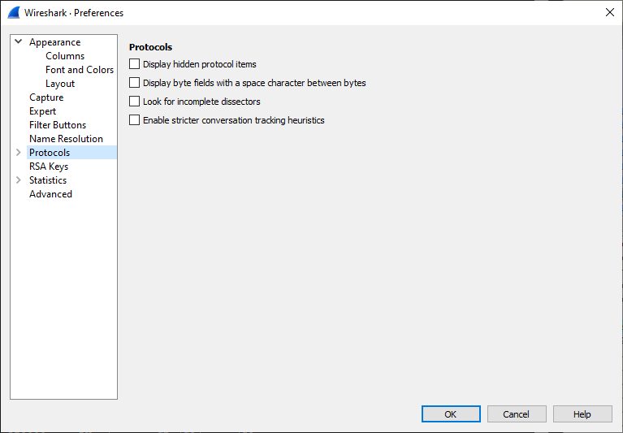

There are a few general protocol related preferences, listed below.

Selecting _Display hidden protocol items_ influences what is shown in the packet details pane of the packet selected from the packet list.
Some protocol dissectors add hidden protocol items that provide additional interpretations of the packet data, or with different display filter strings.
These may or may not provide valuable information to the user and may clutter the output, therefor these items can be hidden.

Selecting _Display byte fields with a space character between bytes_ influences the way a byte field in shown in the packet details pane of the packet selected in the packet list, if the dissector creates a byte field that is.
The bytes in the byte field are normally shown as a concatenated sequence of hexadecimals.
This preference allows you to get the representation of each byte separated by a space.
This may improve readability of the individual bytes in the byte field.

Selecting _Look for incomplete dissectors_ causes expert items to be added to the dissection of packet data for which the dissector does not create an interpretation.
Dissectors should strive to not skip packet bytes and this preference allows you to be made aware of this.

Selecting _Enable stricter conversation tracking heuristics_ allows dissectors to take more identifiers into consideration when creating "conversations".
These are used to track related packets.
The heuristics for these conversations are sensitive to mis-identification of packets, possibly corrupting conversation analysis.
Adding more identifiers can reduce the change of this happening.
Currently only the IPv4, ICMP and ICMPv6 dissector use this preference.

Selecting _Ignore duplicate frames_ causes a duplicate frame to appear in the packet list, but flagged as ignored, hence not dissected.
The determination of a duplicate frame is made based on the SHA256 hash of the bytes in the frame.

The preference _Deinterlacing conversations key_ gives you options for deinterlacing the conversations. While _NONE_ keeps the historical behaviour, the other options
are built on three keys with the following meanings: _V_ (VLAN), _M_ (Mac Address), _I_ (Interface). Packets which seem identical because they have the
same payload but have a different value for their VLAN Tag, a MAC Address, or were captured on different interfaces, will then be part of different conversations
if the respective deinterlacing key is activated.

The preference _The max number of hashes to keep in memory for determining duplicate frames_ allows you to set how large the set of frames to consider for duplication is.

[#ChCustPrefsRSASection]

==== RSA Keys

For more information see {wireshark-wiki-url}TLS.

.RSA keys
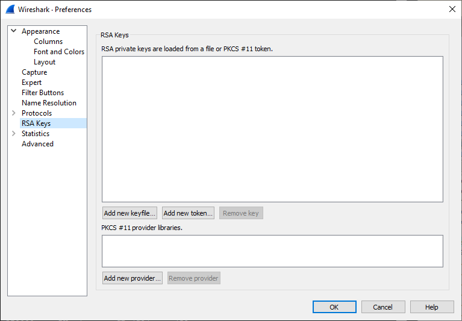

==== Statistics

These preference have influence on the Statistics Tree (stats_tree) based dialogs accessible via the _Statistics_ menu.

.Statistics preferences
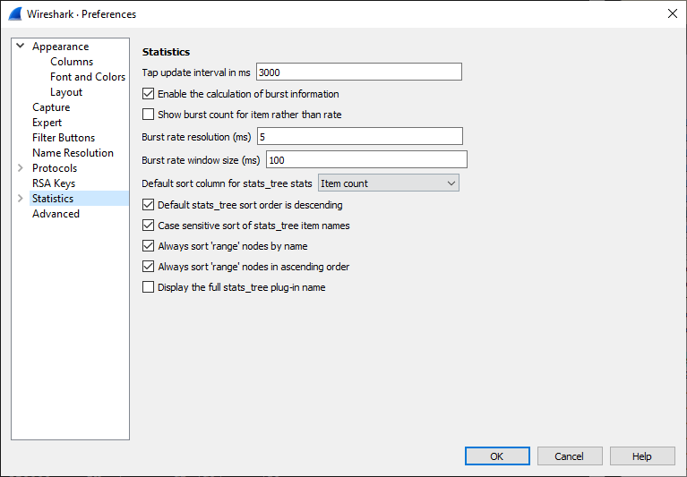

The preference _Tap update interval in ms_ allows you to set how quickly protocol taps are being updated, partially determining the update speed of various dialogs and graphs.

Selecting _Enable the calculation of burst information_ allows the Statistics Tree system to calculate burst information.

Selecting _Show burst count for item rather than rate_ allows the statistics nodes to show the count of events within the burst window instead of a burst rate.
Burst rate is calculated as number of events within burst window divided by the burst window length.

The preference _Burst rate resolution (ms)_ sets the duration of the time interval into which events are grouped when calculating the burst rate.
Setting a higher resolution (ie., a smaller number) increases processing overhead.

The preference _Burst rate window size (ms)_ sets the duration of the sliding window during which the burst rate is measured.
Longer window relative to burst rate resolution increases processing overhead.
This value will be truncated to a multiple of the _Burst rate resolution_ preference setting.

The preference _Default sort column for stats_tree stats_ gives you to option to select one of the columns to sort on.

Selecting _Default stats_tree sort order is descending_ causes a descending sort order based on the previously selected column.

Selecting _Case sensitive sort of stats_tree item names_ causes a case sensitive sort based on the previous selected order and column.

Selecting _Always sort 'range' nodes by name_ causes the sort to take place by name rather than values.

Selecting _Always sort 'range' nodes in ascending order_ makes an exception for range nodes to the previously selected sort order.

Selecting _Display the full stats_tree plug-in name_ causes the full menu path of the Statistics Tree plugin to be shown in the title.

==== Advanced

The “Advanced” pane will let you view and edit all of Wireshark’s preferences, similar to link:about:config[] and link:chrome:flags[] in the Firefox and Chrome web browsers.

.Advanced preferences
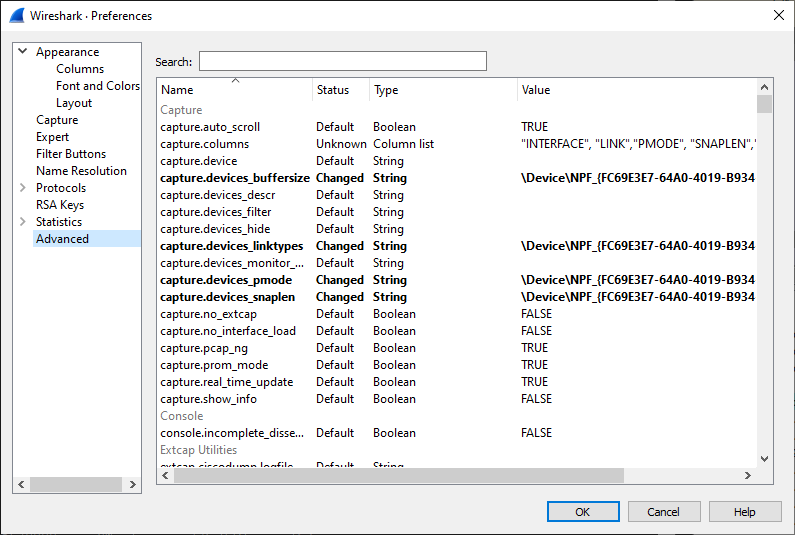

You can search for a preference by typing text into the “Search” entry.
You can also pass preference names to Wireshark and TShark on the command line.
For example, the __gui.prepend_window_title__ can be used to differentiate between different instances of Wireshark on your screen:

[source,sh]
----
$ wireshark -o "gui.prepend_window_title:LAN" &
$ wireshark -o "gui.prepend_window_title:External Network" &
----

[#ChCustConfigProfilesSection]

=== Configuration Profiles

Configuration Profiles can be used to configure and use more than one set of
preferences and configurations. Select the menu:Edit[Configuration Profiles...] menu item
or press kbd:[Shift+Ctrl+A] or kbd:[Shift+Cmd+A] (macOS) and Wireshark will pop up
the Configuration Profiles dialog box as shown in
<<ChCustGUIConfigProfilesPage>>. It is also possible to click in the “Profile”
part of the statusbar to popup a menu with available Configuration Profiles
(<<ChUseWiresharkStatusbarProfile>>).

Configuration files stored in each profile include:

* Preferences (preferences) (<<ChCustPreferencesSection>>)

* Capture Filters (cfilters) (<<ChWorkDefineFilterSection>>)

* Display Filters (dfilters) (<<ChWorkDefineFilterSection>>)

* Display Filter Macros (dmacros) (<<ChWorkDefineFilterMacrosSection>>)

* Coloring Rules (colorfilters) (<<ChCustColorizationSection>>)

* Disabled Protocols (disabled_protos) (<<ChAdvEnabledProtocols>>)

* Most User Accessible Tables (<<ChUserTable>>)

* Changed dissector assignments (__decode_as_entries__), which can be set in the “Decode
  As...” dialog box (<<ChAdvDecodeAs>>).

* Some recent settings (recent), such as pane sizes in the Main window
  (<<ChUseMainWindowSection>>), column widths in the packet list
  (<<ChUsePacketListPaneSection>>), all selections in the menu:View[] menu
  (<<ChUseViewMenuSection>>) and the last directory navigated to in the “File
  Open” dialog.

All other configurations are stored in the personal configuration folder and
are common to all profiles.

[#ChCustGUIConfigProfilesPage]
.The configuration profiles dialog box
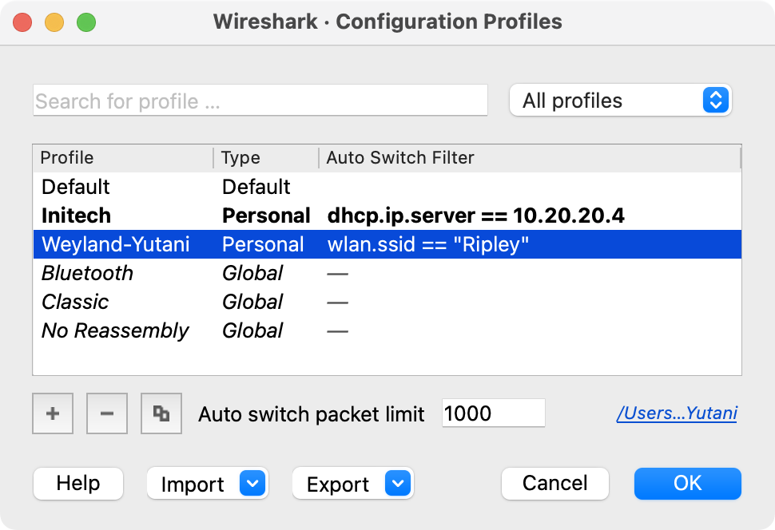

Search for profile ...::
The list of profiles can be filtered by entering part of the profile's name
into the search box.

Type selection::
Profiles can be filtered between displaying "All profiles", "Personal profiles"
and "Global profiles"
* Personal profiles - these are profiles stored in the user's configuration directory
* Global profiles - these are profiles provided with Wireshark

New (+)::
Create a new profile. The name of the created profile is “New profile”
and is highlighted so that you can more easily change it.

Delete (-)::
Deletes the selected profile. This includes all configuration files used
in this profile. Multiple profiles can be selected and deleted at the same time.
It is not possible to delete the “Default” profile or global profiles.
Deletion of the "Default" profile will reset this profile.

Copy::
Copies the selected profile. This copies the configuration of the
profile currently selected in the list. The name of the created profile
is the same as the copied profile, with the text “(copy)” and is
highlighted so that you can more easily change it.

Auto switch packet limit::
The number of packets to check for automatic profile switching, described below.
Setting this to zero disables automatic profile switching.

btn:[Import]::
Profiles can be imported from zip-archives as well as directly from directory
structures. Profiles, which already exist by name will be skipped, as well as
profiles named "Default".

btn:[Export]::
Profiles can be exported to a zip-archive. Global profiles, as well as the default
profile will be skipped during export. Profiles can be selected in the list individually
and only the selected profiles will be exported

btn:[OK]::
This button saves all changes, applies the selected profile and closes the
dialog.

btn:[Cancel]::
Close this dialog. This will discard unsaved settings, new profiles will not be
added and deleted profiles will not be deleted.

btn:[Help]::
Show this help page.

==== Automatic Profile Switching

You can configure Wireshark to automatically change configuration profiles by adding a display filter to the "Auto Switch Filter" setting for a profile.
When you open a capture file, Wireshark will check each filter against a limited number of packets and will switch to the first profile with a matching filter.
The number of packets is determined by the "Auto switch packet limit" setting, and a limit of 0 will disable this feature.
Manually changing your profile will disable this behavior until you open a different capture file.

[#ChUserTable]

=== User Accessible Tables

User Accessible Tables are a type of preference table which may be
associated with particular <<ChCustPrefsProtocolsSection,protocols>> or
with the application as a whole.

User Accessible Tables have a common editor dialog which works as described
in <<ChCustPrefsExpertSection>> and <<ChCustFilterButtons>>. Note that
the name of the file appears in the lower right corner of the dialog.

The files are saved in a CSV format, where values are either double quoted
ASCII strings (using C-style backslash escapes for non-printable characters)
or unquoted hexstrings, depending on the field type. They can be edited directly
when Wireshark is not running, though this is discouraged. Entries can
also be appended to the table by passing an appropriate CSV formatted
record string <<ChCustCommandLine,on the command line>>.

// There's a number of newer dissector UATs that aren't mentioned here
// and could use help sections.

Most UATs are stored in the
<<ChCustConfigProfilesSection,configuration profile>>:

--
* Custom HTTP headers (custom_http_header_fields)

* Custom IMF headers (imf_header_fields)

* Custom LDAP AttributeValue types (custom_ldap_attribute_types)

* <<ChCustFilterButtons,Display Filter Buttons>> (dfilter_buttons)

* <<ChWorkDefineFilterMacrosSection,Display Filter Macros>> (dfilter_macros), prior to Wireshark 4.4

* <<ChCustPrefsNameSection,DNS Servers>> (addr_resolve_dns_servers)

* <<ChEssCategoryAttributes,ESS Category Attributes>> (ess_category_attributes)

* <<ChCustPrefsExpertSection,Expert Item Severity>> (expert_severity)

* <<Ch80211Keys,IEEE 802.11 WLAN Decryption Keys>> (80211_keys)

* <<ChIKEv2DecryptionSection,IKEv2 decryption table>> (ikev2_decryption_table)

* <<ChStatIOGraphs,I/O Graphs>> (io_graphs)

* <<ChK12ProtocolsSection,K12 Protocols>> (k12_protos)

* <<ChObjectIdentifiers,Object Identifier Names and Associated Syntaxes>> ()

* <<ChStatPacketLengths,Packet Lengths>> (packet_lengths)

* <<ChPresContextList,PRES Users Context List>> (pres_context_list)

* <<ChSccpUsers,SCCP Users Table>> (sccp_users)

* <<ChSNMPEnterpriseSpecificTrapTypes,SNMP Enterprise Specific Trap Types>> (snmp_specific_traps)

* <<ChSNMPUsersSection,SNMP Users>> (snmp_users)

* <<ChUserDLTsSection,User DLTs Table>> (user_dlts)

* <<ChProtobufSearchPaths,Protobuf Search Paths>> (protobuf_search_paths)

* <<ChProtobufUDPMessageTypes,Protobuf UDP Message Types>> (protobuf_udp_message_types)
--

Other UATs are stored in the personal configuration directory and are
common to all profiles:

--
* <<ChMaxMindDbPaths,MaxMind Database Paths>> (maxmind_db_paths)

* <<ChCustPrefsRSASection,RSA Private Keys>> (rsa_keys) and <<ChCustPrefsRSASection,PKCS #11 Provider Libraries>> (pkcs11_libs)

* <<ChCustPrefsNameSection,SMI Modules>> (smi_modules) and <<ChCustPrefsNameSection,SMI Paths>> (smi_paths)
--

[#ChEssCategoryAttributes]

=== ESS Category Attributes

Wireshark uses this table to map ESS Security Category attributes to textual representations.  The values to put in this table are usually found in an http://www.xmlspif.org/[XML SPIF], which is used for defining security labels.

This table is a user table, as described in <<ChUserTable>>, with the
following fields:

Tag Set::
An Object Identifier representing the Category Tag Set.

Value::
The value (Label And Cert Value) representing the Category.

Name::
The textual representation for the value.

[#ChMaxMindDbPaths]

=== MaxMind Database Paths

If your copy of Wireshark supports https://www.maxmind.com/[MaxMind’s] MaxMindDB library, you can use their databases to match IP addresses to countries, cites, autonomous system numbers, and other bits of information.
Some databases are https://dev.maxmind.com/geoip/geoip2/geolite2/[available at no cost for registered users], while others require a licensing fee.
See https://www.maxmind.com/[the MaxMind web site] for more information.

The configuration for the MaxMind database is a user table, as described
in <<ChUserTable>>, with the following fields:

Database pathname::
This specifies a directory containing MaxMind data files. Any files
ending with _.mmdb_ will be automatically loaded.

By default Wireshark will always search for data files in
`/usr/share/GeoIP` and `/var/lib/GeoIP` on non-Windows platforms
and in `C:\ProgramData\GeoIP` and `C:\GeoIP` on Windows. You can
put any additional search paths here, e.g. `C:\Program Files\Wireshark\GeoIP`
might be a good choice on Windows.

[NOTE]
====
While the default search paths are not listed in the user table, they
are in the list viewable by opening menu:Help[About Wireshark] and
selecting the "Folders" tab.
====

[#ChGeoIPDbPaths]

Previous versions of Wireshark supported MaxMind's original GeoIP Legacy
database format. They were configured similar to MaxMindDB files above,
except GeoIP files must begin with _Geo_ and end with _.dat_. They are
no longer supported and MaxMind stopped distributing GeoLite Legacy
databases in April 2018.

[#Ch80211Keys]

=== IEEE 802.11 WLAN Decryption Keys

Wireshark can decrypt WEP and WPA/WPA2/WPA3 in pre-shared (or personal) mode,
as well as in enterprise mode. Security improvements in more recent 802.11
releases require distinct session keys, instead of being able to decipher
all traffic to a given access point with a single known password and SSID.

You can add decryption keys using Wireshark's IEEE 802.11 preferences.
Up to 64 keys are supported.

==== Adding Keys

Go to menu:Edit[Preferences >Protocols >IEEE 802.11], or, from the pop-up menu
in the "Packet List" or "Packet Details" pane from a frame that contains IEEE
802.11, menu:Protocol Preferences[IEEE 802.11 wireless LAN].
You should see a window that looks like this:

."IEEE 802.11 wireless LAN" preferences
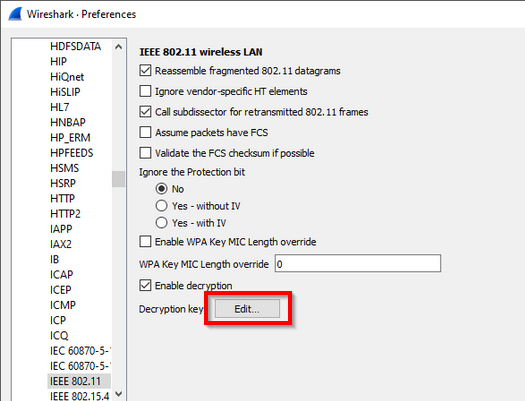

Click on the "Edit..." button next to "Decryption Keys" to add keys.
You should see a window that looks like this:

.802.11 Decryption Key Types
image::images/ws-wireless-key-type.png[{screenshot-attrs}]

When you click the **+** button to add a new key, there are five key types you
can choose from: **wep**, **wpa-pwd**, **wpa-psk**, **tk**, or **msk**.
The correct key type(s) depend on the Cipher Suite and Authentication and
Key Management Suite (AKMS) used to encrypt the wireless traffic.

wep:: The key must be provided as a string of hexadecimal numbers, with or
without colons, and will be parsed as a WEP key. WEP keys can be 40-bit
(5 bytes, or 10 hexadecimal characters), 104-bit, or occasionally 128-bit:

 a1:b2:c3:d4:e5

 0102030405060708090a0b0c0d

wpa-pwd:: The password and SSID are used to create a raw pre-shared WPA key.
The password can be between 8 and 63 characters, and the SSID can be up to
32 bytes. (Typically both are printable ASCII, but that is not a hard
limitation of the specification, only a recommendation.)

 MyPassword:MySSID

You can optionally omit the colon and SSID, and Wireshark will try to decrypt
packets using the last-seen SSID. This may not work for captures taken in busy
environments, since the last-seen SSID may not be correct.

 MyPassword

[NOTE]
====
The WPA passphrase and SSID let you encode non-printable or otherwise troublesome
characters using URI-style percent escapes, e.g., `%20` for a space. As a result
you have to escape the percent characters themselves using `%25`. You also *must*
escape colons in the passphrase or SSID themselves as `%3a`, in order to
distinguish them from a colon as a separator between the passphrase and SSID.
====

[WARNING]
====
The WPA pass-phrase and SSID method is for WPA/WPA2-Personal only. It will
not work for WPA3-Personal, which uses SAE (Simultaneous Authentication of
Equals), nor for the Enterprise / 802.1X / EAP modes.
====

wpa-psk:: The key must be provided as a hexadecimal string, and is parsed as a
PSK (Pre-Shared Key) or PMK (Pairwise Master Key). For WPA/WPA2-Personal,
the PSK and the PMK are identical, and directly derived from the passphrase
and SSID above. The keys can be 256 bits (32 bytes, 64 hex characters) or
384 bits (48 bytes, 96 hex characters).

 0102030405060708091011...6061626364

tk:: The key must be provided as a hexadecimal string, and is parsed as a
PTK (Pairwise Transient Key) or GTK (Group Temporal Key). The keys can
be 16 or 32 bytes (128 or 256 bits), depending on the cipher suite used.
(5 and 13 byte WEP TKs are not yet supported.)

msk:: The key must be provided as a hexadecimal string, and is parsed as
a MSK (Master Session Key). This is used for FT-EAP (IEEE 802.11r
Fast BSS Transition with EAP authentication). The key can be 64 or 128
bytes.

.802.11 Decryption Key Examples
image::images/ws-wireless-key-examples.png[{screenshot-attrs}]

////
AirPcap was discontinued so this sections from the Wiki isn't relevant for many people currently
==== Adding Keys: Wireless Toolbar

If you are using the Windows version of Wireshark and you have an [AirPcap](/AirPcap) adapter you can add decryption keys using the wireless toolbar. If the toolbar isn't visible, you can show it by selecting *View-\>Wireless Toolbar*. Click on the *Decryption Keys...* button on the toolbar:

This will open the decryption key management window. As shown in the window you can select between three decryption modes: **None**, **Wireshark**, and **Driver**:

Selecting **None** disables decryption. Selecting **Wireshark** uses Wireshark's built-in decryption features. **Driver** will pass the keys on to the [AirPcap](/AirPcap) adapter so that 802.11 traffic is decrypted before it's passed on to Wireshark. Driver mode only supports WEP keys.
////

==== Gotchas

Along with decryption keys there are other preference settings that affect decryption.

  - Make sure *Enable decryption* is selected.

  - You may have to toggle *Assume Packets Have FCS* and *Ignore the Protection bit* depending on how your 802.11 driver delivers frames.

===== Capturing the 4-way Handshake

WPA and WPA2 use keys derived from an EAPOL handshake, which occurs when a machine joins a Wi-Fi network, to encrypt traffic. Unless **all four** handshake packets are present for the session you're trying to decrypt, Wireshark won't be able to decrypt the traffic. You can use the display filter **eapol** to locate EAPOL packets in your capture.

In order to capture the handshake for a machine, you will need to force the machine to (re-)join the network while the capture is in progress. One way to do this is to put the machine to sleep (for smartphones and tablets, "turning off" the machine puts it to sleep) before you start the capture, start the capture, and then wake the machine up. You will need to do this for all machines whose traffic you want to see.

If a TK is provided as a key, then the EAPOL 4-way handshake is not necessary,
as the TK is what the handshake derives. However, all available TKs will be
tried agi

===== Too Many Associations

WPA and WPA2 use individual keys for each device. Wireshark is able to handle
up to 256 active associations, which should be enough in most circumstances.
Nevertheless, if a capture has too many devices and too many associations, then
while the packet list may show all packets decoded on the first pass, randomly
accessing different packets in the packet details will result in some packets
failing to be properly deciphered.

Filtering out only the relevant packets (e.g. with "wlan.addr") and saving into
a new file should get decryption working in all cases, though it may require
editing keys in the preferences or restarting Wireshark in order to free used
associations. For the same reason, it is possible to be able to decode packets
in a capture file without any EAPOL packets in it, as long as Wireshark did see
the handshake for this communication in another capture without being
restarted or editing keys. This can sometimes lead to exporting selected
packets to a new file, opening that file and decoding seeming to work, but
then decoding suddenly fail on the new file after Wireshark is restarted or keys
are edited. If decoding suddenly stops working on a capture make sure the needed
EAPOL packets are still in it.

===== WPA/WPA2 Enterprise/Rekeys

As long as you can somehow extract the PMK from either the client or the Radius
Server and configure the key (as PSK) all supported Wireshark versions will decode
the traffic just fine up to the first EAPOL rekey.

EAPoL rekey is often enabled for WPA/WPA2 enterprise and will change the used
encryption key similar to the procedure for the initial connect, but it can also
be configured and used for pre-shared (personal) mode.

Decrypting IEEE 802.11r Fast BSS Transition roaming requires capturing
reassociation frames for similar reasons, and is supported by recent
Wireshark versions.

===== WPA3 Per-Connection Decryption

In WPA3, a different PMK is used for each connection in order to achieve forward
secrecy. Capturing the 4-way handshake and knowing the network password is not
enough to decrypt packets; you must obtain the PMK from either the client or
access point (typically by enabling logging in `wpa_supplicant` or `hostapd`
with the `-d -K` flags) and use this as the decryption key in Wireshark. Even
then, the decryption will only work for packets between that client and access
point, not for all devices on that network.

===== TKs and Performance

The TKs are the actual transient keys used to encrypt packets, which are derived
during the handshake. If known, they can decrypt packets without having the
handshake packets in a capture. However, having TKs as encryption keys in the
table will affect IEEE 802.11 dissector performance as each encrypted
packet will be tested against every TK until decryption is successful.
If the table is configured with many TKs, none of which match any
encrypted frame in the capture, performance can be slow.

Once a match is found, an association is formed similar to in the usual
method and decryption of other frames with the same key should be on
par with normal decryption flow. Thus, if most frames in the capture
match TKs (or other keys), and only a limited number of TKs are configured,
the performance impact is slight.

[#ChIKEv2DecryptionSection]

=== IKEv2 decryption table

Wireshark can decrypt Encrypted Payloads of IKEv2 (Internet Key Exchange version
2) packets if necessary information is provided. Note that you can decrypt only
IKEv2 packets with this feature. If you want to decrypt IKEv1 packets or ESP
packets, use Log Filename setting under ISAKMP protocol preference or settings
under ESP protocol preference respectively.

This is handled by a user table, as described in <<ChUserTable>>,
with the following fields:

Initiator’s SPI::
Initiator’s SPI of the IKE_SA. This field takes hexadecimal string without
“0x” prefix and the length must be 16 hex chars (represents 8 octets).

Responder’s SPI::
Responder’s SPI of the IKE_SA. This field takes hexadecimal string without
“0x” prefix and the length must be 16 hex chars (represents 8 octets).

SK_ei::
Key used to encrypt/decrypt IKEv2 packets from initiator to responder. This
field takes hexadecimal string without “0x” prefix and its length must meet
the requirement of the encryption algorithm selected.

SK_er::
Key used to encrypt/decrypt IKEv2 packets from responder to initiator. This
field takes hexadecimal string without “0x” prefix and its length must meet
the requirement of the encryption algorithm selected.

Encryption Algorithm::
Encryption algorithm of the IKE_SA.

$$SK_ai$$::
Key used to calculate Integrity Checksum Data for IKEv2 packets from responder
to initiator. This field takes hexadecimal string without “0x” prefix and its
length must meet the requirement of the integrity algorithm selected.

$$SK_ar$$::
Key used to calculate Integrity Checksum Data for IKEv2 packets from initiator
to responder. This field takes hexadecimal string without “0x” prefix and its
length must meet the requirement of the integrity algorithm selected.

Integrity Algorithm::
Integrity algorithm of the IKE_SA.

[#ChObjectIdentifiers]

=== Object Identifiers

// This table appears under the BER dissector, perhaps it should be moved
// to the "Name Resolution" preference section?

Many protocols that use ASN.1 use Object Identifiers (OIDs) to uniquely identify
certain pieces of information. In many cases, they are used in an extension
mechanism so that new object identifiers (and associated values) may be defined
without needing to change the base standard.

While Wireshark has knowledge about many of the OIDs and the syntax of their
associated values, the extensibility means that other values may be encountered.

Wireshark uses this table to allow the user to define the name and syntax of
Object Identifiers that Wireshark does not know about (for example, a privately
defined X.400 extension). It also allows the user to override the name and
syntax of Object Identifiers that Wireshark does know about (e.g., changing the
name “id-at-countryName” to just “c”).

This table is a user table, as described in <<ChUserTable>>, with the
following fields:

OID::
The string representation of the Object Identifier e.g., “2.5.4.6”.

Name::
The name that should be displayed by Wireshark when the Object Identifier is
dissected e.g., (“c”);

Syntax::
The syntax of the value associated with the Object Identifier. This must be one
of the syntaxes that Wireshark already knows about (e.g., “PrintableString”).

[#ChPresContextList]

=== PRES Users Context List

Wireshark uses this table to map a presentation context identifier to a given
object identifier when the capture does not contain a PRES package with a
presentation context definition list for the conversation.

This table is a user table, as described in <<ChUserTable>>, with the
following fields:

Context Id::
An Integer representing the presentation context identifier for which this
association is valid.

Syntax Name OID::
The object identifier representing the abstract syntax name, which defines the
protocol that is carried over this association.

[#ChSccpUsers]

=== SCCP users Table

Wireshark uses this table to map specific protocols to a certain DPC/SSN
combination for SCCP.

This table is a user table, as described in <<ChUserTable>>, with the
following fields:

Network Indicator::
An Integer representing the network indicator for which this association is
valid.

Called DPCs::
A range of integers representing the dpcs for which this association is valid.

Called SSNs::
A range of integers representing the ssns for which this association is valid.

User protocol::
The protocol that is carried over this association

[#ChSNMPSMIModules]

=== SMI (MIB and PIB) Modules

If your copy of Wireshark supports libSMI, you can specify a list of MIB and PIB
modules here. The COPS and SNMP dissectors can use them to resolve OIDs.

Module name::
The name of the module, e.g., IF-MIB.

[#ChSNMPSMIPaths]

=== SMI (MIB and PIB) Paths

If your copy of Wireshark supports libSMI, you can specify one or more paths to
MIB and PIB modules here.

Directory name::
A module directory, e.g., `/usr/local/snmp/mibs`. Wireshark automatically uses
the standard SMI path for your system, so you usually don’t have to add anything
here.

[#ChSNMPEnterpriseSpecificTrapTypes]

=== SNMP Enterprise Specific Trap Types

Wireshark uses this table to map specific-trap values to user defined
descriptions in a Trap PDU. The description is shown in the packet details
specific-trap element.

This table is a user table, as described in <<ChUserTable>>, with the
following fields:

Enterprise OID::
The object identifier representing the object generating the trap.

Trap Id::
An Integer representing the specific-trap code.

Description::
The description to show in the packet details.

[#ChSNMPUsersSection]

=== SNMP users Table

Wireshark uses this table to verify authentication and to decrypt encrypted
SNMPv3 packets.

This table is a user table, as described in <<ChUserTable>>, with the
following fields:

Engine ID::
If given this entry will be used only for packets whose engine id is this. This
field takes a hexadecimal string in the form 0102030405.

Username::
This is the userName. When a single user has more than one password for
different SNMP-engines the first entry to match both is taken, if you need a
catch all engine-id (empty) that entry should be the last one.

Authentication model::
Which auth model to use (either “MD5”, “SHA1”, "SHA2-224", "SHA2-256", "SHA2-384" or "SHA2-512").

Password::
The authentication password. Use _\xDD_ for unprintable characters. A
hexadecimal password must be entered as a sequence of _\xDD_ characters. For
example, the hex password 010203040506 must be entered as
_\x01\x02\x03\x04\x05\x06_. The _\_ character must be treated as an unprintable
character, i.e., it must be entered as _\x5C_ or _\x5c_.

Privacy protocol::
Which encryption algorithm to use (either “DES”, “AES”, "AES192" or "AES256").

Privacy password::
The privacy password. Use _\xDD_ for unprintable characters. A hexadecimal
password must be entered as a sequence of _\xDD_ characters. For example, the hex
password 010203040506 must be entered as _\x01\x02\x03\x04\x05\x06_. The _\_
character must be treated as an unprintable character, i.e., it must be entered
as _\x5C_ or _\x5c_.

Key expansion method::
Which method to use to expand the key when the generated key provides too few bytes
for the selected encryption method (either based on "draft-reeder-snmpv3-usm-3desede-00" or
as implemented in AGENT++).

[#ChK12ProtocolsSection]

=== Tektronix K12xx/15 RF5 protocols Table

The Tektronix K12xx/15 rf5 file format uses helper files (*.stk) to identify the
various protocols that are used by a certain interface. Wireshark doesn’t read
these stk files, it uses a table that helps it identify which lowest layer
protocol to use.

Stk file to protocol matching is handled by a user table, as described
in <<ChUserTable>>, with the following fields:

Match string::
A partial match for an stk filename, the first match wins, so if you have a
specific case and a general one the specific one must appear first in the list.

Protocol::
This is the name of the encapsulating protocol (the lowest layer in the packet
data) it can be either just the name of the protocol (e.g., mtp2, eth_withoutfcs,
sscf-nni ) or the name of the encapsulation protocol and the “application”
protocol over it separated by a colon (e.g., sscop:sscf-nni, sscop:alcap,
sscop:nbap, ...)

[#ChUserDLTsSection]

=== User DLTs dissector table

When a pcap file uses one of the user DLTs (147 to 162) Wireshark uses this
table to know which dissector(s) to use for each user DLT.

This table is a user table, as described in <<ChUserTable>>, with the
following fields:

DLT::
One of the user dlts.

Payload dissector::
This is the name of the payload dissector (the lowest layer in the packet data).
(e.g., “eth_withfcs, "eth_withoutfcs”, and "eth_maybefcs" respectively for Ethernet frames that do, do not, or might possibly include the FCS at the end, “ip” for trying IPv4 then IPv6)

Header size::
If there is a header (before the payload) this tells which
size this header is. A value of 0 disables the header dissector.

Header dissector::
The name of the header dissector to be used (uses “data” as default).

Trailer size::
If there is a trailer (after the payload) this tells which
size this trailer is. A value of 0 disables the trailer dissector.

Trailer dissector::
The name of the trailer dissector to be used (uses “data” as default).

[#ChProtobufSearchPaths]

=== Protobuf Search Paths

The
https://developers.google.com/protocol-buffers/docs/encoding[binary wire format]
of Protocol Buffers (Protobuf) messages are not self-described protocol. For
example, the `varint` wire type in protobuf packet may be converted to int32, int64,
uint32, uint64, sint32, sint64, bool or enum field types of
https://developers.google.com/protocol-buffers/docs/proto3[protocol buffers language].
Wireshark should be configured with Protocol Buffers language files (*.proto) to
enable proper dissection of protobuf data (which may be payload of
https://grpc.io/[gRPC]) based on the message, enum and field definitions.

You can specify protobuf search paths at the Protobuf protocol preferences.
For example, if you defined a proto file with path `d:/my_proto_files/helloworld.proto`
and the `helloworld.proto` contains a line of `import "google/protobuf/any.proto";`
because the `any` type of official protobuf library is used. And the real path of
`any.proto` is `d:/protobuf-3.4.1/include/google/protobuf/any.proto`. You should
add the `d:/protobuf-3.4.1/include/` and `d:/my_proto_files` paths into protobuf
search paths.

The configuration for the protobuf search paths is a user table, as described
in <<ChUserTable>>, with the following fields:

Protobuf source directory::
This specifies a directory containing protobuf source files. For example,
`d:/protobuf-3.4.1/include/` and `d:/my_proto_files` in Windows, or
`/usr/include/` and `/home/alice/my_proto_files` in Linux/UNIX.

Load all files::
If this option is enabled, Wireshark will load all *.proto files in this directory
and its subdirectories when Wireshark startup or protobuf search paths preferences
changed. Note that the source directories that configured to protobuf official or third
libraries path (like `d:/protobuf-3.4.1/include/`) should not be set to load all
files, that may cause unnecessary memory use.

[#ChProtobufUDPMessageTypes]

=== Protobuf UDP Message Types

If the payload of UDP on certain ports is Protobuf encoding, Wireshark use this table
to know which Protobuf message type should be used to parsing the data on the specified
UDP port(s).

The configuration for UDP Port(s) to Protobuf message type maps is a user table, as
described in <<ChUserTable>>, with the following fields:

UDP Ports::
The range of UDP ports. The format may be "8000" or "8000,8008-8088,9080".

Message Type::
The Protobuf message type as which the data on the specified udp port(s) should be parsed.
The message type is allowed to be empty, that means let Protobuf to dissect the data on
specified UDP ports as normal wire type without precise definitions.

Tips: You can create your own dissector to call Protobuf dissector. If your dissector is
written in C language, you can pass the message type to Protobuf dissector by `data`
parameter of call_dissector_with_data() function. If your dissector is written in Lua, you
can pass the message type to Protobuf dissector by `pinfo.private["pb_msg_type"]`. The format
of `data` and `pinfo.private["pb_msg_type"]` is

----
    "message," message_type_name
----

For example:

----
    message,helloworld.HelloRequest
----

the `helloworld` is package name, `HelloRequest` is message type.

// End of WSUG Chapter Customizing
