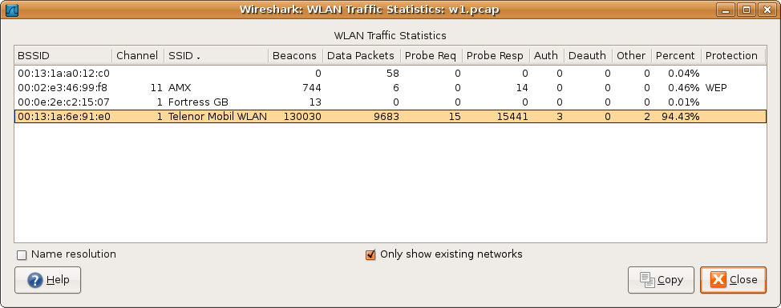

// WSUG Chapter Wireless

[#ChWireless]

== Wireless

[#ChWirelessIntroduction]

=== Introduction

The Wireless menu provides access to statistics related to wireless traffic.
For configuring keys to decrypt wireless traffic, see <<Ch80211Keys>>

[#ChWirelessBluetoothATTServerAttributes]

=== Bluetooth ATT Server Attributes

Bluetooth ATT Server Attributes window displays a list of captured Attribute Protocol (ATT) packets. The user can filter the list by the interfaces or devices, and also exclude repetitions by checking the `Remove duplicates` check box.

`Handle` is a unique attribute which is specific to the device.

`UUID` is a value which defines a type of an attribute.

`UUID Name` is a specified name for the captured packet.

[#ChWirelessBluetoothDevices]

=== Bluetooth Devices

The Bluetooth Devices window displays the list of the captured information about devices, such as MAC address, Organizationally Unique Identifier (OUI), Name and other. Users can filter it by interface.

.Bluetooth Devices window
image::images/ws-bluetooth-devices.png[{screenshot-attrs}]

[#ChWirelessBluetoothHCISummary]

=== Bluetooth HCI Summary

The Bluetooth HCI Summary window displays the summary for the captured Host Controller Interface (HCI) layer packets. This window allows users to apply filters and choose to display information about specific interfaces or devices.

.Bluetooth HCI Summary window
image::images/ws-bt-hci-summary.png[{screenshot-attrs}]

[#ChWirelessWLANTraffic]

=== WLAN Traffic

Statistics about captured WLAN traffic. This can be found under the
menu:Wireless[] menu and summarizes the wireless network traffic found
in the capture. Probe requests will be merged into an existing network
if the SSID matches.

.The “WLAN Traffic Statistics” window

Each row in the list shows the statistical values for exactly one wireless
network.

_Name resolution_ will be done if selected in the window and if it is active for
the MAC layer.

_Only show existing networks_ will exclude probe requests with a SSID not
matching any network from the list.

The btn:[Copy] button will copy the list values to the clipboard in CSV (Comma
Separated Values) format.

[TIP]
====
This window will be updated frequently, so it will be useful, even if you open
it before (or while) you are doing a live capture.
====

// End of WSUG Chapter Wireless
